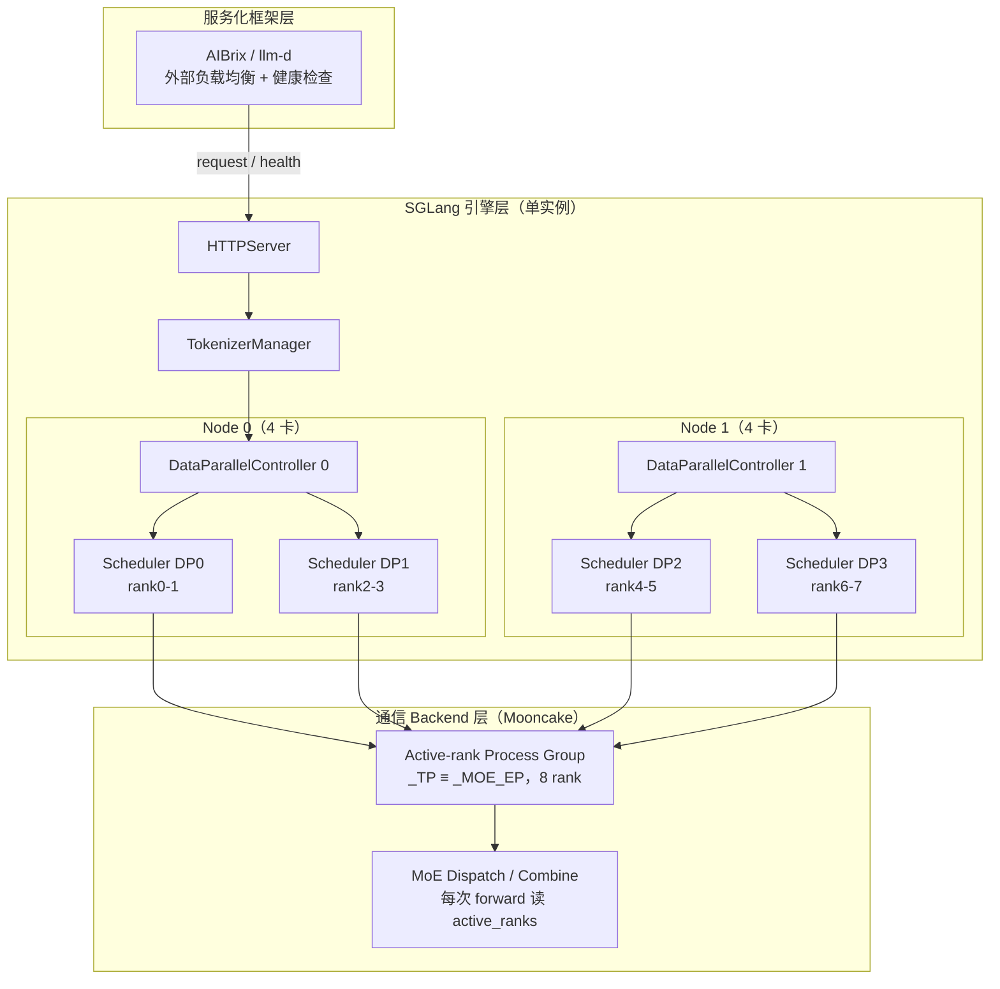
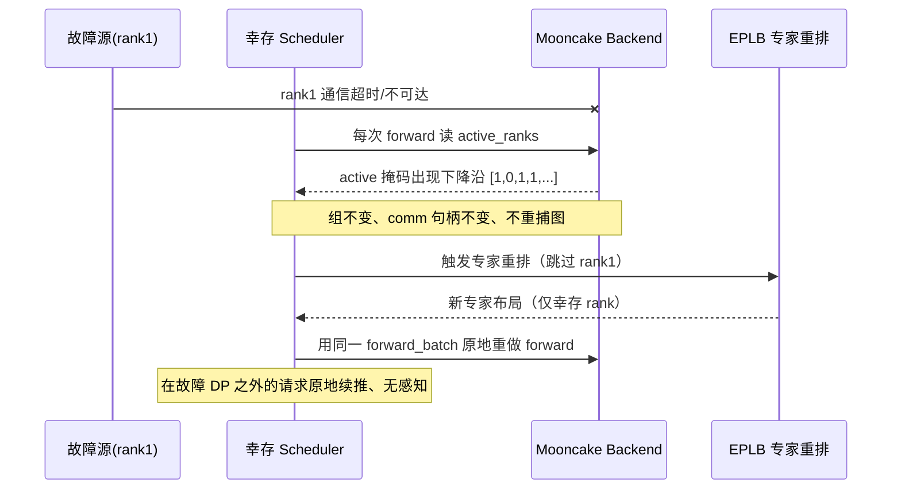
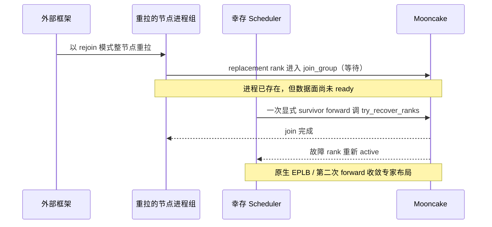
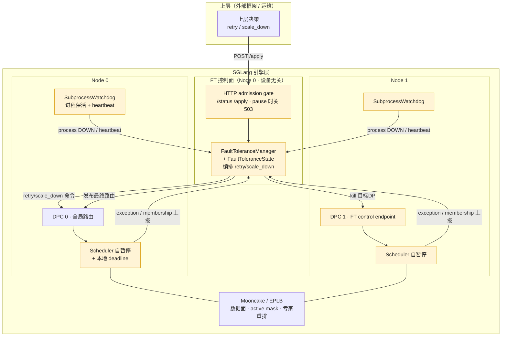
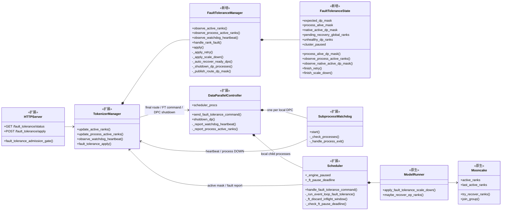
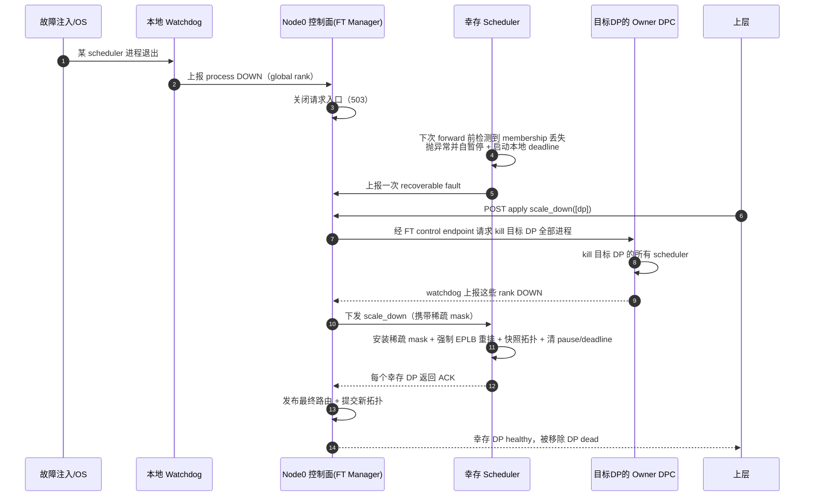
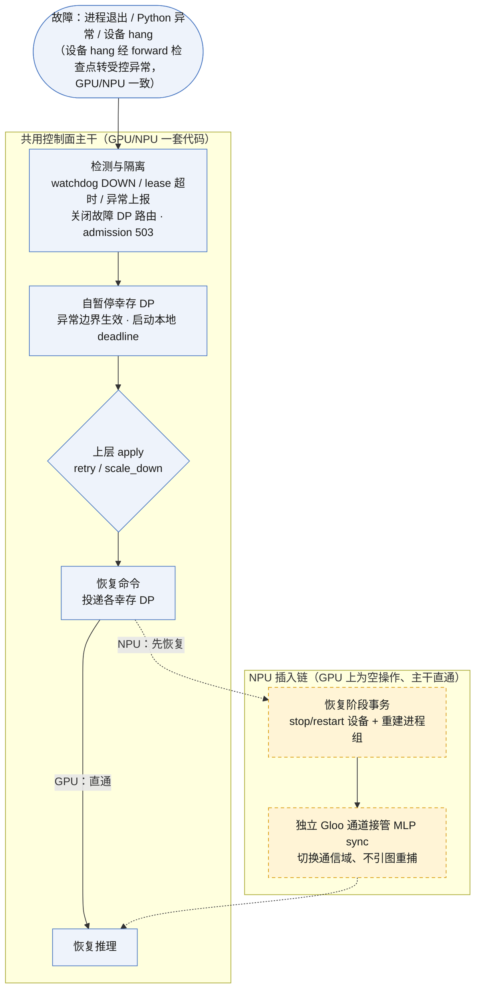
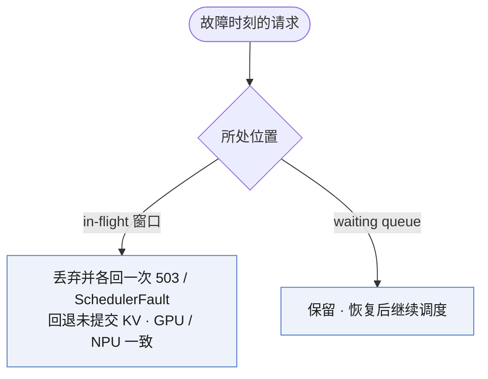

# SGLang 容错框架技术报告

> 面向：技术管理者 / 架构师
> 范围：SGLang DP 粒度容错框架（GPU 已实现并验证，NPU 设计闭环、开发中）
> 说明：本文聚焦"为什么做、难在哪、怎么做、进展如何"。具体接口字段、状态机实现、测试矩阵等见同目录各设计规格（`gpu/v7/`、`npu/`），此处只陈述问题与解决思路。

---

## 0. 概述

- **问题**：大规模 MoE 推理（DP attention + EP）将数十至上百张卡通过集合通信强耦合，单卡/单进程/单节点故障会被放大为整个实例不可用。SGLang 社区原生的 Mooncake 容错只解决"通信层跳过故障 rank"，不覆盖进程检测、请求路由收敛、缩容决策与恢复授权等服务层问题，且属于 GPU 生态，无法直接覆盖 NPU。
- **目标**：在原生 Mooncake Elastic EP 之上叠加一层设备无关的容错控制面。对上仅暴露 `status` / `apply` 两个接口与 `healthy / unhealthy / dead` 三种状态；对下将 GPU 的"原地续推"与 NPU 的"重置重算"两套恢复模型收敛进同一套代码。
- **方法**：控制面仅负责故障观察、恢复决策与路由授权；数据面恢复复用原生 Mooncake/EPLB，进程保活复用原有 watchdog。以"Scheduler 自暂停 + 本地 deadline"取代中心全局 pause；以"故障缩容时序"与"NPU 插入点"两条主线贯穿 GPU 与 NPU。
- **进展**：GPU 侧架构已实现并完成单机逻辑多节点回归（含连续缩容）；NPU 侧设计已闭环、代码开发中。

---

## 1. 为什么要做 SGLang 容错框架

### 1.1 大规模 MoE 推理的故障是常态，且爆炸半径大

稀疏 MoE 部署下，单个推理实例通常包含多路 DP 副本，通过 EP + DP 混合并行协同工作（DeepSeek Decode 这类集群可跨 16 个物理节点、144 张卡）。集合通信的强一致性要求意味着：任一单点故障（一张卡失效、一次网络闪断）都可能拖垮整个实例，导致数千路并发请求同时失败。

传统"异常即停服"模型的恢复需重新加载模型、同步集群状态，耗时达分钟级；对通信闪断、瞬时硬件错误这类可恢复故障，"一刀切"重启造成大量不必要中断。据大规模部署统计，弹性缩容与瞬时故障重推两类手段合计可覆盖约 70% 的硬件相关故障——这正是进程级容错要拿下的价值区间。

### 1.2 SGLang 已有 Mooncake 原生容错，但它不解决服务层问题

SGLang 社区已集成 Mooncake Elastic EP：它能在通信层基于 active-rank mask 自动隔离故障 rank，并让幸存 rank 原地续推（详见 §2）。但其边界清晰——它只解决"通信"问题，不解决"服务"问题：

| 实际故障处置需要的能力 | Mooncake 原生是否提供 |
|---|---|
| 检测"进程退出了 / 整节点失联了" | 否（只在 forward 时被动观察 membership） |
| 故障时关闭请求入口、避免请求进入故障 rank | 否 |
| 判断"该重试还是该缩容" | 否（属上层决策） |
| 缩容后如何安全收敛拓扑、路由、专家布局 | 否 |
| 故障 rank 恢复后由谁授权重新接入请求 | 否 |

Mooncake 提供了"数据面在故障下继续算"的能力，但把它变成"服务能优雅降级并恢复"还缺一层控制面。这层控制面正是本容错框架要补的。

### 1.3 Mooncake 是 GPU 生态，NPU 需要上层框架统一引领

Mooncake 深度绑定 GPU 生态（NCCL/RDMA 语义、原地续推模型）。在 NPU（华为昇腾）上硬件约束根本不同：集合通信要求全员参与，单 rank 故障会污染所有幸存 rank 的 HCCL 上下文，幸存 rank 也必须做设备级 stop/restart，原地续推在物理上不成立（详见 §7）。

若让 GPU 走一套容错、NPU 另起一套，引擎层将裂成两个平行实现，长期维护成本极高。因此我们的立场是：用一个设备无关的上层容错框架引领社区容错架构，把设备差异压到引擎层之下的适配点里，从而减小而非放大 GPU/NPU 的引擎层差异。这是本框架第二个、更具战略性的动机。

---

## 2. 背景：Mooncake + DP Attention + Elastic EP 的原生容错

理解 FT 框架补了什么，需要先看清 SGLang 原生已能做什么。本节用一个通用拓扑讲透原生容错流程。

### 2.1 部署形态：DP attention 下的 rank 布局

以一个更一般的拓扑为例：`--tp 8 --dp 4 --enable-dp-attention --enable-eplb`，两个计算节点、每节点两路 DP、每路 DP 内部做 `attn_tp_size = 2` 的切分，共 8 张卡：

```
tp_size = 8         # torch/model worker 的 world 大小（8 个 global rank）
dp_size = 4         # DP attention 的数据并行维度
ep_size = 8         # MoE 专家并行维度（Mooncake 路径强制 ep_size = tp_size）
attn_tp_size = 2    # 每路 DP 内部 attention 仍按 2 切分
nnodes = 2          # 2 个计算节点，每节点 4 张卡 = 2 路 DP
```

8 个 global rank 按 `(dp, attn_tp)` 布局如下（`R = tp_size / dp_size = 2`，每路 DP 含 2 个 rank）：

```
            Node 0                            Node 1
        DP0        DP1                  DP2        DP3
      ┌────────┐┌────────┐          ┌────────┐┌────────┐
      │rank0 A ││rank2 A │          │rank4 A ││rank6 A │   A = attention 分片
      │rank1 A ││rank3 A │          │rank5 A ││rank7 A │   (attn_tp=2)
      └────────┘└────────┘          └────────┘└────────┘
        GPU0-1    GPU2-3              GPU4-5    GPU6-7

  每路 DP：2 个 rank 共同构成一路完整数据副本的 attention 切片
  全部 8 个 rank：共同构成一个 EP 组（MoE 专家按 EP=8 分布）
```

分层的 AI Infra 部署视图：



### 2.2 Mooncake 的核心机制：基于 active mask 自动隔离故障 rank

Mooncake 容错的本质可用一张掩码概括。设 rank1 故障：

```
正常：   rank:         0   1   2   3   4   5   6   7
         active_ranks:[1   1   1   1   1   1   1   1]   ← 全员参与 dispatch/combine

rank1 故障后：
         active_ranks:[1   0   1   1   1   1   1   1]   ← group 不变、comm 不变
                                                          故障 rank 的 token 在 backend 层被跳过
```

这套机制有三个关键性质，是"不重捕图、原地续推"的根基：

1. **组不变、通信句柄不变**：不重建 process group，不把幸存 rank 重新编号。故障 rank 只是在每次 forward 时被掩码跳过，图（CUDA graph）里固化的通信句柄保持有效。
2. **每次 forward 实时读掩码**：dispatch/combine 执行时读取当前 `active_ranks`，故障 rank 的 token 在 backend 层被跳过，无需上层干预。
3. **故障当拍自愈**：幸存 rank 检测到掩码下降沿后立即做 EPLB 专家重排，然后用同一个 forward_batch 原地重做 forward。只要故障不在请求所在的 DP，running batch 原地继续，请求无感知。

原生机制下"单卡故障 → 隔离 → 原地续推"的数据面自愈流程：



### 2.3 原生 Elastic EP 的 rejoin：整节点重拉 + survivor 驱动恢复

故障 rank 的恢复同样复用原生能力：



要点：恢复的单位是完整节点进程组（SGLang 按 nnodes 启动/重启），不是单独 spawn 一个 scheduler；replacement rank 进入 join 后要等 survivor 的一次 forward 来驱动恢复。

### 2.4 原生机制的边界（FT 要补的口子）

原生 Mooncake 把"数据面继续算"做到了，但它的每个能力都以 forward 为前提：故障检测靠 survivor forward 被动观察 membership；它不知道"进程退出了""整节点断电了"这类没有 forward 触发的故障；也不知道上层想把请求路由到哪些 DP、要不要缩容、什么时候算恢复完成可重新接请求。这些边界就是 FT 控制面的价值空间。

---

## 3. SGLang 容错面临的具体困难

SGLang 的容错能力对标并复刻自 vLLM 的进程级容错（二者对外暴露的容错接口形态一致），不存在额外的功能新增。真正的困难来自 SGLang 自身的部署形态与生态约束，集中在以下三点。

### 3.1 只有中心化部署，没有 external 模式，框架处理代码更重

vLLM 的容错建立在 external LB 部署模式上：每路 DP 是一个相对独立的 EngineCore，各自管理请求调度与状态，DP 之间只共享专家（EP）。故障隔离与恢复的语义因此很直接——单路 DP 故障只影响它自己，框架侧只需较少的状态汇总与命令转发。

SGLang 当前只有中心化部署：全局由 Node 0 的 TokenizerManager / DataParallelController 统一路由与编排，多路 DP 共享同一个全局 runtime group。容错要在这个中心化模型里维护全局拓扑、进程事实、数据面事实与最终路由的一致性，框架处理代码明显更多、状态收敛更复杂。

### 3.2 active-mask 只适配 GPU 生态，NPU 需要框架做统一

这是最根本的生态差异。vLLM 无论 GPU 还是 NPU，容错时都采用"切换通信域"——重建一个不含故障 rank 的新通信组，幸存 rank 在新组上继续。而 SGLang 的 Mooncake 用的是"active-rank mask"——组不变、在原组里用掩码跳过故障 rank，这套机制只适配 GPU 生态，NPU 上没有等价物。

因此 SGLang 要做 NPU 容错，不能简单照搬 active-mask，而必须由上层容错框架提供一层统一抽象，把"GPU 用 mask、NPU 切通信域"这两种数据面差异收敛到同一控制面之下（详见 §6）。这是 vLLM 不需要额外处理、而 SGLang 必须解决的问题。

### 3.3 容错与主动弹性尚未区分，需持续跟进演进中的社区主线

SGLang 社区的 Elastic EP 主线正持续演进（从 #8961 一路到 #30164），且**容错场景与主动弹性（在线扩缩容）场景目前没有区分**，二者共用同一套 elastic EP 代码；核心代码仍在更新中（如 #33728）。这意味着我们的容错实现建立在一个仍在变动的基础之上，需要及时跟进社区、保持沟通，避免与主线演进脱节。

---

## 4. 当前方案

### 4.1 总体思路与引入的功能点

在原生 Mooncake Elastic EP 之上叠加一层设备无关的容错控制面。控制面只做三件事——**观察故障、决策恢复、授权路由**；数据面的专家重排与 membership 恢复复用原生 Mooncake/EPLB，进程保活复用原有 watchdog。GPU 路径保持零改动，NPU 差异通过适配点注入（见 §6）。

下图在 §2.1 部署视图基础上标注 FT 引入的功能点（黄色着色为新增）：



FT 引入的功能点可归为五类：

| 功能点 | 为什么需要它 | 职责 |
|---|---|---|
| HTTP admission gate | 故障时需阻止请求进入故障/降级中的 DP，避免错误扩大 | 暴露 `status`/`apply`；pause 策略下关闭请求入口（503） |
| 容错编排 + 状态（FaultToleranceManager / State） | 原生 Mooncake 不做恢复决策与状态收敛，需要控制面补齐 | 维护全局拓扑与故障状态；编排 `retry`/`scale_down`；发布最终路由 |
| SubprocessWatchdog（扩展） | Mooncake 靠 forward 被动观察，无法发现"进程退出/整节点失联" | 每节点轮询本地 scheduler 进程并上报 process-DOWN；维护 node 级 heartbeat/lease |
| Scheduler 自暂停 + 本地 deadline | 中心发 pause + 等全局 ACK 会引入全局 barrier，且故障 rank 可能正卡在集合通信里 | 故障时在 forward 异常边界自行暂停并启动本地 deadline，超时未被处置则本节点 fail-stop |
| 每节点 DPC 的 FT control endpoint | 缩容需 kill 目标 DP 的进程，需一条到各节点的控制通道 | 接收并执行"kill 目标 DP"命令 |

其中两个关键设计取舍，单独说明其动因：

- **自暂停取代中心 pause**：让 Scheduler 在异常边界自行暂停、自行计时，中心不发 pause、不等 ACK。这样把"幸存者是否已离开上一轮集合通信"的安全问题，从中心建 barrier 转化为缩容的调用前置条件（见 §5），避免了多阶段协议。
- **进程拉起 ≠ 数据面 ready**：故障节点整组重拉后进程已存在，但 membership 与专家布局尚未恢复。框架用进程事实与数据面事实两个信号分别把关，二者都满足后才自动恢复路由（见 §4.3），避免出现"看起来活着、实际不能算"的假阳性。

### 4.2 FT 引入的组件

上一节的功能点在代码中落实为下列组件（类）。这些组件分两类：**纯新增**（FT 框架全新引入）与**扩展原生**（在 SGLang 既有组件上叠加 FT 能力）。下图为容错控制面的类结构与协作关系：



各组件的分工（**类型**列区分"纯新增"与"扩展原生"）：

| 组件 | 类型 | 角色 | 持有的状态 | 不负责什么 |
| --- | --- | --- | --- | --- |
| `FaultToleranceManager` | **纯新增** | 编排 retry/scale_down、route ACK、watchdog lease、自动恢复 | pending command/route future、node lease、`route_mask` | 不发 pause、不保存 Mooncake 权威 mask |
| `FaultToleranceState` | **纯新增** | 纯状态与状态转移 | `expected_dp_mask`、`process_alive_mask`、`pending_recovery`、`unhealthy_dp_ranks`、`cluster_paused` | 不做 IPC |
| HTTP server | 扩展原生 | 暴露 `status`/`apply`，执行 admission gate | 无独立 FT 状态 | 不决定 rank 是否可用 |
| `TokenizerManager` | 扩展原生 | Node 0 控制面入口，汇总 scheduler/DPC 消息 | 持有 `FaultToleranceManager`、per-node DPC control socket | 不自行推导状态 |
| `DataParallelController` | 扩展原生 | 启动本地 scheduler、转发 FT 命令、heartbeat 与 process-DOWN 上报、执行 `shutdown_dp` | 本地 child `Process`、DP route mask、watchdog sender | 不拥有全局 FT 状态 |
| `SubprocessWatchdog` | 扩展原生 | 每秒轮询本地 child、exit callback、heartbeat | 本地已上报集合、stop event | 不推导全局 node/DP 状态 |
| `Scheduler` | 扩展原生 | 执行 batch、自暂停、响应 DP 级 retry/scale_down、上报异常与 membership | `_engine_paused`、`_ft_pause_deadline` | 不决定全局路由、不接收中心 pause |
| `ModelRunner` / Mooncake | 原生复用 | 维护 global rank membership、执行 mask 恢复与 EPLB 重排 | rank 级 `active_ranks`/`last_active_ranks` | 不维护控制面拓扑 |

> 说明：`FaultToleranceManager` 与 `FaultToleranceState` 是本框架全新引入的两个类，构成控制面核心；HTTP server、`TokenizerManager`、`DataParallelController`、`SubprocessWatchdog`、`Scheduler` 为 SGLang 既有组件，FT 在其上扩展了接口与行为；`ModelRunner`/`Mooncake` 的数据面能力（mask 恢复、EPLB 重排、rejoin）为原生复用，未改动。

### 4.3 对外接口与状态

框架对上只暴露两个接口：

- **`GET /fault_tolerance/status`**：返回每路 DP 的状态，仅有三种——`healthy`（正常）、`unhealthy`（已自暂停、待处置）、`dead`（进程不存活或已被缩容移除）。
- **`POST /fault_tolerance/apply`**：接收上层恢复指令，当前支持两种——
  - `retry`：用于瞬时可恢复故障，无真实进程丢失时恢复到异常前的数据面状态；
  - `scale_down(ranks)`：用于持续性故障，整路移除目标 DP 并让幸存者按收缩后的拓扑继续服务。

**恢复是自动的**：被缩容的 DP 经整节点重拉后，框架在其"进程 ready"与"数据面 native-active"两个信号汇合时自动将其重新纳入拓扑并开通路由，无需上层调用额外的恢复指令。因此对外没有独立的 `recover` 接口，也没有 `disabled` 状态。

### 4.4 两种故障策略

- **`pause`（默认）**：故障时暂停幸存 DP、关闭请求入口，等待上层在 deadline 前选择 `retry` 或 `scale_down`；超时未处置则各节点本地 fail-stop。
- **`continue`**：不暂停集群，直接移除故障 DP、其余 DP 降级续服，并在数据面恢复后自动重新纳入。

---

## 5. 故障缩容时序

pause 策略下"kill 一个 scheduler → 缩容"的完整时序如下：



---

## 6. NPU 兼容：一套代码 + 适配点

NPU 适配的总立场与 §3.2 一致：控制面主干设备无关、GPU/NPU 共用；GPU 路径零改动，NPU 特殊性通过适配点注入。NPU 与 GPU 的根本差异在于恢复模型——GPU 原地续推，NPU 必须重置重算。

### 6.1 故障处理全流程与 NPU 插入点

下图中蓝色实线框是两种设备共用的控制面主干，黄色虚线框是 NPU 插入点（GPU 上为空操作、主干直通）：



### 6.2 在途请求的处理

当前实现对两种设备一致：故障发生时，正在处理窗口内的请求被丢弃并各返回一次 `503/SchedulerFault`，尚在 waiting queue 的请求不受影响、恢复后继续。窗口内已分配但未提交的 KV 尾部按真实 token 边界回退释放，不写入 radix cache。



### 6.3 NPU 适配点

故障入口对两种设备是统一的：进程退出、Python 异常、设备 hang（HCCL 超时、AI Core 错误等）都归一到既有 exception 族上报，不向控制面新增故障类型——GPU 与 NPU 一致，非 NPU 适配点。NPU 的特殊性收敛为三个适配点，GPU 路径均不受影响：

| 适配点 | 位置 | 说明 |
|---|---|---|
| 新增 stop/restart 设备操作 | 恢复阶段 | NPU 单 rank 故障会污染幸存 rank 的 HCCL 上下文，幸存者在恢复时需对设备做 stop + restart 连做（含进程组重建，集体操作本身即天然 barrier）。GPU 上为 no-op。 |
| Gloo 替换 Mooncake PG | 控制面 | NPU 上恢复期的 MLP sync 与控制面集合通信改用可重建的独立 Gloo 通道替代 Mooncake PG，故障后切换通信域不引入图重捕。 |
| MC2 算子替换 Mooncake EP | 数据面 | NPU 的 MoE dispatch/combine 走 MC2 算子，需绑定重建后的通信组，并补齐 Elastic Info 传参路径（当前 sgl-kernel-npu 尚无该传参路径）。 |

---

## 7. 当前进展

### 7.1 GPU：架构已实现，完成单机逻辑多节点回归

- 已实现容错框架（status、retry、scale_down、rejoin）。
- 已在 4 卡上完成单机逻辑多节点回归，pause 与 continue 两种策略的恢复路径均通过；连续缩容（4→3→2→1）经多次独立冷启动验证通过；故障前后确定性 prompt 的 token 序列一致。
- **新写的控制面核心约 600 行**（`FaultToleranceManager` + `FaultToleranceState` 两个类），其余 FT 源文件改动（约 820 行）分散在 scheduler、DPC、watchdog、tokenizer 等既有组件的扩展点上，单测约 1100 行

代码量统计：

| 范围 | 文件数 | 净增行 | 说明 |
|---|---:|---:|---|
| FT 全部改动（源 + 测试） | 23 | +2530 / -82 | 相对上游基线共 27 文件 +2647/-104，含 Mooncake 集成点之前的上游差异 |
| 其中：容错源文件（非测试） | 18 | +1423 / -78 | 含 `scheduler.py`、`data_parallel_controller.py`、`tokenizer_manager.py`、`watchdog.py` 等 |
| 其中：容错单测 | 5 | +1107 | `test_manager.py`/`test_scheduler_control.py`/`test_controller.py` 等 |


### 7.2 NPU：设计闭环，代码开发中

- NPU + MC2 的容错适配方案在原理上无残留障碍：数据面各跨 DP 集合通信点已逐点确认可闭环，控制面方案（独立容错通道 + 无状态重建）已定型。
- 工程集中在 §6 的适配点（独立容错通道、MC2 新组闭环与 Elastic Info 传参、设备 stop/restart）。

---

## 8. 下一步

- **GPU**：把回归从单机逻辑多节点推进到真实跨机集群，重点验证跨机网络下的 heartbeat lease、节点失联与整节点重拉；并将"幸存者自暂停前置条件"从调用契约升级为接口强制校验，堵掉误用窗口。
- **NPU**：完成各适配点的最小实现，先在缩小拓扑上跑通"自暂停 → stop/restart → 重算"闭环，再对齐 GPU 回归口径做精度验证。
- **社区跟进**：持续跟进社区 Elastic EP 主线演进（含容错与主动弹性的区分进展），保持实现与主线对齐。

---

## 附：术语速查

| 术语 | 含义 |
|---|---|
| DP / DP attention | 数据并行 / 数据并行注意力（SGLang 部署形态，多路 DP 副本共享一个全局 runtime group） |
| EP / EPLB | 专家并行 / 专家负载均衡（MoE 专家在 rank 间的分布与重排） |
| Mooncake Elastic EP | SGLang 集成的 EP backend，基于 active-rank mask 做通信层故障隔离与弹性恢复 |
| active mask | 标记哪些 rank 参与本次通信的掩码；Mooncake 用它跳过故障 rank，组不变、不重捕图 |
| self-pause（自暂停） | Scheduler 在 forward 异常边界自行暂停并启动本地 deadline，中心不发 pause、不等 ACK |
| scale_down（缩容） | 单阶段整 DP 移除：kill 目标 DP + 幸存者安装稀疏 mask + 强制专家重排 + 提交新拓扑 |
| rejoin | 故障节点整组重拉（原生 Elastic EP 能力） |
| 自动恢复 | 进程 ready 与数据面 native-active 两信号汇合后，框架自动将 DP 重新纳入拓扑并开通路由 |
| external LB 模式 | vLLM 的部署模式：每路 DP 独立自管、只共享专家；SGLang 当前仅支持中心化部署 |
| 原地续推 / 重置重算 | GPU（Mooncake）与 NPU 两种根本不同的故障恢复模型 |
