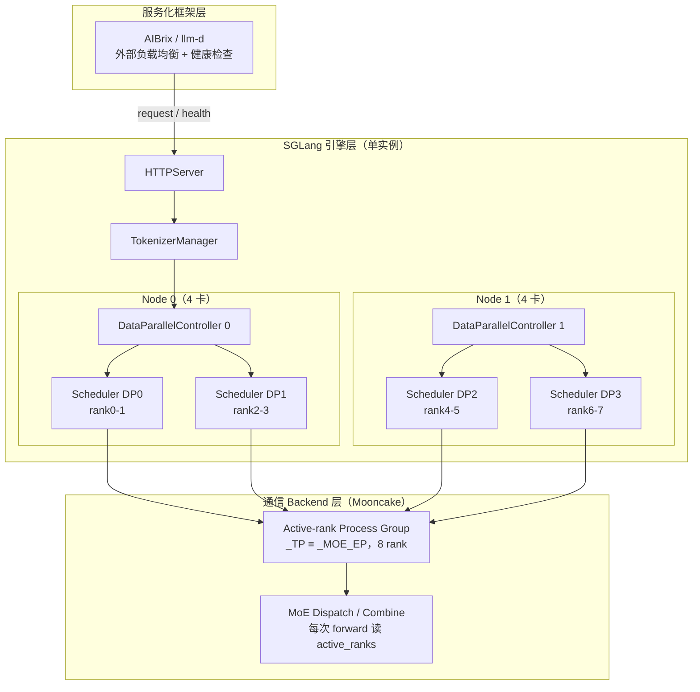
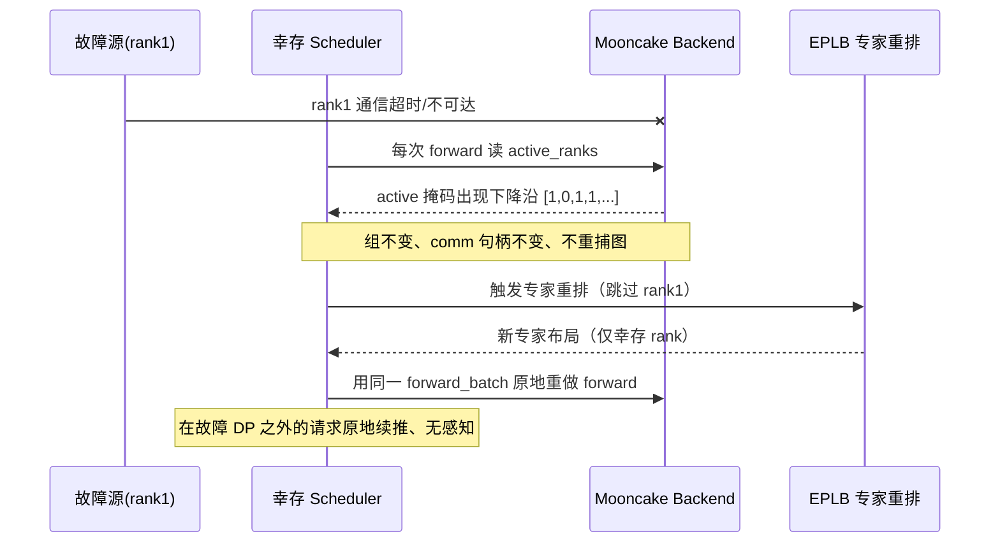
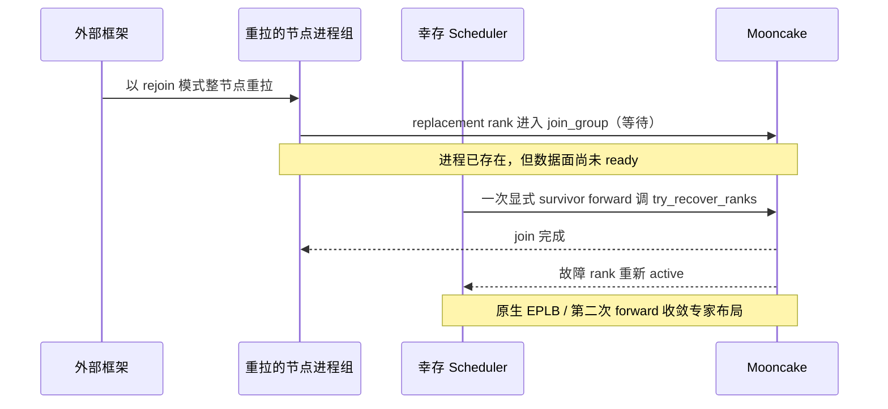
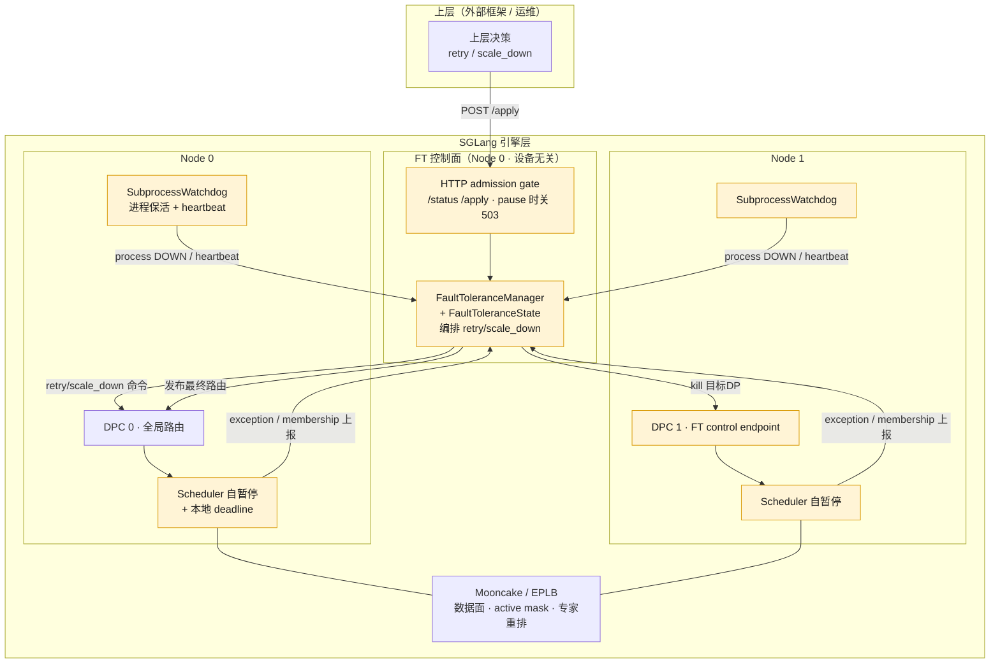
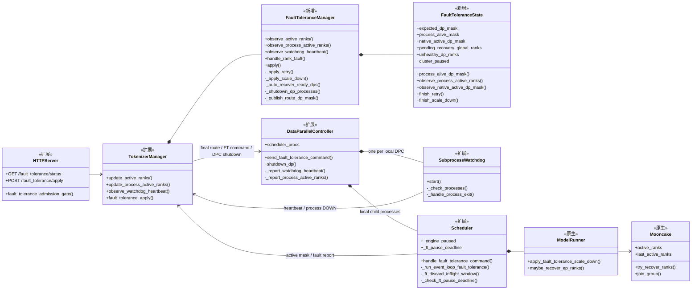
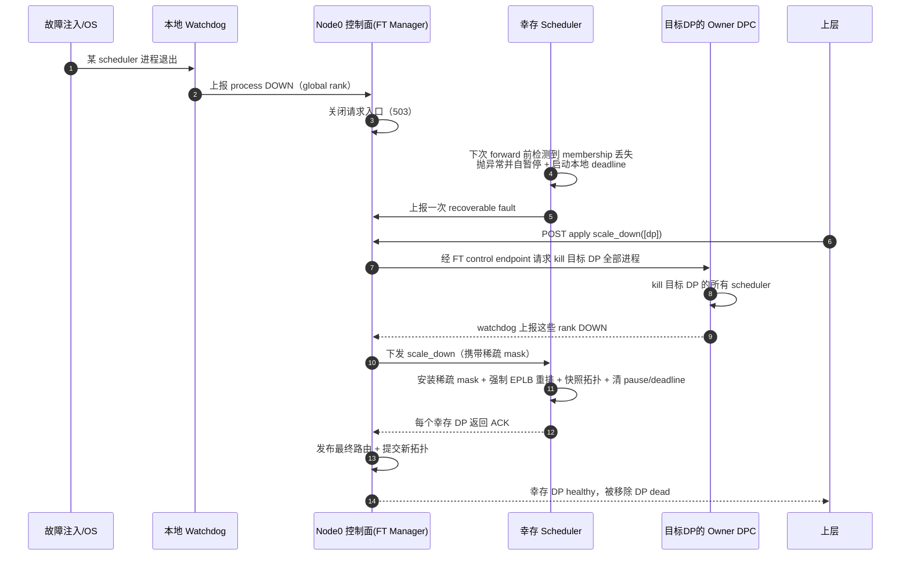
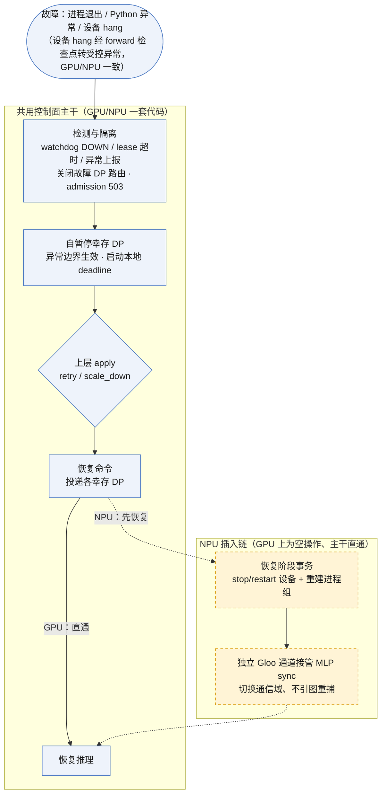
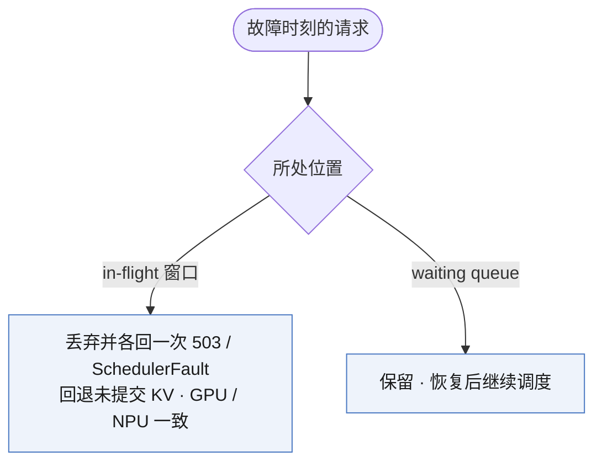

# SGLang 容错框架技术报告

---

## 0. 概述

- **问题**：大规模 MoE 推理将推理集群推向千卡、万卡规模，单卡故障会被放大为整个实例不可用。特别是在昇腾多对一模式下，缺乏可靠性保障将直接影响到推理集群的性能和可用性，而当前的主流推理引擎缺乏故障容忍机制，或者无法应对真实故障场景，且对昇腾生态不友好。因此需要在引擎层引入容错框架，构建大EP场景下的在线卡级弹性容错机制。


## 1. SGLang 总体策略
**整体目标：在SGLang构建故障场景下的弹性容错机制，推动核心代码合入主社区。**

### 1.1  现状分析
当前推理引擎市场主要由vLLM和SGLang占据：
1. **vLLM**：已经集成容错框架，通过 external LB 部署模式实现，容错接口形态已经成标准，后续将稳步推进减卡缩容等关键能力，并持续兼容其他社区特性。
2. **SGLang**：
   - 社区已经集成了容错算子 Mooncake Backend，用 active-rank mask 在通信层做到跳过故障卡继续推理，并基于该容错算子实现Mooncake Elastic EP，用于支持故障场景的自动缩容和主动扩容，是另一条完全不同的容错路线。
   - Mooncake 深度绑定 GPU 生态（NCCL/RDMA 语义、原地续推模型）。在 NPU（华为昇腾）上硬件约束根本不同：集合通信要求全员参与，单 rank 故障会污染所有幸存 rank 的 HCCL 上下文，幸存 rank 也必须做设备级 stop/restart，原地续推在物理上不成立。
   - 若让 GPU 走一套容错、NPU 另起一套，引擎层将裂成两个平行实现，社区合入难，且长期维护成本极高。因此我们的立场是：用一个设备无关的上层容错框架引领社区容错架构，把设备差异压到引擎层之下的适配点里，从而减小而非放大 GPU/NPU 的引擎层差异。

vLLM社区已将容错纳入RoadMap且已合入容错框架核心代码，而上层服务如Dynamo、AIBrix等服务化框架需要在不同推理引擎之间统一容错接口，因此进一步在SGLang社区推动卡级弹性是充分且必要的。

### 1.2 推进策略
1. **建立社区沟通渠道：**
	- 在社区提交容错框架RFC #22344，奠定决策层、控制层与通信层分离的生态标准
	- 已与Mooncake、Nvidia 、SGLang 容错特性相关Owner 沟通，建立技术共识
	- 在社区例会汇报整体方案通过，待完成代码开发提交PR后进一步讨论
2. **方案分析：**
	- SGLang现有容错能力分析：现有容错机制Mooncake Elastic EP依赖容错算子Mooncake，该方案基于Active Ranks 机制对故障rank设置掩码，发生故障自动隔离故障卡重算续推，并在DP层级缩容，仅适用ROCE网络
	- SGLang容错框架架构设计： 新增容错控制组件，故障后暂停引擎，等待上层服务下发恢复决策，数据面可兼容Mooncake\NIXL\MC2等多种算子
	- NPU昇腾场景差异风险分析：当前昇腾主要使用MC2算子提供容错能力，仅支持MoE侧的容错Mask能力，且需要调用stop/restart 接口，NV生态不支持，需要在SGLang侧额外适配。
3. **代码开发：**
	- GPU场景：根据RFC拆分Milestone进行开发，首先完成整体容错框架开发，实现故障后暂停上报Status，适配GPU Mooncake Elastic EP 已有特性，并提供retry\scale_down等恢复接口。
	- NPU场景：基于GPU已有容错框架开发，通过重建并切换通信域、适配SGLang EPLB 能力、打通MC2算子调用链路，实现NPU上的卡级弹性缩容。
4. **推动社区合入：**
	- 完成本地开发和验证后，提交PR到社区，等待Committer评审意见，完成修改后合入社区
	- 昇腾容错算子调用路径实现在独立仓库 **sgl-kernel-npu**，NPU场景需依赖该仓库提前适配

## 2. 社区推进思路
开源社区容错生态的建设比较匮乏，主要体现在容错算子（Mooncake、NIXL、DeepEP）上，这些容错算子主要靠算子超时、或Mask机制来工作，只依赖后端的判断来抛出故障或自动隔离，覆盖不了很多真实的故障场景——这正是需要一个引擎级容错框架的原因：

+ **场景一：瞬态网络波动。** 短时网络中断（脏光模块、光纤弯折、链路倒换）是大型集群最常见的故障模式之一。它们不必然表示硬件故障，往往是瞬态且可恢复的，尽管可能同时影响多个 rank。最优响应是先暂停操作、重试请求，而不是立即隔离 rank。如果每个本地超时都触发缩容：
	
	- 多个 rank 可能被错误隔离；
	- 服务容量可能以级联方式崩塌；
	- 使故障后的解释与复盘复杂化。
	
	而"先重试"还是"先隔离"的抉择，需要历史信号、时间窗口和外部监控上下文——这属于服务化/控制面的范畴。
+ **场景二：xPU HBM 不可纠错错误（UCE）。** 不可纠错内存错误是大型加速器 HBM 中的另一类常见故障。UCE指内存一小部分内的不可纠错错误，并不总是需要整 rank或整设备下电。在某些平台上，恢复可能涉及：隔离受影响的内存区域、重载权重、重建状态、重试执行，仅对大规模、持续性的不可纠错错误才升级为rank/节点隔离。硬编码"后端失败 → 立即缩容"，会把本可恢复的故障转化为不必要的容量损失。
+ **场景三：头节点控制组件（如 DP 协调器）的单点故障。** 头节点控制组件的故障需要控制面去重启或恢复这些组件，单独的 worker缩容无法解决此类问题。这类操作必须由服务化/控制层管理，以保证一致的状态迁移和安全的暂停/恢复行为。
+ **场景四：节点粒度的恢复策略。** 生产中，修复与维护策略通常按节点而非 GPU 定义。例如：如果一张 GPU 宕机，整个节点常常需要下电；逐 rank修复在运维上可能不可行。Kernel 或集合通信层无法做这类策略决策，必须在控制面定义、按集群范围执行。
+ **场景五：硬件差异性与 Sentinel 抽象。** 不同硬件平台的容错机制差异很大：有些原生支持"超时 + mask"，有些则需要 sidecar线程去调用特定接口（如 stop_device、comm_abort）。把所有容错逻辑直接嵌入主执行路径（如execute_model、调度、组管理）会导致：抽象差、可移植性差、代码难维护。通过 sidecar Sentinel/控制面框架，把检测、上报与受控动作的执行从核心推理路径中解耦出来，是更工程化的做法。
+ **场景六：高性能约束。** 并非所有场景都会启用 FT 后端。相比普通后端，支持 mask/超时可能引入额外开销。因此系统需要根据 SLA要求、业务场景和集群健康度，动态启用/禁用 FT 后端或切换 FT 策略级别。这是典型的控制面策略切换，不应散落在 worker 执行路径中。

此外，在大规模集群中，仅依赖内部 rank mask 并不够：各 rank 超时时刻不同会产生竞态、各 rank视图不一致、且无法与硬件监控或外部告警自然集成；同时，后端方案无法结构化地回答"引擎当前可恢复状态是什么、哪些请求可重试、缩容影响的容量多大"这些问题。引擎级容错框架正是通过为服务层提供控制面能力来补齐这些缺口：统一的状态可观测性——提供可查询的引擎状态以支持故障诊断、定位与溯源；统一的控制接口——使上层服务化框架能明确下发清晰的策略与动作（重试、缩容、隔离节点、重启组件等）。最终结果是清晰的分工：引擎如实上报故障并执行恢复动作，服务化层做准确的全局决策、优化编排。


## 3. SGlang卡级弹性进展
### GPU —— 架构已实现，完成单机逻辑多节点回归：
- 已实现容错框架全链路：status、retry、scale_down、rejoin，对应两种策略 pause 与 continue。
-  在 4 卡上完成单机逻辑多节点回归：两种策略的恢复路径均通过；连续缩容 4→3→2→1 经多次独立冷启动验证通过；故障前后确定性 prompt 的 token  序列一致。
-  代码量：新写的控制面核心约 600 行（FaultToleranceManager + FaultToleranceState 两个类）；FT 全部改动（源 + 测试）23 个文件 +2530/-82，其中容错源文件 18 个 +1423/-78、单测 5 个 +1107。
### NPU —— 设计已闭环，代码开发中：
- 适配方案在原理上已确认无残留障碍，工程集中在三个适配点：独立 Gloo 控制通道、EPLB 特性适配，MC2 替换 Mooncake 数据面并补齐 Elastic Info 传参路径。
- 穿刺代码已在缩小拓扑跑通"自暂停 → stop/restart → 重算"闭环，正式代码正在重构中。


## 4. 整体方案

### 4.1 SGLang 容错机制现状：Mooncake + DP Attention + Elastic EP

#### 4.1.1 部署形态：DP attention 下的 rank 布局

以一个更一般的拓扑为例：`--tp 8 --dp 4 --enable-dp-attention --enable-eplb`，两个计算节点、每节点两路 DP、每路 DP 内部做 `attn_tp_size = 2` 的切分，共 8 张卡：

```
tp_size = 8         # torch/model worker 的 world 大小（8 个 global rank）
dp_size = 4         # DP attention 的数据并行维度
ep_size = 8         # MoE 专家并行维度（Mooncake 路径强制 ep_size = tp_size）
attn_tp_size = 2    # 每路 DP 内部 attention 仍按 2 切分
nnodes = 2          # 2 个计算节点，每节点 4 张卡 = 2 路 DP
```

8 个 global rank 按 `(dp, attn_tp)` 布局如下（`R = tp_size / dp_size = 2`，每路 DP 含 2 个 rank）：

```
            Node 0                            Node 1
        DP0        DP1                  DP2        DP3
      ┌────────┐┌────────┐          ┌────────┐┌────────┐
      │rank0 A ││rank2 A │          │rank4 A ││rank6 A │   A = attention 分片
      │rank1 A ││rank3 A │          │rank5 A ││rank7 A │   (attn_tp=2)
      └────────┘└────────┘          └────────┘└────────┘
        GPU0-1    GPU2-3              GPU4-5    GPU6-7

  每路 DP：2 个 rank 共同构成一路完整数据副本的 attention 切片
  全部 8 个 rank：共同构成一个 EP 组（MoE 专家按 EP=8 分布）
```

分层的 AI Infra 部署视图：



#### 4.1.2 Mooncake 的核心机制：基于 active mask 自动隔离故障 rank

Mooncake 容错的本质可用一张掩码概括。设 rank1 故障：

```
正常：   rank:         0   1   2   3   4   5   6   7
         active_ranks:[1   1   1   1   1   1   1   1]   ← 全员参与 dispatch/combine

rank1 故障后：
         active_ranks:[1   0   1   1   1   1   1   1]   ← group 不变、comm 不变
                                                          故障 rank 的 token 在 backend 层被跳过
```

这套机制有三个关键性质，是"不重捕图、原地续推"的根基：

1. **组不变、通信句柄不变**：不重建 process group，不把幸存 rank 重新编号。故障 rank 只是在每次 forward 时被掩码跳过，图（CUDA graph）里固化的通信句柄保持有效。
2. **每次 forward 实时读掩码**：dispatch/combine 执行时读取当前 `active_ranks`，故障 rank 的 token 在 backend 层被跳过，无需上层干预。
3. **故障当拍自愈**：幸存 rank 检测到掩码下降沿后立即做 EPLB 专家重排，然后用同一个 forward_batch 原地重做 forward。只要故障不在请求所在的 DP，running batch 原地继续，请求无感知。

原生机制下"单卡故障 → 隔离 → 原地续推"的数据面自愈流程：



#### 4.1.3 原生 Elastic EP 的 rejoin：整节点重拉 + survivor 驱动恢复

故障 rank 的恢复同样复用原生能力：



要点：恢复的单位是完整节点进程组（SGLang 按 nnodes 启动/重启），不是单独 spawn 一个 scheduler；replacement rank 进入 join 后要等 survivor 的一次 forward 来驱动恢复。

#### 4.1.4 原生机制的边界（FT 要补的口子）

原生 Mooncake 把"数据面继续算"做到了，但它的每个能力都以 forward 为前提：故障检测靠 survivor forward 被动观察 membership；它不知道"进程退出了""整节点断电了"这类没有 forward 触发的故障；也不知道上层想把请求路由到哪些 DP、要不要缩容、什么时候算恢复完成可重新接请求。这些边界就是 FT 控制面的价值空间。

###  4.2  卡级弹性当前方案

#### 4.2.1 总体思路与引入的功能点

在原生 Mooncake Elastic EP 之上叠加一层设备无关的容错控制面。控制面只做三件事——**观察故障、决策恢复、授权路由**；数据面的专家重排与 membership 恢复复用原生 Mooncake/EPLB，进程保活复用原有 watchdog。GPU 路径保持零改动，NPU 差异通过适配点注入（见 §6）。

下图在 §2.1 部署视图基础上标注 FT 引入的功能点（黄色着色为新增）：



FT 引入的功能点可归为五类：

| 功能点 | 为什么需要它 | 职责 |
|---|---|---|
| HTTP admission gate | 故障时需阻止请求进入故障/降级中的 DP，避免错误扩大 | 暴露 `status`/`apply`；pause 策略下关闭请求入口（503） |
| 容错编排 + 状态（FaultToleranceManager / State） | 原生 Mooncake 不做恢复决策与状态收敛，需要控制面补齐 | 维护全局拓扑与故障状态；编排 `retry`/`scale_down`；发布最终路由 |
| SubprocessWatchdog（扩展） | Mooncake 靠 forward 被动观察，无法发现"进程退出/整节点失联" | 每节点轮询本地 scheduler 进程并上报 process-DOWN；维护 node 级 heartbeat/lease |
| Scheduler 自暂停 + 本地 deadline | 中心发 pause + 等全局 ACK 会引入全局 barrier，且故障 rank 可能正卡在集合通信里 | 故障时在 forward 异常边界自行暂停并启动本地 deadline，超时未被处置则本节点 fail-stop |
| 每节点 DPC 的 FT control endpoint | 缩容需 kill 目标 DP 的进程，需一条到各节点的控制通道 | 接收并执行"kill 目标 DP"命令 |

其中两个关键设计取舍，单独说明其动因：

- **自暂停取代中心 pause**：让 Scheduler 在异常边界自行暂停、自行计时，中心不发 pause、不等 ACK。这样把"幸存者是否已离开上一轮集合通信"的安全问题，从中心建 barrier 转化为缩容的调用前置条件（见 §5），避免了多阶段协议。
- **进程拉起 ≠ 数据面 ready**：故障节点整组重拉后进程已存在，但 membership 与专家布局尚未恢复。框架用进程事实与数据面事实两个信号分别把关，二者都满足后才自动恢复路由（见 §4.3），避免出现"看起来活着、实际不能算"的假阳性。

#### 4.2.2 FT 引入的组件

上一节的功能点在代码中落实为下列组件（类）。这些组件分两类：**纯新增**（FT 框架全新引入）与**扩展原生**（在 SGLang 既有组件上叠加 FT 能力）。下图为容错控制面的类结构与协作关系：



各组件的分工（**类型**列区分"纯新增"与"扩展原生"）：

| 组件 | 类型 | 角色 | 持有的状态 | 不负责什么 |
| --- | --- | --- | --- | --- |
| `FaultToleranceManager` | **纯新增** | 编排 retry/scale_down、route ACK、watchdog lease、自动恢复 | pending command/route future、node lease、`route_mask` | 不发 pause、不保存 Mooncake 权威 mask |
| `FaultToleranceState` | **纯新增** | 纯状态与状态转移 | `expected_dp_mask`、`process_alive_mask`、`pending_recovery`、`unhealthy_dp_ranks`、`cluster_paused` | 不做 IPC |
| HTTP server | 扩展原生 | 暴露 `status`/`apply`，执行 admission gate | 无独立 FT 状态 | 不决定 rank 是否可用 |
| `TokenizerManager` | 扩展原生 | Node 0 控制面入口，汇总 scheduler/DPC 消息 | 持有 `FaultToleranceManager`、per-node DPC control socket | 不自行推导状态 |
| `DataParallelController` | 扩展原生 | 启动本地 scheduler、转发 FT 命令、heartbeat 与 process-DOWN 上报、执行 `shutdown_dp` | 本地 child `Process`、DP route mask、watchdog sender | 不拥有全局 FT 状态 |
| `SubprocessWatchdog` | 扩展原生 | 每秒轮询本地 child、exit callback、heartbeat | 本地已上报集合、stop event | 不推导全局 node/DP 状态 |
| `Scheduler` | 扩展原生 | 执行 batch、自暂停、响应 DP 级 retry/scale_down、上报异常与 membership | `_engine_paused`、`_ft_pause_deadline` | 不决定全局路由、不接收中心 pause |
| `ModelRunner` / Mooncake | 原生复用 | 维护 global rank membership、执行 mask 恢复与 EPLB 重排 | rank 级 `active_ranks`/`last_active_ranks` | 不维护控制面拓扑 |

> 说明：`FaultToleranceManager` 与 `FaultToleranceState` 是本框架全新引入的两个类，构成控制面核心；HTTP server、`TokenizerManager`、`DataParallelController`、`SubprocessWatchdog`、`Scheduler` 为 SGLang 既有组件，FT 在其上扩展了接口与行为；`ModelRunner`/`Mooncake` 的数据面能力（mask 恢复、EPLB 重排、rejoin）为原生复用，未改动。

#### 4.2.3 对外接口与状态

框架对上只暴露两个接口：

- **`GET /fault_tolerance/status`**：返回每路 DP 的状态，仅有三种——`healthy`（正常）、`unhealthy`（已自暂停、待处置）、`dead`（进程不存活或已被缩容移除）。
- **`POST /fault_tolerance/apply`**：接收上层恢复指令，当前支持两种——
  - `retry`：用于瞬时可恢复故障，无真实进程丢失时恢复到异常前的数据面状态；
  - `scale_down(ranks)`：用于持续性故障，整路移除目标 DP 并让幸存者按收缩后的拓扑继续服务。

**恢复是自动的**：被缩容的 DP 经整节点重拉后，框架在其"进程 ready"与"数据面 native-active"两个信号汇合时自动将其重新纳入拓扑并开通路由，无需上层调用额外的恢复指令。因此对外没有独立的 `recover` 接口，也没有 `disabled` 状态。

#### 4.2.4 两种故障策略

- **`pause`（默认）**：故障时暂停幸存 DP、关闭请求入口，等待上层在 deadline 前选择 `retry` 或 `scale_down`；超时未处置则各节点本地 fail-stop。
- **`continue`**：不暂停集群，直接移除故障 DP、其余 DP 降级续服，并在数据面恢复后自动重新纳入。

---

####  4.2.5 故障缩容时序

pause 策略下"kill 一个 scheduler → 缩容"的完整时序如下：



---

### 4.3 NPU 兼容：一套代码 + 适配点

NPU 适配的总立场与 §3.2 一致：控制面主干设备无关、GPU/NPU 共用；GPU 路径零改动，NPU 特殊性通过适配点注入。NPU 与 GPU 的根本差异在于恢复模型——GPU 原地续推，NPU 必须重置重算。

#### 4.3.1 故障处理全流程与 NPU 插入点

下图中蓝色实线框是两种设备共用的控制面主干，黄色虚线框是 NPU 插入点（GPU 上为空操作、主干直通）：



#### 4.3.2 在途请求的处理

当前实现对两种设备一致：故障发生时，正在处理窗口内的请求被丢弃并各返回一次 `503/SchedulerFault`，尚在 waiting queue 的请求不受影响、恢复后继续。窗口内已分配但未提交的 KV 尾部按真实 token 边界回退释放，不写入 radix cache。



#### 4.3.3 NPU 适配点

故障入口对两种设备是统一的：进程退出、Python 异常、设备 hang（HCCL 超时、AI Core 错误等）都归一到既有 exception 族上报，不向控制面新增故障类型——GPU 与 NPU 一致，非 NPU 适配点。NPU 的特殊性收敛为三个适配点，GPU 路径均不受影响：

| 适配点 | 位置 | 说明 |
|---|---|---|
| 新增 stop/restart 设备操作 | 恢复阶段 | NPU 单 rank 故障会污染幸存 rank 的 HCCL 上下文，幸存者在恢复时需对设备做 stop + restart 连做（含进程组重建，集体操作本身即天然 barrier）。GPU 上为 no-op。 |
| Gloo 替换 Mooncake PG | 控制面 | NPU 上恢复期的 MLP sync 与控制面集合通信改用可重建的独立 Gloo 通道替代 Mooncake PG，故障后切换通信域不引入图重捕。 |
| MC2 算子替换 Mooncake EP | 数据面 | NPU 的 MoE dispatch/combine 走 MC2 算子，需绑定重建后的通信组，并补齐 Elastic Info 传参路径（当前 sgl-kernel-npu 尚无该传参路径）。 |


## 附：术语速查

| 术语 | 含义 |
|---|---|
| DP / DP attention | 数据并行 / 数据并行注意力（SGLang 部署形态，多路 DP 副本共享一个全局 runtime group） |
| EP / EPLB | 专家并行 / 专家负载均衡（MoE 专家在 rank 间的分布与重排） |
| Mooncake Elastic EP | SGLang 集成的 EP backend，基于 active-rank mask 做通信层故障隔离与弹性恢复 |
| active mask | 标记哪些 rank 参与本次通信的掩码；Mooncake 用它跳过故障 rank，组不变、不重捕图 |
| self-pause（自暂停） | Scheduler 在 forward 异常边界自行暂停并启动本地 deadline，中心不发 pause、不等 ACK |
| scale_down（缩容） | 单阶段整 DP 移除：kill 目标 DP + 幸存者安装稀疏 mask + 强制专家重排 + 提交新拓扑 |
| rejoin | 故障节点整组重拉（原生 Elastic EP 能力） |
| 自动恢复 | 进程 ready 与数据面 native-active 两信号汇合后，框架自动将 DP 重新纳入拓扑并开通路由 |
| external LB 模式 | vLLM 的部署模式：每路 DP 独立自管、只共享专家；SGLang 当前仅支持中心化部署 |
| 原地续推 / 重置重算 | GPU（Mooncake）与 NPU 两种根本不同的故障恢复模型1 |
