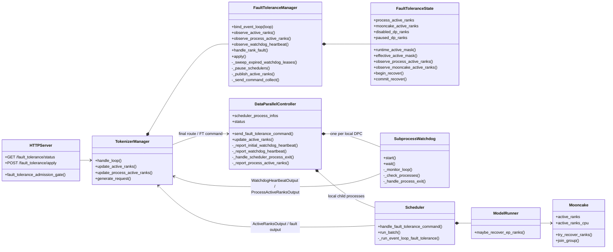
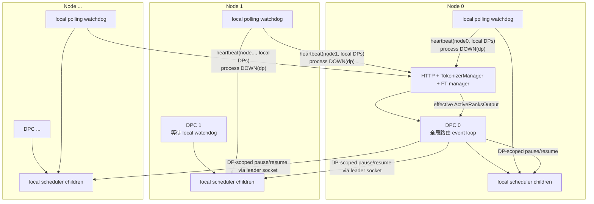
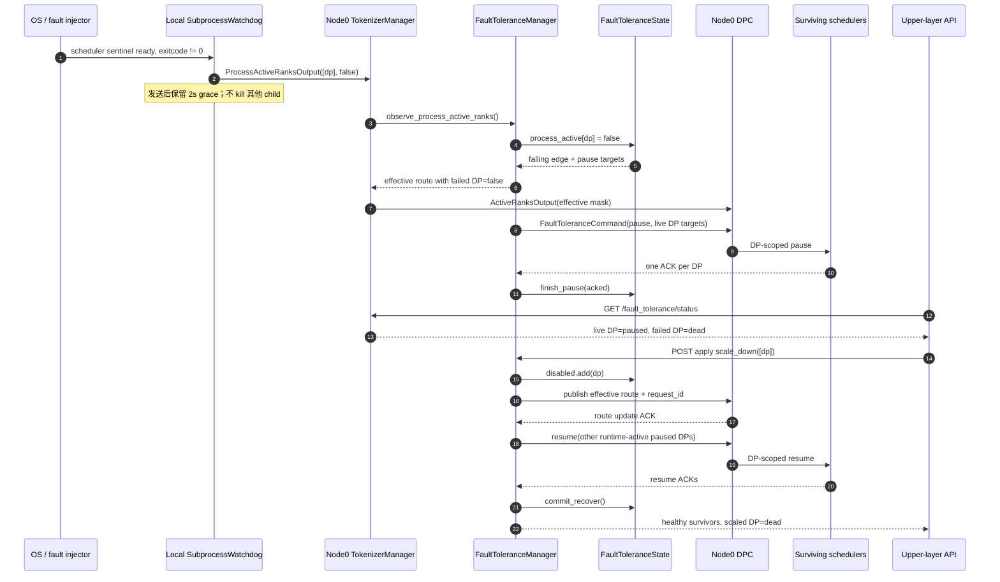
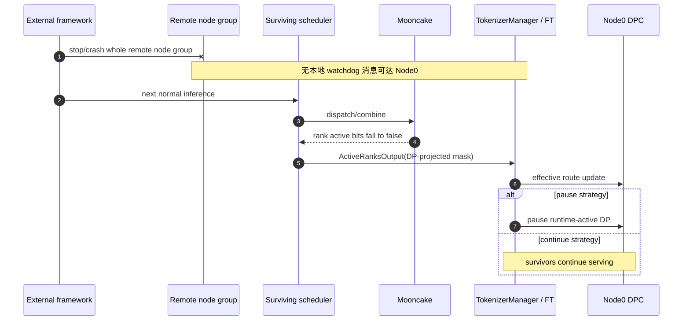
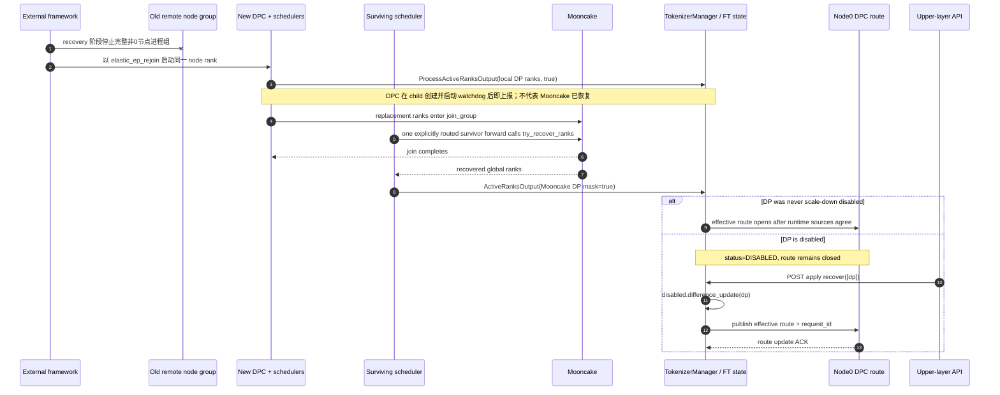
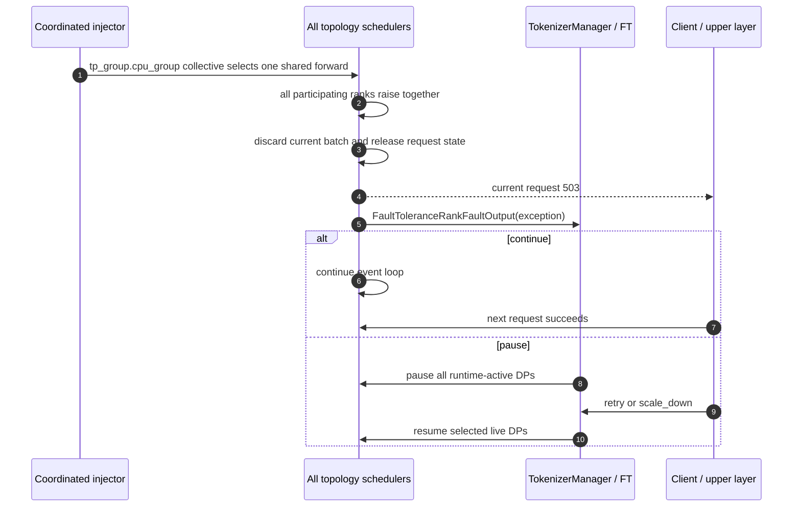

# SGLang DP-only FT 架构设计与验证指南

生成时间：2026-07-17  
最后更新：2026-07-27  
用途：给人工审查者和后续 Codex agent 提供最新、可独立阅读的架构与测试上下文。  
基准：SGLang `worktree-dp-only-ft-revise@<PENDING_FT_COMMIT>`；本轮实现基于 `81d859af67c5581cf6f360775e4034ae72a687ff`。

> 本文区分三种结论：
>
> - **设计不变量**：当前方案必须保持，不因局部 bug 改变。
> - **已验证**：已有运行产物，但结论范围仍以产物中的实际断言为准。
> - **待验证/实现风险**：设计目标明确，但当前代码或测试还没有通过。
>
> 当前代码可能有 bug。不能因为某个测试未通过就擅自改写设计，也不能因为代码里存在旧逻辑就把旧逻辑当成目标架构。

## 1. Goal & Context

### 1.1 目标

在 SGLang 原生 Mooncake elastic EP 的基础上，以尽量少的新增机制实现 DP 粒度容错：

1. scheduler 进程退出时由本节点 watchdog 立即上报所属 DP 不可用；整个远端 DPC/watchdog 一起消失时，由 Node 0 的 heartbeat lease 在无推理条件下判定其本地 DP 不可用。
2. Node 0 汇总进程状态、Mooncake membership 和上层主动隔离状态，得到唯一的最终 DP 路由。
3. `pause` 策略先暂停仍可用的 DP，等待上层选择 `retry` 或 `scale_down`。
4. `continue` 策略直接移除故障 DP，其他 DP 继续服务。
5. `scale_down` 永远以 DP 为单位，只做逻辑隔离，不杀进程、不释放 GPU、不扩大故障半径。
6. `recover` 是上层撤销逻辑隔离的唯一入口；runtime rejoin 不能隐式修改控制面授权。
7. 多节点 rejoin 仍复用 Mooncake 原生恢复，不新增 supervisor、PID 代理或独立 runtime 恢复协议。
8. 单个 scheduler 故障不能连带清理同节点其他 DP，也不能连带 kill 同一 DP 中仍存活的其他 attention/EP rank；但 `A*C>1` 时若死亡者是 DP leader，存活 sibling 会卡在以 leader 为源的 work broadcast，当前不能在线恢复。

### 1.2 四个基础事实

这些事实决定了设计边界：

1. **Mooncake 按 global rank 隔离和 rejoin。**
2. **SGLang 按 `nnodes` 启动和重启节点进程组。**
3. **FT 控制面按 DP 执行 `pause`、`retry`、`scale_down`、`recover` 和路由。**
4. **watchdog 每秒轮询本地 scheduler 进程并向 Node 0 上报 `node_rank + local dp_ranks` heartbeat；单进程退出仍上报所属 DP index。**

因此，故障检测、物理进程生命周期和服务路由不是同一个层级，必须作为独立信息源处理。

### 1.3 明确不做

- `scale_down` 不负责 kill scheduler，不释放 GPU。
- 不支持 `scale_down.shutdown` 参数。
- 不引入 `DPSupervisor`、`PIDProcess`、远程 PID 代理或跨节点 shutdown RPC。
- 不把一个 scheduler 退出扩展成“清理全部本地 scheduler”。
- 不新增独立探针端口或 heartbeat 线程；节点存活检测复用 DPC watchdog 线程和现有 Tokenizer ZMQ endpoint。
- 不扩展 no-DP-attention 的跨节点 FT 通道。
- 不处理 `A*C>1` 时 DP leader 死亡、sibling 残存的在线恢复。
- 不处理 Node 0 / Tokenizer 所在控制面整机故障。
- 不处理 pause/resume 进行中的二次局部故障和陈旧 generation。
- 不支持 FT 的 `dp_size=1`。
- 不把 exception 故障和进程退出故障混成一个测试流程。

### 1.4 关键路径

- SGLang 本轮源码：`D:\Codex\repos\sglang-dp-only-ft-revise`
- Remote-agent 测试：`D:\Codex\projects\workflow\remote-agent`
- 历史阅读指南：`D:\Codex\shared\2026-07-13\SGLang DP-only FT 代码阅读指南\README.md`

历史指南固定在旧实现，只能用来理解演进背景。其中的 supervisor、shutdown、`awaiting_native_down` 等内容不代表当前设计。

## 2. Physical State

### 2.1 SGLang

- Workspace：`D:\Codex\repos\sglang-dp-only-ft-revise`
- Branch：`worktree-dp-only-ft-revise`
- HEAD：`<PENDING_FT_COMMIT>`
- Base：`e63cb37b2`，Mooncake elastic EP recovery 集成点
- Git status：提交后应为 clean；继续工作前必须重新执行 `git status --short`

关键提交：

```text
<PENDING_FT_COMMIT_SHORT> fix(ft): track node watchdog leases and paused ranks
81d859af6 docs(ft): record elastic-ep revert, rejoin port guard, watchdog style rationale
74cafe366 fix(ft): coordinate scheduler pause at MLP sync
a2eb77550 debug(ft): add opt-in scheduler stack signal
296deb012 feat(ft): require explicit recovery for disabled DP ranks
f803457d2 refactor(ft): remove redundant fault tolerance state
54ee9906e fix(ft): discard the full overlap fault window
d3dedc160 fix(ft): resume isolated live DP participants
2e135251d fix(ft): drop dead ranks from pending pause
664843da6 fix(elastic-ep): preserve live replicas after rank faults
88c60c696 fix(elastic-ep): restore fallback rejoin hardening
742950150 fix(elastic-ep): tolerate lazy buffer on rejoin
ea650e4ad fix(ft): preserve scale-down and rejoin semantics
265eca161 fix(ft): isolate DP failures without killing local workers
8dc8b6cdd fix(ft): let remote DPC watchdog replace process joins
29510cdd0 feat(ft): add DP-only fault tolerance
e63cb37b2 fix(sglang): integrate Mooncake elastic EP recovery
```

相对 `e63cb37b2` 的主要非测试改动位于：

```text
python/sglang/srt/entrypoints/http_server.py
python/sglang/srt/fault_tolerance/controller.py
python/sglang/srt/fault_tolerance/manager.py
python/sglang/srt/managers/data_parallel_controller.py
python/sglang/srt/managers/io_struct.py
python/sglang/srt/managers/scheduler.py
python/sglang/srt/managers/tokenizer_manager.py
python/sglang/srt/model_executor/model_runner.py
python/sglang/srt/server_args.py
python/sglang/srt/utils/watchdog.py
python/sglang/srt/elastic_ep/elastic_ep.py
python/sglang/srt/eplb/expert_location.py
python/sglang/srt/layers/moe/token_dispatcher/mooncake.py
```

### 2.2 Remote-agent

- Workspace：`D:\Codex\projects\workflow\remote-agent`
- Branch：`codex/sglang-ft-v5-test-plan`
- 检查时 HEAD：`2dda42ac75c6a63b8c2f543dc0a9e624b156fd88`
- Git status：clean

最近的测试修正：

```text
444be3a debug(sglang): isolate same-prompt cache stability without FT
9352670 docs(sglang): restore fixed documentation ownership
5ad366d docs(sglang): capture TBO gate design experience
7c2f67a test(sglang): strengthen two-GPU TBO precision gate
0e5768c test(sglang): add two-GPU conclusion gates
b7e43b2 docs(sglang): align suite evidence with rerun queue
e0d6dbf docs(sglang): define final-head rerun queue
```

当前 remote-agent 已包含两卡 static watchdog/rejoin 与 exception + overlap/TBO 的缩小拓扑用例；运行进度以本文第 7、8 节和 `VALIDATION_HISTORY.md` 为准，remote-agent 只维护可执行脚本与命令。

### 2.3 固定文档及职责

- `README.md`：本文
- `TEST_SPEC_CHANGELOG.md`：2026-07-21 状态、recover API 和测试迁移增量说明
- `ACCEPTANCE_TEST_SPEC.md`：详细验收用例和运行入口
- `VALIDATION_HISTORY.md`：逐轮运行证据、失败样本和 artifact
- `DEBUGGING_EXPERIENCE.md`：可复用调试方法与常见误判
- `NORMAL_FLOW_REVIEW.md`：正常功能闭环、问题归属和后续冗余审查清单
- `ARCHITECTURE_GRAVEYARD.md`：已否决方案和历史理由
- `FT_REVISE_PLAN.md`：逐批代码审查、设计决策和本轮 node lease / pause-resume 收敛记录
- `artifacts\`：后续共享验证产物目录；当前本轮没有新增 GPU artifact

## 3. Current Progress

### 3.1 一页结论

当前架构由两个 runtime 事实源、一个控制面意图集合和一个派生路由组成：

```text
process_active_ranks[dp]     本地 watchdog / rejoin DPC 提供
mooncake_active_ranks[dp]    Mooncake rank membership 投影到 DP 提供
disabled_dp_ranks            上层 scale_down 写入，显式 recover 删除

runtime_active[dp]
  = process_active_ranks[dp] && mooncake_active_ranks[dp]

effective_active[dp]
  = runtime_active[dp] && dp not in disabled_dp_ranks
```

这两个派生集合分别表达不同资格：

- `runtime_active` 是执行参与资格：进程存在且仍在 Mooncake membership 中，可参加 idle forward、EP dispatch/combine 和必要 collective。
- `effective_active` 是请求路由资格：在具备执行参与资格的基础上，未被上层 `scale_down` 逻辑隔离。
- `paused_dp_ranks` 是恢复决策期间的临时执行控制，不是第三个可用性事实源。pause 完成后它等于实际 ACK 集合；恢复时 resume `paused_dp_ranks ∩ runtime_active_ranks`，retry/scale-down 全部成功后整体清空。其中被 scale-down 的存活 DP只关闭请求路由，仍继续作为执行参与者。

rank state 不是信息源，只是 `/fault_tolerance/status` 的即时派生结果：

```text
runtime_active == false          -> DEAD
runtime_active == true
  && dp in paused_dp_ranks       -> PAUSED
runtime_active == true
  && dp in disabled_dp_ranks     -> DISABLED
otherwise                        -> HEALTHY
```

最重要的行为：

- watchdog 是 Mooncake membership 检测的 fast path，不替代 Mooncake。
- watchdog heartbeat 首次上报建立 `node_rank -> local dp_ranks` 映射；Node 0 每秒扫描 lease，5 秒未刷新时无需 forward 即把该节点涉及的 DP复用 process-DOWN 路径置为不可用。
- 普通 heartbeat 只刷新 lease，绝不执行 process-UP；rejoin ready 仍通过 `ProcessActiveRanksOutput(active=true)` 恢复 process 事实。
- process 和 Mooncake 任一为 false，DP 路由就关闭。
- process-DOWN 不主动清除旧 Mooncake cache。若 Mooncake 已在此前 forward 中观察到 false，rejoin 的 process-UP 单独不能开放路由；若故障只由 lease 检测且 Mooncake cache 仍为 true，process-UP 可能先恢复派生路由，下一次 forward 再驱动 Mooncake membership/rebalance 收敛。
- `scale_down` 只写 `disabled_dp_ranks`，不写进程状态，不 kill。
- 健康 DP 被 scale-down 后可以是 `runtime_active=true`、`effective_active=false`：不接请求，但继续执行 idle/collective 工作。
- `disabled_dp_ranks` 只能由 `scale_down` 添加、由显式 `recover` 删除；process/Mooncake/rejoin 不修改它。
- `pause` 是临时执行控制；`DISABLED` 是控制面路由隔离；`DEAD` 只表示 runtime 事实不完整。三者不能互相替代。
- 连续 process-down 会从尚未完成的 pause transaction 中移除已确认 runtime-inactive 的 target，避免等待死亡 scheduler ACK。
- `A*C>1` 的 DP leader 死亡但 sibling 残存时，sibling 会先卡在本 DP leader 发起的 work broadcast，无法走到后续控制命令；heartbeat 只能隔离 DP，不能恢复这些 sibling。
- overlap exception 会按 request ID 去重并清理 `cur_batch`、`last_batch`、`running_batch`、`result_queue` 和 `chunked_req` 中的完整不确定窗口；waiting queue 不属于已执行窗口，继续保留。
- 逻辑多节点 `T=4,D=4,N=2,A=1` 的完整 kill、pause、scale-down、整节点重拉、Mooncake recovery、`DISABLED -> recover -> HEALTHY` 和恢复后精度流程已在显式 recover 新契约下通过；11/11 精度 JSON 准确，recover 没有额外发送 scheduler resume。
- `T=4,D=4,N=4,A=1` strict rejoin 用例已补齐故障前四 DP baseline、故障后三个 survivor、recovery-drive、rejoin 后 DP3 的 10-token 严格比较。`dynamic` 分派下已捕获偶现 token 分叉；切换到 `static` 后在同一诊断 HEAD 连续通过两次。该结论证明 `torch.randint` 驱动的副本选择是偶现性的触发因素，但不证明不同物理副本的底层 GEMM 输出 bitwise 等价。规格边界见第 7.2 节，逐轮证据见 `VALIDATION_HISTORY.md`。
- 整个逻辑 node3 进程组退出后，pause 指令异步到达曾让一个 DP先设置 `_engine_paused`、其余 DP卡在 MLP-sync `all_gather_into_tensor`。`74cafe366` 改为在现有 MLP-sync 中传播粘滞 `PAUSE_READY`，全部预期存活 DP ready 后才停止并 ACK；原整节点 kill -> forward -> pause -> scale-down -> inactive recover -> rejoin 用例已连续通过两次。
- 两卡 static watchdog/rejoin 在 `T=2,D=2,EP=2,N=2,A=1` 下连续通过两次：完整 node1 退出后 watchdog 无需 post-kill forward 即关闭 DP1，DP0 degraded、recovery-drive 和 rejoined DP1 三组 10-token precision 均准确。该结果关闭核心 static rejoin 结论，不外推原 `N=4/D=4` 映射。
- 两卡 exception + overlap/TBO 在 `T=2,D=2,EP=2,N=1,A=1` 下连续通过两次：两个 DP1 decode 请求各得到一次 503，discard=2，双 scheduler healthy，独立 precision prompt 的 pre/post 10 token 相同且无 pool leak。该结果不覆盖四 DP running-slot 分布。

### 3.2 拓扑术语

本文使用：

```text
T = tp_size
D = dp_size
N = nnodes
C = attn_cp_size
A = attention_tp_size = T / (D * C)
```

DP attention 的 global rank 布局是连续的 `(dp, cp, tp)`：

```text
dp_rank = tp_rank // (A * C)
```

在 `PP=1`、节点持有连续 TP rank 的前提下：

- `D = N`：通常每节点一个 DP block。
- `D > N`：一个节点可能承载多个 DP。
- `D < N`：一个 DP 必然跨多个节点。

因此 node rank 和 DP rank 不是同一个概念。

### 3.3 模块说明

| 模块 | 角色 | 持有的状态 | 不负责什么 |
| --- | --- | --- | --- |
| HTTP server | 暴露 `/fault_tolerance/status`、`/fault_tolerance/apply`，执行 admission gate | 无独立 FT 状态 | 不决定 rank 是否可用 |
| `TokenizerManager` | Node 0 控制面入口，汇总 scheduler/DPC 消息，转发最终路由 | 持有 `FaultToleranceManager` | 不自行推导状态 |
| `FaultToleranceManager` | 异步编排 pause/resume、路由 ACK、apply 请求、node heartbeat lease 和 fail-stop | pending command/future、`node_rank -> (last_seen, dp_ranks)` lease | 不把 heartbeat 当成第三套 DP 可用性模型 |
| `FaultToleranceState` | 纯状态与状态转移 | process/Mooncake runtime 事实、disabled 控制意图、paused 临时控制及派生状态 | 不做 IPC |
| `DataParallelController` | Node 0 路由；每节点启动本地 scheduler；FT 命令转发；初始/周期 heartbeat 与本地 process-DOWN 上报 | 本地 child `Process` 对象、DP route mask、watchdog-thread 私有 ZMQ sender | 不拥有全局 FT 状态 |
| `SubprocessWatchdog` | 每秒轮询本地 child；执行 exit callback 和 `on_poll` heartbeat | 本地已上报 index 集合、stop event | 不推导全局 node/DP 状态 |
| `Scheduler` | 执行 batch；响应 DP 级 pause/resume；上报 exception 和 Mooncake DP membership | 本 rank 运行状态 | 不决定全局路由，不撤销控制面隔离 |
| `ModelRunner` / Mooncake | 维护 global rank membership，执行 inference-driven recovery | rank 级 active mask | 不维护上层 `disabled_dp_ranks` |

### 3.4 类图



### 3.5 多节点进程布局

每个逻辑节点都有自己的 DPC 和本地 watchdog。只有 Node 0 的 DPC 运行全局请求路由 event loop；非 0 节点 DPC 用 watchdog 的 `wait()` 替代原来的逐个 `proc.join()`。



一个节点可有多个 DP，一个 DP也可跨节点。watchdog 只保存本节点真实 `Process` 对象，不需要远程 PID。

### 3.6 消息模型

| 消息 | 发送者 | 接收者 | 语义 |
| --- | --- | --- | --- |
| `WatchdogHeartbeatOutput(node_rank, ranks)` | 每节点 DPC watchdog；DPC ready 前的初始注册 | Node 0 TokenizerManager | 首次建立 node→DP 映射，后续只刷新 lease；绝不执行 process-UP |
| `ProcessActiveRanksOutput(ranks, active)` | 每节点 DPC watchdog；rejoin DPC | Node 0 TokenizerManager | 进程视角的 DP 可用性 |
| `ActiveRanksOutput(status)` | scheduler / FT manager | TokenizerManager / Node 0 DPC | Mooncake DP mask；或 runtime 事实与 disabled 控制意图合成后的最终路由 |
| `FaultToleranceCommandReqInput` | FT manager | Node 0 DPC -> DP scheduler block | DP 级 `pause` / `resume` |
| `FaultToleranceCommandReqOutput` | DP attention leader | FT manager | pause/resume ACK |
| `ActiveRanksUpdateReqOutput` | Node 0 DPC | FT manager | apply 过程中的路由更新 ACK |
| `FaultToleranceRankFaultOutput` | scheduler | FT manager | 可恢复 Python exception，不表示进程或 membership 已下线 |

`RecoveredDPRanksOutput` 已删除。Mooncake recovery 的控制面可见结果只有新的 `ActiveRanksOutput` runtime mask；它不能修改 `disabled_dp_ranks`。

### 3.6.1 FT 命令与回流消息的闭环

`/fault_tolerance/apply` 不经过 TokenizerManager 的结果 dispatcher：HTTP handler 直接调用 `TokenizerManager.fault_tolerance_apply()`，再由 `FaultToleranceManager` 创建 FT 命令并通过 `TokenizerManager.send_to_scheduler` 发往 Node 0 DPC。下发和回流分别如下：

```text
apply HTTP -> TokenizerManager -> FaultToleranceManager
    -> FaultToleranceCommandReqInput -> Node 0 DPC
    -> target DP leader scheduler -> target attention TP/CP block
    -> FaultToleranceCommandReqOutput -> TokenizerManager result dispatcher
    -> FaultToleranceManager pending-command future
```

- DPC 的 `FaultToleranceCommandReqInput` handler 直接向 `target_ranks` 对应的 scheduler leader socket 投递；它不走 `send_control_message()` fallback，也不受当前 route mask 限制。
- scheduler 将该命令归为 control request，并仅在接收命令的 DP 所属 attention TP/CP block 内传播；FT 不改变 DPC 原生 `enable_dp_attention_local_control_broadcast` 的语义。
- 对 FT 而言，TokenizerManager 的 `init_request_dispatcher()` 接收以下回流消息：

| 回流消息 | 发送者 | TokenizerManager handler | 结果 |
| --- | --- | --- | --- |
| `FaultToleranceCommandReqOutput` | target scheduler block 的 leader | `FaultToleranceManager.handle_command_output` | 完成 pause/resume ACK future；失败或超时由 apply/pause 事务处理。 |
| `ActiveRanksUpdateReqOutput` | Node 0 DPC | `FaultToleranceManager.handle_active_ranks_update_output` | 完成 apply 路由发布 ACK future。 |
| `FaultToleranceRankFaultOutput` | scheduler | `FaultToleranceManager.handle_rank_fault` | 按 `pause` / `continue` 策略处理运行期 Python exception。 |
| `ProcessActiveRanksOutput` | 各节点 DPC watchdog；elastic-rejoin DPC | `TokenizerManager.update_process_active_ranks` | 更新 process runtime 事实；必要时回发最终 `ActiveRanksOutput` 路由。 |
| `WatchdogHeartbeatOutput` | 各节点 DPC | `FaultToleranceManager.observe_watchdog_heartbeat` | 建立/刷新 node lease；超时扫描另行复用 process-DOWN 路径。 |

`ActiveRanksOutput` 本身有两条既有流向：scheduler 的 Mooncake membership 投影回 TokenizerManager；FT manager 派生最终路由后下发 Node 0 DPC。它不是 pause/resume 的 ACK。

### 3.7 watchdog 语义

`SubprocessWatchdog`：

- 使用 `stop_event.wait(interval=1s)` 周期轮询；每轮先 `_check_processes()`，再执行 `on_poll` heartbeat。
- `_reported` 保证每个 child 的退出回调只执行一次。通用默认 `report_clean_exit=false` 仍忽略 clean exit；FT DPC 单独设为 true，因此 scheduler 无论退出码是否为 0 都上报 process-DOWN，但 clean exit 不触发 SIGQUIT。
- FT 模式使用 `fail_stop_on_exit=false`。一个 child 退出后继续监控其他 child；即使全部 child 已退出，只要配置了 `on_poll`，watchdog 仍持续 heartbeat，直到显式 `stop()` 或 DPC/watchdog 本身退出。
- DPC ready 前由主线程持久 PUSH 发送一次初始 `WatchdogHeartbeatOutput`。周期 heartbeat 与本地 process-DOWN 使用 watchdog 线程懒建并独占的另一只持久 PUSH；两者复用现有 `tokenizer_ipc_name`，不新增端口，也不跨线程复用 ZMQ socket。
- heartbeat 使用 `NOBLOCK + SNDHWM=1`，允许丢弃单次刷新；process-DOWN 使用同一 watchdog PUSH 的限时阻塞发送，并先于随后 heartbeat 入队。若 DOWN 发送或其他 callback 异常，watchdog 线程停止、关闭自己的 socket，Node 0 随后通过 node lease 超时保守地隔离该节点全部本地 DP。
- Node 0 首次收到 heartbeat 时固定记录 `node_rank -> sorted(unique local dp_ranks)` 和接收端 monotonic 时间，后续同节点 heartbeat 只刷新时间。每秒扫描一次，5 秒未刷新则合并所有过期节点的 DP，调用一次现有 `ProcessActiveRanksOutput(active=false)` 处理路径。
- heartbeat 本身永远不把 process 标为 true；late heartbeat 只重新注册 lease。process-UP 仍只能由 rejoin DPC 的 ready 路径显式上报。

### 3.8 scheduler 控制语义

FT manager 发送的是 DP 级命令。Node 0 DPC 把命令送到目标 DP leader socket，scheduler 层在对应 attention TP/CP block 内执行和汇总：

- `pause`：设置 `_engine_paused=True`。
- `resume`：设置 `_engine_paused=False`。
- attention TP/CP block 内所有成员聚合执行结果。
- 只有 `attn_tp_rank == 0 && attn_cp_rank == 0` 返回一个 DP 级 ACK。
- 命令发送不受当前路由 mask 限制，否则已关闭路由的 DP 无法被 resume。
- pause/resume 超时或失败后，FT 控制面 fail-stop；不继续信任半完成的 DP 状态。

### 3.9 为什么 FT manager 必须绑定 TokenizerManager 的 event loop

`FaultToleranceManager` 不创建第二个控制线程或第二个 asyncio loop。它在 TokenizerManager 的 loop 上：

- 创建 pause/recovery task。
- 创建唯一的 watchdog lease sweep task，并串行处理 heartbeat、lease timeout 和 process-DOWN 状态转移。
- 创建和完成 command ACK future。
- 创建和完成 route update ACK future。
- 使用同一个异步 ZMQ sender。

这样 scheduler/DPC 输出的处理、状态转移和 ACK future 完成都在同一 loop 中串行发生，避免跨 loop future 和并发状态修改。

## 4. Key Decisions & Assumptions

### 4.1 状态转移原则

#### 进程故障

FT DPC 监控到任一 scheduler 退出（包括 clean exit）：

```text
process_active_ranks[dp] = false
```

同一 DP 有多个 scheduler 时，一个退出就足以关闭该 DP 的 attention 路由；其他仍存活成员不被 kill，可继续保留其 EP 专家能力。

如果整个 DPC/watchdog 所在节点一起退出，Node 0 无法收到单 child DOWN，但对应 heartbeat 会停止；5 秒 lease 超时后，控制面根据首次注册的 `node_rank -> local dp_ranks` 映射，对这些 DP复用同一 process-DOWN 状态转移。无论直接 DOWN 还是 lease DOWN，都不主动清除 `mooncake_active_ranks` 的旧缓存。

#### Mooncake 故障

survivor forward 后，Mooncake 的 global-rank active mask 投影成 DP mask：

```text
dp_active[dp] = product(all global rank active bits in that DP block)
```

DP 内任一 rank inactive，该 DP 的 Mooncake mask 为 false。

#### 主动 scale-down

```text
disabled_dp_ranks.add(dp)
```

不修改 process mask，不修改 Mooncake mask，不 kill process。状态显示按 runtime 事实优先：runtime-active 的隔离 DP显示 `DISABLED`；runtime-inactive 的隔离 DP仍显示 `DEAD`。

#### rejoin

DP在 rejoin 后最终恢复为 `HEALTHY` 并重新接收请求，需要三项同时满足：

```text
process_active_ranks[dp] == true
mooncake_active_ranks[dp] == true
dp not in disabled_dp_ranks
```

新 DPC 启动后先发送 node heartbeat，再上报 process true。若故障前 Mooncake 已观察到该 DP inactive，则 process true 只是必要条件，仍需 survivor/首个 forward 完成 Mooncake recovery；若故障只由 lease 检测且 Mooncake cache 一直保留旧 true，则 process true 会使派生 runtime 提前恢复，首个 forward 再负责 Mooncake membership/rebalance 的真实收敛。无论哪种情况，若该 DP曾被 scale-down，`disabled_dp_ranks` 都继续阻止请求路由，必须由上层显式调用 `recover` 才能撤销授权隔离。

### 4.2 `pause` 与 `continue`

#### `pause`

process 或 Mooncake 有效路由出现 true -> false 的下降沿时：

1. 故障 DP 立即从最终路由移除，显示 `DEAD`。
2. FT manager 向其余 runtime-active DP 发 pause。
3. pause ACK 后，`paused_dp_ranks` 直接等于实际 ACK 集合；运行中变 inactive 的 target 不再要求 ACK。
4. 普通推理 admission 返回 503。
5. `/fault_tolerance/status`、`/fault_tolerance/apply`、`/health`、`/metrics`、`/ping` 保持可访问。
6. 上层执行 `retry` 或 `scale_down`；`recover` 只负责撤销已有逻辑隔离，不替代这两个 pause 恢复命令。

重复 process/Mooncake false 不产生第二次下降沿；已有 pause 或 operation 时也不会重复发 pause。

#### `continue`

- 故障 DP 显示 `DEAD` 并从路由移除。
- 其他 DP 不 pause，继续接收请求。
- 无需 apply。

### 4.3 `retry`

`retry`：

- 只允许在存在 paused DP 时调用。
- 不接收 rank 参数。
- 只 resume 当前 `runtime_active` 的 paused DP。
- 不恢复 process 或 Mooncake 已经不可用的 DP。
- 不清除 `disabled_dp_ranks`。
- 全部 resume 成功后整体清空 `paused_dp_ranks`；路由发布失败、resume 失败或 `recover` 都不清。

因此，进程故障后 `retry` 的典型结果是：

```text
[paused, dead, paused, paused]
    -> retry
[healthy, dead, healthy, healthy]
```

### 4.4 `scale_down`

`scale_down(ranks)`：

1. 只允许在存在 paused DP 时调用。
2. ranks 必须非空且合法。
3. 不能隔离掉全部 runtime-active DP。
4. 先把 ranks 加入 `disabled_dp_ranks`。
5. 若最终路由发生变化，先下发 route mask 并等待 Node 0 DPC ACK。
6. resume 所有 runtime-active paused DP，包括仍存活的 scale-down ranks。
7. runtime-inactive ranks 不等待 resume ACK；它们已经无法参与执行。
8. 全部 resume 成功后整体清空 `paused_dp_ranks`；runtime-active target 显示 `DISABLED`，runtime-inactive target 仍显示 `DEAD`。路由发布失败或 resume 失败时保留原 paused 集合。
9. 存活的 scale-down rank 不接收真实请求，仍进入必要的 idle/EP/collective forward。
10. 不 kill scheduler，不释放 GPU。

`shutdown` 参数返回 400：`scale_down_does_not_accept_shutdown`。

### 4.5 `recover`

`recover(ranks)` 是控制面撤销逻辑隔离的唯一入口：

```json
{
  "fault_tolerance_instruction": "recover",
  "fault_tolerance_params": {"ranks": [2]}
}
```

1. 不要求存在 paused rank，但 `ft_operation_in_progress=true` 时返回 409。
2. ranks 必须非空、合法且全部已经在 `disabled_dp_ranks` 中。
3. 只执行 `disabled_dp_ranks.difference_update(ranks)`；不验证 process/Mooncake 已完整恢复。
4. 不发送 scheduler resume，不修改 paused 集合。
5. runtime-active target 会使 effective route false->true，并复用带 request ID 的 DPC route ACK。
6. runtime-inactive target 的 effective route 不变，响应状态仍为 `DEAD`；后续 runtime 事实恢复后由普通 active-rank 路径自动发布路由。
7. paused+disabled target 执行 recover 后仍为 `PAUSED`，pause 策略 admission 继续拒绝，直到后续 `retry`。

当前实现不提供 route publish 失败后的 disabled rollback；这是可靠性加固项，不是本阶段的强事务承诺。

### 4.6 exception 是独立故障族

scheduler event loop 中的 Python exception：

- non-overlap 清理当前 batch；overlap 清理当前/上一批、running batch、pending result queue 和 chunked request 构成的完整 fault window，并按 request ID 去重。
- fault window 内每个已执行请求收到一次 `SchedulerFault/503`；尚在 waiting queue 的请求不因本次 forward exception 被丢弃。
- forward 前已分配、异常时尚未提交的 KV 尾部按真实 token 边界回退并释放，不写入 radix cache。
- scheduler 发送 `FaultToleranceRankFaultOutput(rank, message)`；消息类型本身已经表达 exception 事件，不再携带恒定 `fault_type` 字段。
- process mask 和 Mooncake mask都不改变。
- `continue` 策略清理当前 batch 后继续 event loop。
- `pause` 策略对全部 runtime-active DP 执行 pause，等待 `retry` 或 `scale_down`。

固定拓扑中的真实 forward exception 必须让参加同一拓扑操作的所有 rank 同步抛出。测试注入器通过 `tp_group.cpu_group` 上的 collective 协调全拓扑注入。只给一个 DP 注入 exception 可能让其他 rank 卡在 collective，不能用来模拟 scheduler process kill。

### 4.7 HTTP 语义

| 场景 | HTTP |
| --- | --- |
| 显式 `routed_dp_rank` 越界 | 400 |
| 显式路由到 inactive/disabled DP | 400 |
| pause 策略存在 paused rank | 503 |
| 没有任何 effective active DP | 503 |
| FT 未启用时访问 FT API | 503 |
| apply 参数或状态不合法 | 400 |
| 另一个 FT operation 正在进行 | 409 |
| recover 目标不是 disabled rank | 400 |
| apply 路由更新失败 | 503 |
| pause/resume 命令超时或失败 | 控制面 fail-stop |

### 4.8 启动配置约束

`is_ft_supported_config()` 当前明确拒绝：

- `dp_size <= 1`
- `pp_size != 1`
- `elastic_ep_backend != "mooncake"`
- PD disaggregation
- NPU
- `tokenizer_worker_num > 1`
- Ray engine
- DP attention 下 `tp_size` 不能被 `dp_size * attn_cp_size` 整除

默认：

```text
fault_tolerance_on_error_strategy = pause
fault_tolerance_timeout = 60 seconds
```

### 4.9 功能支持矩阵

符号：

- **已验证**：有当前分支运行产物；不表示产物覆盖了该场景的全部正确性维度。
- **设计支持**：代码路径和设计允许，但应补运行验证。
- **限定支持**：只承诺列出的条件。
- **不支持**：当前目标明确不覆盖。

| 功能 | A / 拓扑 | 故障或操作 | 结论 |
| --- | --- | --- | --- |
| watchdog 静态感知 scheduler 退出 | `A>=1`，单/多节点 | 单个本地 scheduler clean/non-clean 退出，DPC 仍存活 | 新实现设计支持；既有 GPU 证据只覆盖旧实现的非正常退出，新 clean-exit 分支目前仅有单测 |
| 同节点其他 DP 保活 | `D>N` | kill 一个 DP 的 scheduler | `D=4,N=1` 有 status-only 证据；`D=4,N=2` 旧契约有完整组合证据，显式 recover 版本待重跑 |
| 同一 DP 其他成员保活 | `A>1` | kill DP 内一个 global rank | `T=4,D=2,N=1,A=2` 已在最终 `74cafe366` 回归通过 |
| `continue` 自动移除故障 DP | `A>=1` | process 或 Mooncake inactive | `D=4,N=1` process kill 和 `A=1,D=N=4` 整节点 Mooncake fallback 均已在最终 `74cafe366` 通过 |
| `pause -> retry` | `A>=1` | process fault 或 exception | process kill 与 recoverable exception 两个独立场景均已在最终 `74cafe366` 通过 |
| `pause -> scale_down` | `A>=1` | DP 粒度逻辑隔离 | 设计支持；单节点 `A=1/A=2` 有历史证据，`D=4,N=2` 旧契约有完整流程证据，显式 recover 版本待重跑 |
| 显式 `recover` | `A>=1` | 撤销 `disabled_dp_ranks`，runtime 决定最终路由 | 健康 DP scale-down/recover、暂停态 recover 与 runtime-inactive recover 已有最终 HEAD GPU 证据 |
| scale-down 释放 GPU | 任意 | 主动 scale-down | 不支持 |
| 整个远端节点直接消失的静态检测 | DP attention 多节点 | DPC 和 watchdog 一起消失，无推理 | 新实现设计支持：5 秒 heartbeat lease 超时后按 node→DP 映射 process-DOWN；待 GPU/真实多机验证 |
| 整个远端节点消失后的 Mooncake fallback | 多节点 | survivor inference | 继续作为 runtime membership 与专家重排的后续收敛/兜底，不再是控制面发现整节点退出的唯一入口 |
| rejoin | `A=1,C=1`，整个非 0 节点进程组外部重启 | Mooncake rank recovery | 未 scale-down 的 `D=N=4` 有范围受限证据；`D=4,N=2` scale-down 后 rejoin 只有旧自动授权契约证据，显式 recover 版本待重跑 |
| rejoin | `A>1` | 完整 DP 所有成员退出后整组重启 | 控制流设计支持 whole-DP rejoin，尚无端到端承诺；leader 死亡而 sibling 残存不支持在线恢复 |
| 单节点原地 rejoin | `N=1` | 重启唯一 node0 进程组 | 不支持在线恢复；等价于重启服务 |
| exception continue/pause | 固定拓扑全 rank 同步抛出 | Python forward exception | pause/retry 与 pause/scale-down/recover 已在最终 `74cafe366` 回归通过；overlap + TBO continue 已用两卡缩小拓扑连续通过两次最终 HEAD 门禁 |

### 4.10 部署场景矩阵

| 场景 | 映射 | scale-down | process fault | rejoin |
| --- | --- | --- | --- | --- |
| `N=1,D>1,A=1` | 单节点多个 singleton DP | 支持 | 支持；不得清理其他 DP | 不做在线 rejoin |
| `N=1,A>1` | 单节点、每 DP 多个 attention rank | 支持 | 限定支持：故障 DP 关闭且不 kill sibling；leader 死亡后 sibling event loop 无法恢复 | 完整 DP重拉路径待验证 |
| `A=1,D=N` | 每节点一个 DP | 支持 | 支持 | 有一次范围受限的运行证据 |
| `A=1,D>N` | 每节点多个 DP | 支持 | 支持；必须保留同节点其他 DP | `T=4,D=4,N=2` 单机逻辑多节点完整组合流程已验证 |
| `A>1,D=N` | 每节点一个多-rank DP | 支持 | 非 leader 故障可隔离；leader 故障+sibling 残存不可恢复 | 完整 DP重拉待验证 |
| `A>1,D<N` | 一个 DP 跨多个节点 | 支持逻辑隔离 | 节点 lease 可隔离受影响 DP；leader 故障+sibling 残存不可恢复 | 完整跨节点 DP重拉待验证 |
| `A>1,D>N` | 节点内多 DP，DP 内多 rank | 支持逻辑隔离 | 同上，并按 node→DP 映射保留未受影响 DP | 完整 DP重拉待验证 |

“不承诺 rejoin”不等于 Mooncake 一定无法运行，而是当前 FT 的可用性粒度、节点重启粒度和验证证据不足，不能对外声明支持。

## 5. Core Call Chains & Sequence Diagrams

### 5.1 scheduler process kill -> pause -> scale-down



关键点：

- kill 是故障注入；`scale_down` 是故障发生后的上层决策，两者不能颠倒。
- process kill 后自动 pause，不需要 exception 注入。
- `scale_down` 不再触发物理 shutdown。

### 5.2 Mooncake fallback

当整个远端节点进程组一起消失，本地 DPC/watchdog 也消失，不能向 Node 0 发送 process false。此时只能依赖 survivor inference：



因此，“静态 kill scheduler”已增强为无推理感知；“整个节点消失”仍是 inference-driven fallback。

### 5.3 外部节点重启与 rejoin



约束：

- 恢复单位是完整节点进程组，不是单独 spawn 一个 scheduler。
- rejoin DPC 的 process true 上报早于 replacement rank 完成 Mooncake join；它只是进程事实源恢复，不能单独开放路由。
- replacement scheduler 进入 `join_group` 后仍可能等待 survivor 推理推进恢复。
- 测试必须等待 replacement ranks 确实进入 Mooncake join，再发 recovery-drive。
- recovery-drive 必须显式路由到已确认存活的 survivor DP；整节点停止到 Mooncake 刷新之间存在旧状态窗口，不能用普通负载均衡请求碰运气。
- `ProcessActiveRanksOutput(active=true)` 不能单独打开路由。
- Mooncake recovery 只恢复 runtime 事实；若 DP曾被 scale-down，必须显式 `recover`，不能依赖 rejoin 自动清除 disabled。
- `recover` 不发送 scheduler resume；若目标仍 paused，必须另行 `retry`。
- 若在 replacement ranks 尚未就绪前反复发 survivor 请求，Mooncake 可能先确认新的 rank fault；`pause` 策略会暂停 survivors，之后 HTTP gate 持续返回 503。发生这种状态时应先检查 `/status` 和日志，必要时 apply `retry` 恢复 survivors，再执行一次 recovery-drive，不能盲目循环 503。

### 5.4 exception



## 6. 已否决设计索引

以下方案不属于当前架构，禁止因旧代码或旧用例重新引入：

- 一个 scheduler 故障清理全部本地进程。
- `scale_down.shutdown`。
- `DPSupervisor`、远程 PID 代理和跨节点进程镜像。
- 用 `awaiting_native_down` 串行化 watchdog 与 Mooncake 两个事实源。
- Mooncake true、process true 或 recovered-rank 事件自动清除 `disabled_dp_ranks`；控制授权只能由显式 `recover` 撤销。
- 在 process-kill 用例里用 exception 替代进程退出。
- rejoin 未就绪时持续发送 recovery-drive。

每项方案的失败原因和历史证据见 [ARCHITECTURE_GRAVEYARD.md](./ARCHITECTURE_GRAVEYARD.md)。

## 7. 已验证功能规格

### 7.1 测试总原则

每个运行用例都必须同时检查：

1. 进程拓扑：目标 scheduler 确实退出；不应退出的 scheduler PID/count 不变。
2. 状态：每一步 `/fault_tolerance/status` 与推导一致。
3. HTTP：inactive 显式路由为 400，pause/no-route admission 为 503。
4. 路由：非显式请求只进入 effective active DP。
5. 精度：确定性 prompt 的输出 token IDs 与故障前一致。
6. rejoin：replacement rank 加入、Mooncake runtime recover、控制面授权和最终 DP 路由分别取证；scale-down 目标必须增加 `DISABLED -> recover -> HEALTHY` 中间断言。
7. 结果证据：不能只 grep 附件脚本里的 `CASE_RESULT`；必须同时确认 `result.json.exit_code == 0` 和 `stdout.txt` 的运行期 PASS。

用例结论必须严格受实际断言范围约束：status-only 用例不能宣称验证了精度；只检查一个 survivor 的用例不能宣称所有 survivor 均可用；进程存活不能单独证明其专家一定参与了计算。

精度基线必须覆盖拓扑中的每个 DP。以 `D=4` 为例，必须先得到 DP0、DP1、DP2、DP3 四份 baseline，不能只比较三个 DP。

建议比较：

```text
同一个 prompt
同一 sampling 参数和 seed
显式 routed_dp_rank
前 10 个 output token IDs 完全一致
```

控制面状态转换、pause/resume ACK 和单次 recovery-drive 超过 120 秒通常视为功能问题。server 冷启动可单独设置更长边界，但不得把 600 秒控制步骤超时用于掩盖状态机错误。

### 7.2 已通过规格矩阵

| 拓扑/场景 | 已验证行为 | 证据边界 |
| --- | --- | --- |
| `T=4,D=4,N=1,A=1` process kill，continue | 故障 DP 路由关闭，只少一个 scheduler，DP0/2/3 与各自 baseline 的前 10 token 一致 | 最终 `74cafe366` 通过；run `final-a-process-kill-continue-20260721-203234-45269` |
| `T=4,D=4,N=1,A=1` process kill，pause -> retry/scale-down | pause admission、dead route、scheduler count、三个 survivor 精度 | 两个变体均在最终 `74cafe366` 通过；run ID 见 `VALIDATION_HISTORY.md` 第 7 节 |
| `T=4,D=2,N=1,A=2` sibling 保留 | kill global rank2 后 rank3 仍存活且专家布局未被错误删除，DP0 输出一致 | 最终 `74cafe366` 通过；run `final-d-a2-sibling-retention-20260721-211021-55709` |
| `T=4,D=4,N=2,A=1` pause -> scale-down -> rejoin -> recover | DP2 隔离不杀 DP3；runtime recovery 后 DP2 保持 DISABLED；显式 recover 后四 DP HEALTHY | 在 `296deb012` 通过；11/11 精度准确；最终 HEAD 待统一回归 |
| `T=4,D=4,N=4,A=1` watchdog -> rejoin，static dispatch | DP3 退出、survivors 精度、recovery-drive、rejoined DP3 前 10 token、最终全 healthy | 在诊断 HEAD `11f55a00a` 连续通过两次；仅为单机逻辑四节点 |
| `T=2,D=2,N=2,A=1` watchdog -> rejoin，static dispatch | 整个逻辑 node1 退出、watchdog 上报、DP0 degraded 精度、recovery-drive、rejoined DP1 10-token、最终双 healthy | 最终 `74cafe366` 连续通过两次；关闭核心 static rejoin 结论，不外推原 `N=4/D=4` 映射或三 survivor 聚合 |
| `T=4,D=4,N=4,A=1` 完整 node3 消失，pause/continue fallback | survivor forward 触发 Mooncake 上报；pause 分支统一 ACK 后 scale-down/recover/rejoin，continue 分支保持三 DP 服务并自动 rejoin | pause 在最终 `74cafe366` 连续通过两次；continue 在同 HEAD 通过一次 |
| `T=4,D=4,N=1,A=1` overlap + TBO exception continue | TBO `bs=2,split=1`；两个 decode 请求各一次 `SchedulerFault/503`；discard=2；四 scheduler healthy；故障后 DP1 精度一致；无 KV leak | 在 `54ee9906e` 连续通过两次；只覆盖 continue，不外推 pause/retry 或 pause/scale-down |
| `T=2,D=2,N=1,A=1` overlap + TBO exception continue | 同一 DP1 fault window 的两请求、TBO `bs=2,split=1`、两个唯一 503、discard=2、双 scheduler healthy、独立 prompt 10-token pre/post 相同、无 pool leak | 最终 `74cafe366` 连续通过两次；关闭核心 discard/继续服务结论，不覆盖四 DP slot 分布；run ID 见 `VALIDATION_HISTORY.md` 第 8 节 |
| `T=4,D=4,N=1,A=1` exception scale-down -> explicit recover | 健康 DP进入 DISABLED、四 scheduler 保留、路由 400、recover 无 resume、最终精度恢复 | 最终 `74cafe366` 通过；run `final-k-exception-scale-down-recover-20260721-210226-30976` |

`dynamic` redundant-expert dispatch 的 strict token equality 尚未通过稳定性门：同一用例既有 PASS，也捕获过 rejoin token 分叉。`static` 两次通过证明 per-call 随机副本选择是偶现性的关键触发因素，但不证明底层 MoE 输出 bitwise 等价。

精确 SHA、artifact、失败样本和 R1-R13 过程见 [VALIDATION_HISTORY.md](./VALIDATION_HISTORY.md)。

### 7.3 详细验收入口

A-J 的拓扑、故障步骤、逐项断言、超时约束和 remote-agent 命令统一维护在 [ACCEPTANCE_TEST_SPEC.md](./ACCEPTANCE_TEST_SPEC.md)。主 README 不复制可执行流程，防止架构规格和脚本细节并行演化后互相矛盾。

## 8. Immediate Next Steps

本节是后续执行进度的唯一任务源；`ACCEPTANCE_TEST_SPEC.md` 维护验收步骤，remote-agent suite 只维护脚本和运行命令。不要把“四卡脚本”误解为所有结论都必须使用四张卡；判断标准是缩小拓扑是否保留了待验证机制和断言。

1. 最终 HEAD `74cafe366` 尚未完成的优先门：
   - **N2 colocated-DP isolation/rejoin/recover**：必须四卡。需要在 `D=4,N=2,A=1` 中 kill DP2、保留同节点 DP3，完整重启 node1 后确认 DP2 仍 `DISABLED`，显式 recover 后才 `HEALTHY`。上次 run 只完成 DP0 baseline 后 SSH 中断，不计 PASS。
   - 两卡 static watchdog/rejoin 与 exception + overlap/TBO discard 均已在最终 HEAD 各连续通过两次，不再列为待跑。详细 run ID 和排除的诊断样本见 `VALIDATION_HISTORY.md` 第 8 节。
2. 最终 HEAD 仍值得补跑的历史 P0 核心：noFT kill 原生隔离、单请求 exception continue、in-flight kill continue、in-flight kill pause/retry、双 kill 后一次 multi-rank scale-down、连续 scale-down 到单 DP。前四项可以做明确的两 DP 变体；后两项至少需要三 DP，优先使用现有四卡脚本。
3. 高价值 P1：无 paused rank 的 apply 拒绝、scale-down 后 retry 拒绝、non-Mooncake 启动拒绝/noFT fail-stop、noFT 原生 rejoin、DeepSeek BF16 精度。API/fail-stop 和一节点一 DP rejoin 可以两卡执行；DeepSeek 降配时必须保持 BF16/DeepGEMM 实际路径和严格精度断言。
4. P2 不阻塞前三项；有余量时补 pause 超时 fail-stop、重复 process/native down 幂等、active-mask 立即路由和 all-false 快速失败。历史 `20260708` 的 23/23 本就没有包含 P2，不能把 P2 描述成已在旧全量中通过。
5. 已补齐整节点 fallback 的 `continue` 分支，以及 J.2/J.3/J.16/J.17 live 入口；继续核对 J 类剩余条目的 unit/live 证据边界。
   - scale-down 健康 DP后，确认其不再接收请求但仍参与 idle/EP/collective forward。
   - status、resume ACK、survivor 精度和 scheduler 存活必须同时断言。
6. 重跑连续双 process kill -> multi-rank scale-down，验证 pending pause target 收缩修复。
7. 明确 EP dispatch 的产品策略，不要直接把测试 A/B 当成最终修复。
   - correctness/determinism 优先时，可把 `--ep-dispatch-algorithm static` 作为候选启动模式。
   - 若必须保留 dynamic 的逐 token 副本负载分摊，需要设计稳定、可重放的副本选择，不能继续依赖进程本地 `torch.randint` 状态。
   - 在策略确定前，不修改正式用例默认值，也不放宽 10-token 严格断言。
8. 若继续修 dynamic，沿已经钉住的首个差异边界向下定位。
   - 对同一逻辑 expert 比较 baseline/rejoin 的物理副本、dispatch row 顺序、每个 expert 的 token count、GEMM 输入行序和 combine 顺序。
   - 区分“换了等价副本”与“同一批 token 的执行顺序变化”；前者解释物理 ID，后者更可能解释 DeepGEMM 数值放大。
   - 成功标准不是单次 token 相等，而是 dynamic 下连续多次严格通过，并能解释或消除 layer 0 `moe_output` 差异。
9. 把 static A/B 固化成显式回归，而不是偷偷改变 suite 默认值。
   - 参数仅使用 `SGLANG_FT_EP_DISPATCH_ALGORITHM=static`，其余模型、冗余专家数、故障步骤和比较条件保持不变。
   - 首次 cold-path 运行允许单独预热，但正式 evidence run 仍使用 one-shot、短 curl 和有界 case timeout。
   - 至少连续通过两次，所有 precision JSON 必须为 `accurate=true`。
10. `T=4,D=2,N=1,A=2` 已在最终 `74cafe366` 通过；不要再把它列作待跑。单节点 process-kill continue 也已补齐 scheduler count 和各 survivor 精度，不再只是旧 status-only 证据。

后续 agent 开始工作前应先阅读本文，不要从旧 suite 描述或旧用例名字反推设计。

## 9. Open Questions & Risks

### 9.1 `D=4,N=2,A=1` 显式 recover 完整流程已通过

新用例已在 process true、Mooncake true、recover API 三个边界分别断言状态和 DP2 路由，并检查 recovery-drive 自身精度：Mooncake runtime 恢复后 DP2 保持 DISABLED 且路由 400，显式 recover 不发送 resume，最终四 DP HEALTHY，11/11 精度 JSON 准确。最终 `74cafe366` 重跑因 SSH 入口中断于首份 baseline，仍需完整重跑。

### 9.2 pause 与 inference-driven recovery 存在已知时序约束

Mooncake recovery 需要 survivor forward。v6 证明在 replacement ranks 尚未进入 join 前驱动推理，可能先产生新的 membership fault并 pause survivors；v8、v9 证明等待两个 replacement rank 的 Mooncake join 日志后，再使用一次显式 survivor recovery-drive 可以完成恢复。当前应把 join readiness 和显式 survivor 路由保持为测试与外部恢复流程约束，不需要据此新增内部 recovery admission 路径。

### 9.3 整节点静态故障没有 Node 0 主动探针

整个远端节点消失时，本地 watchdog 也消失。当前可接受行为是由下一次推理触发 Mooncake fallback，未来可以由：

- 上层检测后主动 scale-down；
- Node 0 新增探针；

补足静态检测。本阶段不实现。

该 fallback 的 pause 分支已在 `74cafe366` 连续通过两次；continue 分支也已通过一次。两者都先 kill 完整 logical node3 进程组，再由 survivor forward 触发 Mooncake 上报；continue 的触发请求本身可返回 200，因此验收契约是后续 DEAD 状态，不是固定 HTTP 503。

### 9.4 A>1 rejoin 不在承诺范围

当前 process source 是 DP bool，不保存每个进程的恢复计数；Mooncake source按 DP 内所有 global rank active bit 的积投影。旧 recovered-DP 映射链路已经删除，所以部分 rank 不会再直接清除 disabled；只要 Mooncake DP mask 尚未完整恢复，最终 runtime 状态仍为 DEAD。

因此：

- A>1 的 process fault、scale-down 和 sibling 保留可以支持。
- recover 可以先于 runtime 完整恢复执行，但不会绕过 runtime mask；所有 rank 恢复后才可能 HEALTHY。
- A>1 rejoin 不得因某个偶然通过的用例直接宣布支持。

### 9.5 recover 路由发布失败不回滚控制状态

当前最小实现清除 disabled 后再发布 effective route 并等待 ACK，但发布失败返回 503 时不会把 disabled 加回。它不是严格 route-only 两阶段事务。正常路径测试不应假设 rollback 已实现；若要把发布失败纳入可靠性承诺，需要另行设计重试、补偿或持久化事务。

### 9.6 `exitcode == 0`

watchdog 忽略 clean exit。当前故障测试使用 SIGKILL/SIGTERM 等非零退出。若未来有 scheduler 以 0 退出但仍应视为不可用，需要重新定义 clean shutdown 协议，不能简单删除分支。

### 9.7 测试进度文档必须跟随运行证据更新

运行结束后只更新固定职责：本文第 7、8 节维护当前结论和下一步，`VALIDATION_HISTORY.md` 维护 run ID、artifact、失败样本和证据边界；验收步骤变化才更新 `ACCEPTANCE_TEST_SPEC.md`，规格增量变化才更新 `TEST_SPEC_CHANGELOG.md`。remote-agent suite 只维护 case/命令，不再写 current evidence，也不再为每轮验证新建 dated report。不能只把 artifact 留在本地目录，也不能用旧提交的整套 PASS 代替最终 HEAD 回归。

### 9.8 现有多节点证据来自单机逻辑多节点

4-GPU 测试通过多个逻辑 SGLang node 覆盖 DPC、watchdog、rank 映射和 rejoin 控制路径，但没有覆盖：

- 真实主机断电或网卡隔离；
- 跨主机 ZMQ/tokenizer IPC 可达性；
- 跨主机 Mooncake transport；
- 独立机器时钟和真实网络抖动。

因此，逻辑多节点用例通过是上真实多机前的必要条件，不是完整的真实多机验收。

### 9.9 same-prefix 分叉已排除 FT，缓存命中路径仍待定位

独立无故障诊断关闭了“故障流 discard 污染缓存”的假设。最终 HEAD `74cafe366` 和精确 e63 集成点 `e63cb37b2` 均在未启用 FT、未注入故障、没有长流和 discard 的情况下稳定复现：同一 prompt 第一次请求 `cached_tokens=0`，后两次均命中 9 个 cached tokens；第一次的前 10 token 与后两次不同，后两次彼此一致。两条分支还产生了完全相同的 token 序列，说明该现象在 e63 已存在，不是本轮 FT 改动引入，也不应再称为 `same-prefix fault discard` 问题。`805ad257` 对照也得到相同结果。

当前可确认的是“无 FT 的 same-prefix cache-hit 计算路径存在确定性分叉”；尚未区分 radix cache、KV slot、TBO/overlap 或其他缓存命中语义。该问题归入 SGLang 原生问题，已发布为团队 StackOverflow [#37](https://github.com/gaidandawang-afk/stackoverflow/issues/37)，不在本 DP-only FT 项目中继续定位或修复；不能把它计入 exception/TBO FT 门，也不能通过放宽或缩短正式 precision 断言规避。运行证据见 `VALIDATION_HISTORY.md` 第 8 节。

## 10. 文档索引

- 详细验收步骤：[ACCEPTANCE_TEST_SPEC.md](./ACCEPTANCE_TEST_SPEC.md)
- 2026-07-21 测试规格增量：[TEST_SPEC_CHANGELOG.md](./TEST_SPEC_CHANGELOG.md)
- 运行证据与失败历史：[VALIDATION_HISTORY.md](./VALIDATION_HISTORY.md)
- 调试方法与常见误判：[DEBUGGING_EXPERIENCE.md](./DEBUGGING_EXPERIENCE.md)
- 正常流程与冗余审查：[NORMAL_FLOW_REVIEW.md](./NORMAL_FLOW_REVIEW.md)
- 已否决架构方案：[ARCHITECTURE_GRAVEYARD.md](./ARCHITECTURE_GRAVEYARD.md)

主 README 只维护当前架构、已通过规格、证据边界和开放风险，不再追加逐轮运行流水账。
