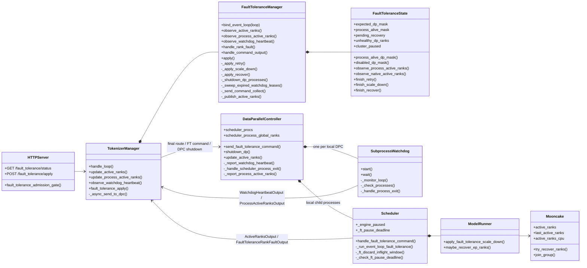
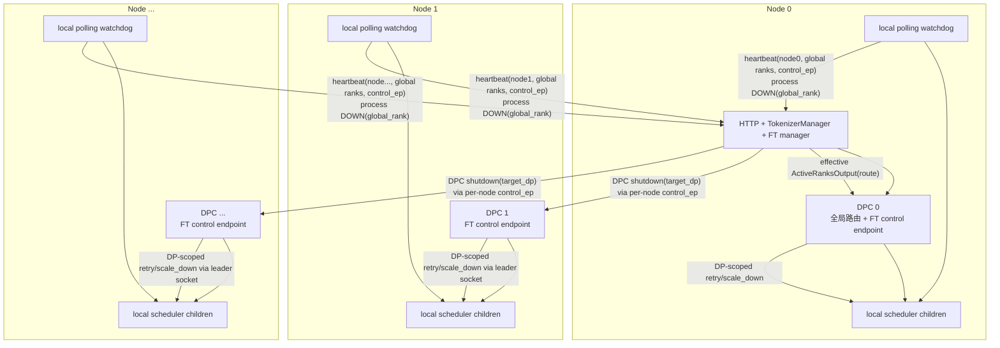
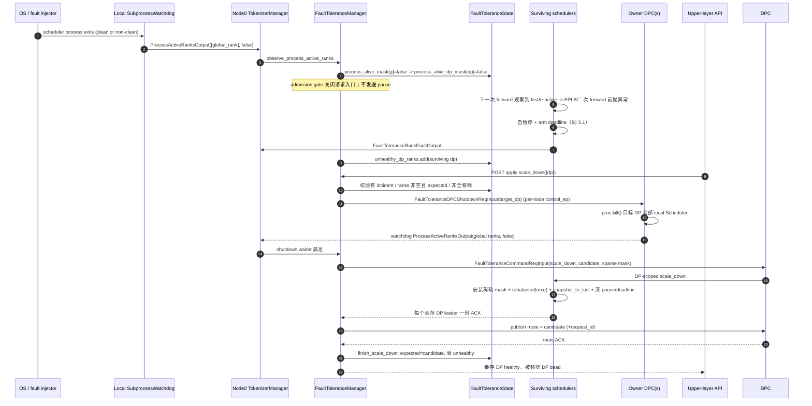
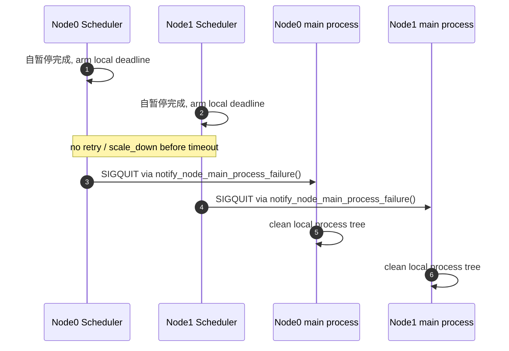
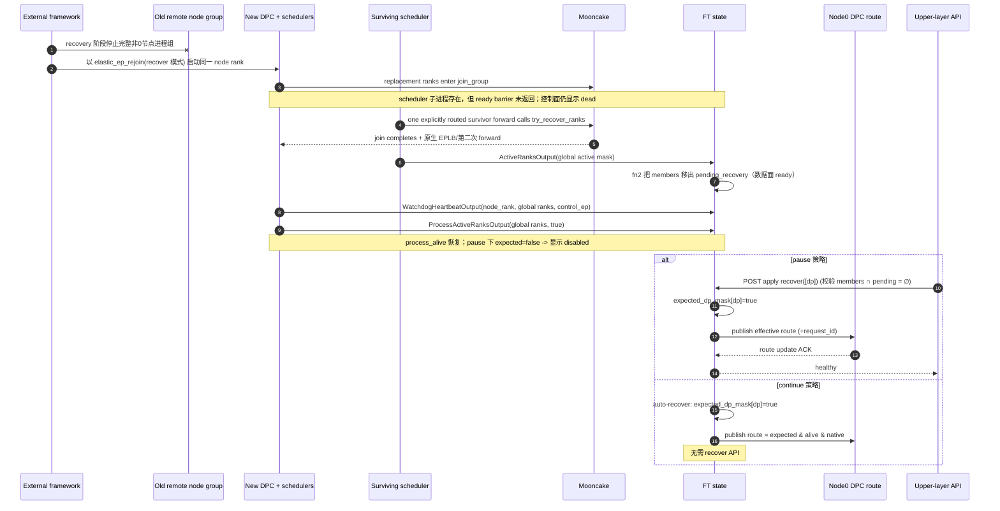

# SGLang Scheduler 自暂停与 whole-DP 容错架构设计与验证指南

生成时间：2026-08-07<br>
最后更新：2026-08-07<br>
用途：给人工审查者和后续 Codex agent 提供最新、可独立阅读的架构与测试上下文。<br>
当前代码基准：SGLang `codex/ft-self-pause-minimal@b7c6f9229`。<br>
基线锚点：`300f63f794066da9e0b23c63247b466c69c6c82c`（rebase 到 main 后的 Mooncake elastic EP recovery 集成点，本设计在此基础上构建）。

> 本文区分三种结论：
>
> - **设计不变量**：当前方案必须保持，不因局部 bug 改变。
> - **已验证**：已有运行产物，但结论范围仍以产物中的实际断言为准。
> - **待验证/实现风险**：设计目标明确，但当前代码或测试还没有通过。
>
> 本文是 SGLang DP 粒度容错的独立设计规格，可独立阅读，不依赖任何前代文档。与同目录规范 `SELF_PAUSE_WHOLE_DP_FT.md` 冲突时，规范中的 12 条核心约束是 normative；本文负责把它落到当前代码的精确接口、流程和验证边界上。

## 1. Goal & Context

### 1.1 目标

在 SGLang 原生 Mooncake elastic EP + EPLB 的基础上，以**尽量少的生产代码**实现 DP 粒度容错。核心思路是：**暂停由 Scheduler 自暂停完成**，**拓扑变化统一收敛为整 DP 移除 + 原生 nnodes 重拉**：

1. 中心不发送 `pause`，也不等待 pause ACK。Scheduler 在 forward 异常边界**自行**置 `_engine_paused` 并启动本地 fail-stop deadline，只向中心上报一次 `FaultToleranceRankFaultOutput`。
2. Mooncake 的 `active_ranks` 是**数据面观察量**，不是 pause 策略下的控制面拓扑真相。控制面拓扑由 `expected_dp_mask`（已提交执行拓扑）单独决定。
3. 原 `SubprocessWatchdog` 机制完整保留，`process_alive_mask` 是**进程存活的唯一权威来源**，粒度为 **global Scheduler rank**。
4. `retry` 只验证 recoverable exception 这一条路径；kill 或进程退出只能验证 `scale_down`。
5. `scale_down` 总是关闭整个目标 DP：目标 DP 内全部 `A*C` 个 Scheduler 都被 kill，幸存者安装稀疏 global active mask 并强制 EPLB rebalance。
6. `rejoin` 总是按原生 `nnodes` node process group 整组重拉，不引入 DP-scoped respawn。
7. `recover` 只提交 `expected_dp_mask` 和 DPC route，不向 Scheduler 下发任何命令。
8. 公共状态只有 `healthy`、`unhealthy`、`dead`、`disabled`，没有 `paused`。

### 1.2 五个基础事实

这些事实决定了设计边界：

1. **Mooncake 按 global rank 隔离和 rejoin。** 它的 `active_ranks` 只在 survivor forward 时被刷新，控制面不能拿它当实时拓扑真相。
2. **SGLang 按 `nnodes` 启动和重启节点进程组。** 没有也不引入 DP-scoped respawn 路径。
3. **FT 控制面只对 expected DP 执行 `retry`、`scale_down`、`recover` 和路由。** 被 scale-down 移除的 DP 不再形成新 incident。
4. **watchdog 每秒轮询本地 scheduler 进程并向 Node 0 上报 `node_rank + global scheduler ranks + control_endpoint` heartbeat；单进程退出仍按 global rank 上报 DOWN。**
5. **Scheduler 是自己的 pause/deadline 决策者。** 中心只对 expected DP 的 leader 下发 `retry`/`scale_down` 命令并等待其 ACK。

因此，故障检测（watchdog/heartbeat）、进程生命周期（整节点重拉）、数据面 membership（Mooncake/EPLB）和请求路由（DPC route）不是同一层级，必须作为独立信息源处理。

### 1.3 明确不做

- 中心不发送 `pause`，不维护 `paused_dp_ranks`，不做 MLP-sync `PAUSE_READY` 全局 pause barrier。
- 不保存 Mooncake active mask 的控制面权威副本。
- 不引入 provisional active、`recover_commit`、incarnation、sequence、retired generation、owner pin。
- 不加 shutdown ACK、grace period 或 lease-DOWN 补 ACK。scale-down 的 EPLB 阶段必须增加幸存者请求边界同步；这不是中心发送通用 pause，也不改变 shutdown 的 process-DOWN 完成条件。
- `recover` 不向 Scheduler 下发命令、不重排专家、不做 topology expansion。
- `retry` 不携带 active mask、不接受 Mooncake 上报、不触发 EPLB。
- 不实现非预期异常窗口的健壮性分支（见第 1.4 节的"不要求处理"）；生产代码保持精简，不为这些窗口引入防御分支。
- 不支持 FT 的 `dp_size=1`、`pp_size != 1`、NPU、PD 分离、Ray、多 tokenizer、非 Mooncake backend、运行时 EP scale（`max_ep_size != dp_size` 或 `ep_join_mode == "scale"`）。
- 不处理 Node 0 / Tokenizer 所在控制面整机故障。
- 不把一个 scheduler 的普通 child-exit 升级为清理全部本地进程；成功自暂停后无人处置超时是独立的服务级 fail-stop，不改变 child-exit 语义。

### 1.4 不要求处理（明确的健壮性边界）

新架构刻意不为以下非预期窗口增加防御分支；这些场景的失败是**可接受的未定义行为**，不是必须修复的 bug：

- 真实进程故障后错误调用 `retry`。
- FT 操作进行中发生第二次独立故障、消息丢失、DPC 换代或重复请求。
- rejoiner 在 `disabled`/`recover` 窗口再次退出。
- `A*C>1` 时 leader 死亡但 sibling 残存（sibling 仍卡在本 DP leader 的 work broadcast，见第 4.6 节）。

### 1.5 关键路径

- SGLang 最新源码：`D:\Codex\repos\sglang-ft-self-pause-minimal`
- Remote-agent 测试：`D:\Codex\projects\workflow\remote-agent`

## 2. Physical State

### 2.1 SGLang

当前代码线：

- Workspace：`D:\Codex\repos\sglang-ft-self-pause-minimal`
- Branch：`codex/ft-self-pause-minimal`
- HEAD：`b7c6f9229`
- Base：`300f63f794066da9e0b23c63247b466c69c6c82c`（rebase 到 main 后的 Mooncake elastic EP recovery 集成点，本设计在此基础上构建）
- Git status：检查时 clean；继续工作前必须重新执行 `git status --short`

当前代码线相对基线锚点的提交：

```text
b7c6f9229 refactor(ft): replace disabled latch with pending-recovery set
764933930 fix(elastic-ep): reset dispatch after rank mask changes
5f748011b refactor(ft): simplify self-pause recovery
```

当前 FT 实现的主要非测试改动位于（含自 `300f63f79` 起完整保留的部分）：

```text
python/sglang/srt/entrypoints/http_server.py
python/sglang/srt/fault_tolerance/controller.py
python/sglang/srt/fault_tolerance/manager.py
python/sglang/srt/managers/data_parallel_controller.py
python/sglang/srt/managers/io_struct.py
python/sglang/srt/managers/scheduler.py
python/sglang/srt/managers/scheduler_components/dp_attn.py
python/sglang/srt/managers/scheduler_components/request_receiver.py
python/sglang/srt/managers/tokenizer_manager.py
python/sglang/srt/model_executor/model_runner.py
python/sglang/srt/server_args.py
python/sglang/srt/utils/common.py
python/sglang/srt/utils/watchdog.py
python/sglang/srt/elastic_ep/elastic_ep.py
python/sglang/srt/eplb/eplb_manager.py
python/sglang/srt/eplb/expert_location.py
python/sglang/srt/layers/moe/token_dispatcher/mooncake.py
```

### 2.2 Remote-agent

- Workspace：`D:\Codex\projects\workflow\remote-agent`
- 用途：维护可执行 case 和命令；运行完成后把结论及证据边界回写本文第 7、8 节，不再新建平行的验证进度文档。

### 2.3 文档与验证证据职责

- 本文是唯一持续维护的架构、限制、当前验证结论和待办入口。
- `sglang-ft-self-pause-minimal` 是最新实现线；新的代码审查、修复和验证结论必须以这条线的精确 HEAD 为准。
- remote-agent 只维护可执行 case 和命令；运行结论回写本文第 7、8 节。

## 3. Current Progress

### 3.1 一页结论

本节的架构与接口行为以 `codex/ft-self-pause-minimal@b7c6f9229` 为准。当前架构由**一个控制面意图集合、一个进程事实源、一个临时异常集合、一个数据面待恢复集合**组成，Mooncake active 只作为数据面观察量：

```text
expected_dp_mask:     bool[D]   已提交执行拓扑；初始全 true，scale-down 清零，recover/continue-auto-recover 置回
process_alive_mask:   bool[T]   global Scheduler rank 粒度进程存活（watchdog 权威）
pending_recovery:     set[int]  global rank 粒度"进程死了 / 数据面还没恢复完"的待恢复集合
unhealthy_dp_ranks:   set[dp]   pause 策略下 Scheduler 上报的 recoverable exception
ft_operation_in_progress: bool
cluster_paused:       bool      集群整体暂停开关（仅 pause 策略生效于 admission）
route_mask:           bool[D]   manager 私有的最后 DPC route
watchdog_leases:      node -> (monotonic_time, owned global scheduler ranks)
```

关键派生：

```text
ranks_per_dp R = T / D = A * C
members(dp)  = global ranks [dp*R, (dp+1)*R)

process_alive_dp_mask[dp] = all(process_alive_mask[r] for r in members(dp))
                            # 一个 DP 只有全部 global Scheduler 成员存活才 process-alive
disabled_dp_mask[dp]      = (not expected_dp_mask[dp]) and process_alive_dp_mask[dp]
                            # 派生显示态：已 scale-down，且 replacement Scheduler
                            # 完成 native join/ready 后由 ProcessUp 标记存活
```

`pending_recovery` 是"数据面是否 ready"的**反向锁存**，由两个钩子维护：

- **fn1**：进程进 dead（watchdog `ProcessActiveRanksOutput(active=False)`）→ 把这些 global rank **加入** pending。
- **fn2**：Mooncake native-active 上报某 rank 翻 true → 把它**移出** pending。**只接 native-active，绝不接 process-up**——进程拉起只翻 process_alive_mask，只有 survivor 恢复 forward 把 `try_recover_ranks` 做完、Mooncake 上报该位变 active，才证明数据面 ready。

公共状态按优先级计算（controller `_rank_state`，**没有 `paused`，也没有 `recovering`**）：

```text
process_alive_dp_mask[dp] == false                -> dead
expected_dp_mask[dp] == false                     -> disabled   (native join/ready 后 ProcessUp 即 disabled；pending 只拦 recover，不改显示)
expected == true 且 dp in unhealthy_dp_ranks      -> unhealthy
否则                                              -> healthy
```

最重要的行为：

- **pause 策略下，Scheduler 在 forward 异常边界自行暂停**：丢弃当前 in-flight window，置 `_engine_paused=true` 并启动本地 `_ft_pause_deadline`（monotonic + `fault_tolerance_pause_timeout`），上报一次 `FaultToleranceRankFaultOutput`；中心把对应 DP 记入 `unhealthy_dp_ranks` 并置 `cluster_paused` 关闭请求入口，**不发送 pause、不等待 ACK**。
- **进程退出路径下其他幸存 Scheduler 也走自暂停**：watchdog 把 global-rank DOWN 上报给中心，中心置 `cluster_paused` 关闭请求入口；幸存 Scheduler 在下一次 forward 前观察到 `last_active_ranks & ~active_ranks`（membership 丢失），在 EPLB 和第二次 forward 之前抛异常，进入与上面相同的自暂停流程。
- **watchdog 是进程事实的 fast path**。heartbeat 首次上报建立 `node_rank -> owned global ranks + control_endpoint` 映射；Node 0 每秒扫描 lease，5 秒未刷新则把该 node 拥有的 global ranks 复用 process-DOWN 路径置为不存活。
- **heartbeat 永不把 false 位恢复为 true**；只有 rejoin DPC 的显式 `ProcessActiveRanksOutput(active=true)`（ProcessUp）恢复进程位。
- **Mooncake active 不进入控制面拓扑**。它只驱动两件事：(1) fn2，把恢复完成的 rank 移出 pending；(2) `continue` 策略下参与 route 合成与 auto-recover。它**不能**改写 pause 策略下的 `expected_dp_mask`。
- **`disabled` 不是存储锁存，而是派生显示态**：`expected=false` 且 replacement Scheduler 完成 native join/ready、DPC 发出 ProcessUp 后，DP 即显示 `disabled`。当前原生启动屏障使 ProcessUp 晚于 survivor recovery-drive，因此端到端 rejoin 通常不会暴露 `disabled` 且仍 pending 的窗口；`recover` 仍必须独立检查 `pending_recovery`，该防线由状态机单测覆盖。
- **scale-down 的 shutdown/拓扑提交仍是一次事务，但 EPLB 前后必须做幸存者 cohort 同步**：owner DPC kill 目标 DP 全部 local Scheduler → 等 watchdog 把这些 global rank 标 DOWN → 每个幸存 Scheduler 到达安全请求边界并 park，确认不再处理上一轮 Mooncake operation → 全体确认后安装同一稀疏 global mask + 强制 EPLB rebalance + 快照到 `last_active_ranks`，并保持 parked → 收齐完成 ACK 后发布 route → release 全部幸存者 → 提交 expected。现有 `b7c6f9229` 尚未实现该同步，见 7.3。
- 被 scale-down 移除的 DP 后续退出**不形成新 incident**，因为 `has_incident()` 只检查 expected DP。

### 3.2 拓扑术语

本文使用：

```text
T = tp_size
D = dp_size
N = nnodes
C = attn_cp_size
R = T / D = A * C          # 每个 DP 的 global Scheduler 成员数
A = attention_tp_size = T / (D * C)
global scheduler ranks = [0, T)
members(dp) = [dp * R, (dp + 1) * R)
```

当前只支持 `PP=1`、节点持有连续 TP rank。global rank 布局连续，`dp_rank = tp_rank // (A * C) = tp_rank // R`。node rank 和 DP rank 不是同一概念；`D = N` 通常每节点一个 DP，`D > N` 一个节点可承载多个 DP，`D < N` 一个 DP 跨多个节点。

### 3.3 模块说明

| 模块 | 角色 | 持有的状态 | 不负责什么 |
| --- | --- | --- | --- |
| HTTP server | 暴露 `/fault_tolerance/status`、`/fault_tolerance/apply`，执行 admission gate | 无独立 FT 状态 | 不决定 rank 是否可用 |
| `TokenizerManager` | Node 0 控制面入口，汇总 scheduler/DPC 消息，转发最终路由；维护 per-node DPC control socket | 持有 `FaultToleranceManager`、`_dpc_control_endpoints/sockets` | 不自行推导状态 |
| `FaultToleranceManager` | 异步编排 retry/scale-down/recover、route ACK、watchdog lease、continue auto-recover、控制命令失败后的 fail-stop | pending command/shutdown/route future、`node_rank -> (last_seen, ranks)` lease、`route_mask` | 不发送 pause、不等待 pause ACK、不保存 Mooncake 权威 mask |
| `FaultToleranceState` | 纯状态与状态转移 | `expected_dp_mask`、`process_alive_mask`、`pending_recovery`、`unhealthy_dp_ranks`、`ft_operation_in_progress`、`cluster_paused` | 不做 IPC；`disabled` 只作派生显示态 |
| `DataParallelController` | 每节点启动本地 scheduler；FT 命令转发；初始/周期 heartbeat 与本地 process-DOWN 上报；执行 `shutdown_dp` kill | 本地 child `Process` 对象、DP route mask、watchdog-thread 私有 PUSH sender、`ft_control_endpoint` | 不拥有全局 FT 状态 |
| `SubprocessWatchdog` | 每秒轮询本地 child；执行 exit callback 和 `on_poll` heartbeat | 本地已上报 index 集合、stop event | 不推导全局 node/DP 状态 |
| `Scheduler` | 执行 batch；**自暂停**：异常边界置 `_engine_paused` + 本地 deadline；响应 DP 级 `retry`/`scale_down`；上报 exception 和 Mooncake DP membership | `_engine_paused`、`_ft_pause_deadline`、本 rank 运行状态 | 不决定全局路由，不接收中心 pause；deadline 到期只通知本节点 main process |
| `ModelRunner` / EPLB / Mooncake | 维护 global rank membership，forward 前检测 membership 丢失，执行 `retry`/`scale_down` 的 mask 恢复与 rebalance | rank 级 `active_ranks`/`last_active_ranks`/`active_ranks_cpu` | 不维护控制面 `expected_dp_mask` |

### 3.4 类图



### 3.5 多节点进程布局

每个逻辑节点都有自己的 DPC 和本地 watchdog。**所有节点的 DPC 在 FT 模式下都运行自己的 event loop**（不再是只有 Node 0 跑路由、其余 `watchdog.wait()`），因为每个 DPC 都要能接受 `FaultToleranceDPCShutdownReqInput` kill 请求。只有 Node 0 的 DPC 持有 `recv_from_tokenizer` 并做全局请求路由；非 0 节点 DPC 只监听自己的 FT control endpoint。



一个节点可有多个 DP，一个 DP 也可跨节点。watchdog 只保存本节点真实 `Process` 对象，不需要远程 PID。

每个 Scheduler 都是本节点 DPC 的 child，DPC 又是本节点 main process 的 child。成功自暂停后，各 Scheduler 独立维护同样的 monotonic deadline；到期时 `notify_node_main_process_failure()` 从 Scheduler 定位 parent DPC 和 grandparent node main，并向本节点 main process 发送 `SIGQUIT`，由既有 node-main signal handler 清理本节点进程树。该路径不需要 Node 0 广播退出。

### 3.6 消息模型

| 消息 | 发送者 | 接收者 | 语义 |
| --- | --- | --- | --- |
| `WatchdogHeartbeatOutput(node_rank, ranks, control_endpoint)` | 每节点 DPC watchdog；scheduler ready barrier 后的初始注册 | Node 0 TokenizerManager | 首次建立 `node_rank -> owned global ranks` 映射并携带本 DPC control endpoint；后续只刷新 lease；绝不执行 process-UP |
| `ProcessActiveRanksOutput(ranks, active)` | 每节点 DPC watchdog；rejoin DPC | Node 0 TokenizerManager | **global Scheduler rank** 粒度的进程存活事实 |
| `ActiveRanksOutput(status, request_id)` | scheduler / FT manager | TokenizerManager / Node 0 DPC | scheduler 侧是 Mooncake global active mask 投影（数据面观察量）；manager 侧是派生最终 route（带 `request_id` 时要求 DPC ACK） |
| `FaultToleranceCommandReqInput(request_id, command, target_ranks, active_mask)` | FT manager | Node 0 DPC -> DP scheduler block | DP 级 `retry` / `scale_down`；`active_mask` 仅 scale_down 携带（稀疏 global mask） |
| `FaultToleranceCommandReqOutput(request_id, rank, success, message)` | DP attention leader（`attn_tp_rank==0 && attn_cp_rank==0`） | FT manager | retry/scale_down ACK；每个目标 DP 一份 |
| `FaultToleranceDPCShutdownReqInput(target_dp_ranks)` | FT manager | owner DPC（经 per-node control endpoint） | 请求 DPC kill 目标 DP 的全部本地 Scheduler |
| `ActiveRanksUpdateReqOutput(request_id, success)` | Node 0 DPC | FT manager | apply 过程中的 route 发布 ACK |
| `FaultToleranceRankFaultOutput(rank, message)` | scheduler | FT manager | recoverable Python exception；`rank` 是 **dp_rank**；不表示进程或 membership 已下线 |

Mooncake recovery 的控制面可见结果只有 `ActiveRanksOutput`（数据面 active mask），它**不能**直接修改 `expected_dp_mask`，只驱动 fn2（把恢复完成的 rank 移出 `pending_recovery`）；continue 策略下 fn2 再顺带 auto-recover（翻 expected）。

#### 3.6.1 FT 命令与回流消息的闭环

`/fault_tolerance/apply` 不经过 TokenizerManager 的结果 dispatcher：HTTP handler 直接调用 `TokenizerManager.fault_tolerance_apply()`，再由 `FaultToleranceManager` 创建 FT 命令并通过 `TokenizerManager._async_dispatch_to_scheduler`（即 `send_to_scheduler`，Node 0 DPC 的 `scheduler_input_ipc_name`）发往 Node 0 DPC。下发和回流分别如下：

```text
apply HTTP -> TokenizerManager -> FaultToleranceManager
    -> FaultToleranceCommandReqInput(retry|scale_down) -> Node 0 DPC scheduler_input
    -> target DP leader scheduler -> 该 DP 的 attn TP/CP block 内广播
    -> FaultToleranceCommandReqOutput -> TokenizerManager result dispatcher
    -> FaultToleranceManager pending-command future
```

scale-down 还包含一条独立的 kill 路径：

```text
FT manager -> per-node DPC control socket (PUSH -> DPC PULL control_endpoint)
    -> FaultToleranceDPCShutdownReqInput -> owner DPC.shutdown_dp()
    -> proc.kill() 目标 DP 的全部 local Scheduler
    -> 各 DPC watchdog 上报 ProcessActiveRanksOutput(global ranks, active=false)
    -> FT manager shutdown waiter 满足
```

- DPC 的 `FaultToleranceCommandReqInput` handler 直接向 `target_ranks` 对应的 DP leader socket 投递；它不走 `send_control_message()` fallback，也不受当前 route mask 限制（否则已关闭 route 的 DP 无法被 resume）。
- scheduler 把 FT 命令归为 control request；FT 启用时 `request_receiver` 强制走 `enable_dp_attention_local_control_broadcast` 语义，在接收命令的 DP 所属 `attn_tp_group + attn_cp_group` 内广播，**非 leader 成员执行命令但不回 ACK**。
- 对 FT 而言，TokenizerManager 的 `init_request_dispatcher()` 接收以下回流消息：

| 回流消息 | 发送者 | TokenizerManager handler | 结果 |
| --- | --- | --- | --- |
| `FaultToleranceCommandReqOutput` | target scheduler block 的 leader | `FaultToleranceManager.handle_command_output` | 完成 retry/scale_down ACK future；失败或超时由 apply 事务 fail-stop。 |
| `ActiveRanksUpdateReqOutput` | Node 0 DPC | `FaultToleranceManager.handle_active_ranks_update_output` | 完成 route 发布 ACK future。 |
| `FaultToleranceRankFaultOutput` | scheduler | `FaultToleranceManager.handle_rank_fault` | 把 dp_rank 记入 `unhealthy_dp_ranks`（仅 pause 策略）。 |
| `ProcessActiveRanksOutput` | 各节点 DPC watchdog；rejoin DPC | `TokenizerManager.update_process_active_ranks` | 更新 global-rank 进程事实；scale-down 时满足 shutdown waiter；continue 策略必要时回发 route。 |
| `WatchdogHeartbeatOutput` | 各节点 DPC | `TokenizerManager.observe_watchdog_heartbeat` | 建立/刷新 node lease；注册 per-node DPC control socket。 |

`ActiveRanksOutput` 本身有两条流向：scheduler 把 Mooncake membership 投影回 TokenizerManager（数据面观察量）；FT manager 派生最终 route 后下发 Node 0 DPC（带 `request_id` 走 ACK）。它不是 pause/resume 的 ACK。

### 3.7 watchdog 语义

`SubprocessWatchdog` 机制**完整保留**，仅粒度从 DP rank 改为 global Scheduler rank：

- 使用 `stop_event.wait(interval=1s)`（`FT_WATCHDOG_POLL_INTERVAL=1.0`）周期轮询；每轮先 `_check_processes()`，再执行 `on_poll` heartbeat。
- `_reported` 保证每个 child 的退出回调只执行一次。FT DPC 显式设置 `report_clean_exit=true`、`fail_stop_on_exit=false`：scheduler 无论退出码是否为 0 都上报 global-rank process-DOWN，但 clean exit 不触发默认 SIGQUIT，一个 child 退出后继续监控其余 child。
- 只要配置了 `on_poll`，即使全部 child 已退出，watchdog 仍持续 heartbeat，直到显式 `stop()` 或 DPC/watchdog 本身退出。
- DPC 主线程同步等待所有本地 Scheduler 完成初始化 pipe；该 ready barrier 返回后，先用 `send_to_tokenizer` PUSH 发送一次初始 `WatchdogHeartbeatOutput`（携带 `control_endpoint`），再启动周期 watchdog。周期 heartbeat 与本地 process-DOWN 使用 watchdog 线程懒建并独占的另一只持久 PUSH（`SNDHWM=1`、`IMMEDIATE`、`SNDTIMEO=FT_WATCHDOG_SEND_TIMEOUT_MS=1000`）；heartbeat 用 `NOBLOCK` 允许丢弃单次刷新，process-DOWN 用限时阻塞发送并先于随后 heartbeat 入队。
- Node 0 首次收到 heartbeat 时固定记录 `node_rank -> sorted(owned global ranks)` 和接收端 monotonic 时间，后续同节点 heartbeat **只刷新时间，不更新 ranks**；同时 TokenizerManager 按 `control_endpoint` 建立/更新该 node 的 DPC control PUSH socket。每秒扫描一次，5 秒（`WATCHDOG_LEASE_TIMEOUT_SEC=5`）未刷新则合并所有过期 node 的 global ranks，复用一次 `ProcessActiveRanksOutput(active=false)` 处理路径。
- heartbeat 本身永远不把 process 标为 true；late heartbeat 只重新注册 lease。process-UP 仍只能由 rejoin DPC 在 scheduler ready barrier 返回后显式上报。

成功自暂停后的超时退出**不是** `SoftWatchdog`/`HardWatchdog`/`SubprocessWatchdog` 的新分支，也不是 FT manager 的 `asyncio.TimerHandle`。它是每个 Scheduler event loop 检查的 monotonic deadline：无需新增线程或 IPC，每个节点都能独立通知自己的 node main。`SubprocessWatchdog` 仍只负责 child 存活轮询和 heartbeat；`HardWatchdog`/`SoftWatchdog` 仍负责既有 forward-progress 监控。

### 3.8 scheduler 自暂停与控制语义

Scheduler 是 pause 的决策者。两条进入暂停的路径：

**(a) recoverable exception。** `_run_event_loop_fault_tolerance` 包住 `dispatch_event_loop`；`dispatch_event_loop` 返回后循环重新进入。event loop 抛异常时：

1. `_ft_discard_inflight_window(exc)` 按 request ID 去重清理 `cur_batch_for_debug`、`last_batch`、`running_batch`、`result_queue`、`chunked_req` 构成的完整不确定窗口，逐请求回退未提交 KV 尾部并发送 `SchedulerFault/503`；waiting queue 不属于已执行窗口，继续保留。
2. 若策略是 `pause`（或 `continue` 但 discard 未成功），置 `_engine_paused=True` 并启动 `_ft_pause_deadline = monotonic + fault_tolerance_pause_timeout`。
3. 上报一次 `FaultToleranceRankFaultOutput(dp_rank, message)`。
4. 若策略是 `continue` 且 discard 成功，直接 `continue` event loop，不进入暂停。

**(b) 进程退出导致的 membership 丢失。** `model_runner` 在 EPLB 和第二次 forward 之前检查：

```python
if (last_active_ranks.bool() & ~active_ranks.bool()).any():
    raise RuntimeError("Elastic EP membership loss detected before EPLB")
```

幸存 Scheduler 因此在一次 forward 中观察到 Mooncake active 下降沿，抛异常并走 (a) 的自暂停流程。中心不发送 pause。

**中心对 Scheduler 的控制只有两个 DP 级命令**（`handle_fault_tolerance_command`）：

- `retry`：`active_ranks.copy_(last_active_ranks)`、`active_ranks_cpu.copy_(last_active_ranks.cpu())`，把数据面恢复到异常前已提交的 mask；随后清 `_engine_paused=False`、清 deadline。**不携带新 mask、不触发 EPLB。**
- `scale_down`：调用 `model_runner.apply_fault_tolerance_scale_down(recv_req.active_mask)`（见 3.9）；随后清 `_engine_paused=False`、清 deadline。

两个命令执行后，仅由 `attn_tp_rank==0 && attn_cp_rank==0` 的 leader 返回该 DP 的 `FaultToleranceCommandReqOutput(success=True)`。**命令失败或 ACK 超时由 apply 事务 fail-stop**；这是控制事务路径，与"成功自暂停后无人处置"的本地 deadline 路径是两条独立的 fail-stop。

`_check_ft_pause_deadline` 在每个 event loop 迭代里检查：deadline 到期先清 None（只通知一次），再 `notify_node_main_process_failure()` 向本节点 main process 发 `SIGQUIT`。

### 3.9 `retry` / `scale_down` 在 ModelRunner 的数据面动作

`apply_fault_tolerance_scale_down(active_mask)`：

```text
active_ranks.copy_(sparse_global_mask)
active_ranks_cpu.copy_(sparse_global_mask.cpu())
EPLBManager.rebalance(force=True)   # 强制重排到稀疏拓扑
snapshot_active_to_last()           # 把新 mask 快照到 last_active_ranks
```

- `rebalance(force=True)` 跳过 `_check_rebalance_needed` 的利用率门（但 `_rebalance_disabled_reason` 仍会短路），用 `ExpertLocationMetadata.init_by_eplb` 重新求解并 `update_expert_location_with_recovery`。`force` 只绕过利用率门，**不**注入 logical_count；rebalance 用的是 EPLB 已累积的分布统计。
- `snapshot_active_to_last()` 让 `last_active_ranks` 追上已提交拓扑，避免 membership-loss 检查在 scale-down 提交后又把幸存者误判为丢成员。
- Mooncake dispatcher 侧（`token_dispatcher/mooncake.py`）在每次 dispatch 记录 `active_ranks` 签名；签名变化时把 `first_execution` 复位为 True，强制 buffer 在新 rank mask 下重新握手。这是 `764933930` 修复的内容。

`retry` 的 mask 恢复（`active_ranks ← last_active_ranks`）依赖 `last_active_ranks` 仍是异常前已提交的拓扑；因此 retry 的严格前置条件是"集群没有真实进程故障"（见第 4.3 节）。

### 3.10 为什么 FT manager 仍绑定 TokenizerManager 的 event loop

`FaultToleranceManager` 不创建第二个控制线程或第二个 asyncio loop。它在 TokenizerManager 的 loop 上：

- 创建 retry/scale-down/recover 的 command/shutdown/route future 并完成它们。
- 创建唯一的 watchdog lease sweep task，串行处理 heartbeat、lease timeout 和 process-DOWN 状态转移。
- 维护 per-node DPC control socket。
- 使用同一个异步 ZMQ sender（`send_to_scheduler`）和 per-node DPC sender（`send_to_dpc`）。

这样 scheduler/DPC 输出的处理、状态转移和 future 完成都在同一 loop 中串行发生，避免跨 loop future 和并发状态修改。控制事务失败（command/route/shutdown 超时或显式失败）统一走 `_failstop`：`kill_process_tree(os.getpid(), include_parent=True)`，即 Node 0 控制面整机 fail-stop。

## 4. Key Decisions & Assumptions

### 4.1 状态转移原则

#### 进程故障

FT DPC 监控到任一 scheduler 退出（包括 clean exit），按 **global rank** 上报：

```text
process_alive_mask[global_rank] = false
=> process_alive_dp_mask[dp] = false   (该 DP 任一成员不存活即整 DP dead)
```

`A*C>1` 时，外部只 kill 一个成员也先把整个 DP 投影为 `dead`；后续 `scale_down` 再 kill 其余 sibling。如果整个 DPC/watchdog 所在节点一起退出，Node 0 收不到单 child DOWN，但对应 heartbeat 停止；5 秒 lease 超时后按首次注册的 `node_rank -> global ranks` 映射把这些 rank 复用同一 process-DOWN 路径置为不存活。

#### Mooncake active（数据面观察量）

survivor forward 后，scheduler 上报的 Mooncake global active mask 投影成 DP mask（`project_global_mask`，DP 内取 `all`）。它**不写入控制面拓扑**，只驱动两件事：

1. **fn2（`observe_native_active_ranks`）**：把 native-active 翻 true 的 global rank 从 `pending_recovery` 移出——这是"数据面 ready"的唯一精确信号，也是 `recover` 校验的依据。
2. **`continue` 策略**下参与 route 合成与 auto-recover（见 4.5）。

pause 策略下，`observe_active_ranks` 返回 `None`，不下发任何 route。

#### scale-down（整 DP 移除）

```text
expected_dp_mask[dp] = false
```

由 `scale_down` 控制事务完成（见 4.4），同时 kill 目标 DP 全部成员，并在幸存者请求边界同步后安装稀疏 mask、强制 rebalance。

#### rejoin 与 recover

pause 策略下，DP 在 rejoin 后最终恢复为 `healthy` 并重新接收请求，需要按顺序满足：

```text
1. 整 node 进程组重拉；replacement Scheduler 进入 native join，控制面仍显示 dead
2. 显式 survivor forward -> Mooncake try_recover，解除 replacement join；再执行原生 EPLB/第二次 forward
3. native active 翻 true -> fn2 把 members(dp) 移出 pending_recovery（数据面 ready）
4. replacement Scheduler 初始化完成 -> DPC ready barrier 返回 -> initial heartbeat + ProcessUp
   -> process_alive_mask 恢复；因 expected=false，显示 disabled
5. recover(dp) -> 校验 members(dp) ∩ pending_recovery == ∅ -> expected_dp_mask[dp]=true
   -> publish DPC route -> 状态 healthy
```

`recover` 不发送 Scheduler 命令、不重排专家、不做 topology expansion；所有数据面扩容必须在 `recover` 前由原生 rejoin forward 完成。continue 策略下最后一步由 fn2/ProcessUp 状态汇合后自动完成，无需 `recover`（见 4.5）。

### 4.2 `pause` 策略

#### recoverable exception

Scheduler 自暂停（3.8(a)），中心只记 `unhealthy_dp_ranks` 并经 admission gate 关闭请求入口（返回 503）。`/fault_tolerance/status`、`/fault_tolerance/apply`、`/health`、`/metrics`、`/ping` 保持可访问。上层在 deadline 前执行 `retry` 或 `scale_down`；deadline 到期仍未恢复时，各 Scheduler 分别通知本节点 main process 执行 fail-stop。

#### 进程退出

watchdog 先更新 `process_alive_mask`，中心据此关闭请求入口；幸存 Scheduler 在下一次 forward 观察到 membership 丢失后自暂停（3.8(b)）。中心同样只关闭入口、不发送 pause。此场景**不能用 `retry` 恢复**（存在真实进程故障），只能用 `scale_down`。

### 4.3 `retry`

`/fault_tolerance/apply` 当前请求格式为：

```json
{
  "instruction": "retry",
  "params": {}
}
```

`params.timeout` 可覆盖本次控制事务超时；未提供时使用 `fault_tolerance_timeout`。请求对象必须同时包含 `instruction` 和 `params`。

`retry` 的严格语义是"集群没有真实故障，恢复异常前已提交的数据面状态"：

- 只允许存在 `unhealthy` DP 时调用（`retry_requires_unhealthy_rank`）。
- 要求所有 `expected=true` DP 的全部进程仍存活（`retry_requires_all_expected_processes_alive`）；有真实进程故障时返回 400。
- 流程：向所有 expected DP leader 下发 `retry`（`active_ranks ← last_active_ranks`，清 pause/deadline）→ 收集每个 DP 的 ACK → `publish DPC route = expected_dp_mask` → 清 `unhealthy_dp_ranks`。
- 不携带 active mask、不接受 Mooncake 上报、不触发 EPLB。控制命令完成仍使用原 Scheduler command response，**不增加全局 pause barrier**。

**拓扑收缩不变量**：若已完成 `4 -> 3` scale-down，`expected_dp_mask` 已是三实例；之后 `retry` 只恢复这三个实例，不能因 runtime active 上报重新扩成四实例（单测 `retry_is_maskless_and_uses_expected_topology`）。

进程 kill、真实进程故障和错误状态下调用 `retry` 均不属于支持场景。

### 4.4 `scale_down`

`scale_down(ranks)`：整 DP 移除；控制事务必须在强制 EPLB 前同步全部幸存 Scheduler 的请求边界。

1. 必须已有 incident（exception 或 process-down），否则 `scale_down_requires_incident`。
2. `ranks` 必须非空（`scale_down_requires_ranks`）、全部当前 `expected=true`（`scale_down_requires_expected_ranks`）。
3. 不能移除全部 expected DP（`cannot_scale_down_all_expected_ranks`）。
4. `candidate = expected_dp_mask - requested`。
5. **shutdown**：对拥有目标 global rank 的 owner DPC 发 `FaultToleranceDPCShutdownReqInput`，每个 DPC kill 目标 DP 的全部本地 Scheduler；等原 watchdog 把每个 requested global rank 标 DOWN（`_shutdown_waiter` 满足）。没有 shutdown ACK、grace period 或 lease 代 ACK——shutdown 完成条件直接复用 process-DOWN 事实。
6. **request-boundary prepare/park**：向 candidate（幸存 expected DP）下发 prepare；每个幸存 Scheduler 只有在退出上一轮 forward/Mooncake fault cleanup、到达可执行 FT control 的安全请求边界后才回 prepared ACK，并在该边界等待同一事务的 commit。中心必须收齐 candidate 全部 prepared ACK；任一超时沿用事务 fail-stop。
7. **scale-down commit**：向已经 prepared 的 candidate 下发同一事务的 commit，携带 `expand_dp_mask(candidate)` 稀疏 global mask；幸存者安装 mask、强制 EPLB rebalance、快照到 `last_active_ranks`，但继续保持 parked；收集每个幸存 DP 的完成 ACK。commit 不得在首个 survivor prepared 时提前执行，任一 survivor 也不得在全体完成前恢复 forward。
8. **发布 route**：`publish DPC route = candidate`，等 Node 0 DPC ACK。
9. **release**：向 candidate 下发同一事务的 release，清 pause/deadline并收齐 ACK；此时 admission 仍由 `ft_operation_in_progress` 关闭。
10. **提交**：`expected_dp_mask = candidate`，清 `unhealthy_dp_ranks`，清 `ft_operation_in_progress`。

只用一个 DPC control endpoint 发送 kill 请求；request-boundary prepare/park 只服务于本次 scale-down 的 survivor cohort，不建立公共 `paused` 状态、不新增中心通用 pause 命令，也不改变自暂停架构。实现可以使用 prepare+commit，或证明具备相同 barrier 语义的等价机制；关键不变量是任何 survivor 开始新的 EPLB collective 前，全部 candidate 已离开上一轮 Mooncake operation。

外部可以先 kill 任意 Scheduler，再对该失活 global rank 所属 DP 调用 `scale_down`；`scale_down` 会继续 kill 该 DP 的其余 sibling。完成后该 DP 状态保持 `dead`；完整节点重拉后仍保持 `dead`，直到 survivor forward 完成原生数据面恢复、replacement Scheduler 穿过 ready barrier 并由 DPC 上报 ProcessUp，才显示 `disabled`。

### 4.5 `continue` 策略

`continue` 保持 no-FT 风格，**不暂停集群**：

- membership loss 继续走 Mooncake 原生 EPLB 和第二次 forward。
- kill 不暂停集群、exception 只丢弃当前请求后继续 event loop，两者都不关闭 admission（`cluster_paused` 在 continue 下不影响 admission）；控制面在无故障时只暴露一个 status API。
- DPC route 取 `expected & process_alive & native_active`（`observe_active_ranks`）；process 事件驱动时再按 `route & process_alive` 收敛。
- ProcessUp 本身**不开放 route**，必须等待新的 native active 上报。
- **auto-recover**：fn2 除了把恢复完成的 rank 移出 `pending_recovery`，对"进程就绪 + native-active + 不在 pending"的非 expected DP 直接翻 `expected_dp_mask[dp]=true`，无需 `recover` API。scale-down 在 continue 下不粘滞，DP 一旦数据面恢复即自动 re-admit。
- recoverable exception 不建立 pause incident，公共状态保持 `healthy`，也不执行 retry reset（即不重置 `active_ranks ← last_active_ranks`；`last_active_ranks` 仅由 Mooncake 原生 fault/rebalance 与 recovery 路径推进）。

### 4.6 exception 是独立故障族

scheduler event loop 中的 Python exception：

- 清理逻辑见 3.8(a)：non-overlap 清当前批；overlap 清当前/上一批、running batch、pending result queue 和 chunked request 构成的完整 fault window，按 request ID 去重。
- fault window 内每个已执行请求收到一次 `SchedulerFault/503`；尚在 waiting queue 的请求不被丢弃。
- forward 前已分配、异常时尚未提交的 KV 尾部按真实 token 边界回退并释放，不写入 radix cache。
- scheduler 发送 `FaultToleranceRankFaultOutput(dp_rank, message)`。
- `process_alive_mask` 和 Mooncake mask 都不改变。
- `continue` 策略清理当前 batch 后继续 event loop。
- `pause` 策略自暂停并记 `unhealthy`，等待 `retry` 或 `scale_down`。

固定拓扑中的真实 forward exception 必须让参加同一拓扑操作的所有 rank 同步抛出。测试注入器通过 `tp_group.cpu_group` 上的 collective 协调全拓扑注入。只给一个 DP 注入 exception 可能让其他 rank 卡在 collective，不能用来模拟 scheduler process kill。

### 4.7 HTTP 语义

| 场景 | HTTP |
| --- | --- |
| 显式 `routed_dp_rank` 越界 | 400（`generate_request` 范围检查 `ValueError`） |
| 显式路由到当前 `route_mask` 为 false 的 DP | 400（`validate_routed_rank` 抛 `ValueError`） |
| pause 策略存在 incident | 503 |
| 没有任何 effective active DP | 503 |
| FT 未启用时访问 FT API | 503 |
| apply 缺少必需字段、instruction 不支持、timeout 非正数或 rank 越界 | 400 |
| 另一个 FT operation 正在进行 | 409 |
| `retry` 无 unhealthy / 存在 expected 进程不存活 | 400 |
| `scale_down` 无 incident / ranks 为空 / 目标非 expected / 移除全部 expected | 400 |
| `recover` 目标未拉回（非派生 disabled）/ 任一成员仍在 pending_recovery / 存在 unhealthy DP | 400 |
| apply 路由更新失败 / 控制命令超时或失败 | Node 0 控制面 fail-stop（整机） |
| 成功自暂停后上层在 pause deadline 前未执行有效 retry/scale-down | 每个节点由本地 Scheduler 通知 node main fail-stop |

apply 的严格参数边界目前由调用方负责：`retry` 不带 ranks，`scale_down/recover` 使用当前 expected/disabled 内的 DP 整数列表，任何 instruction 都不得携带未定义业务字段。服务端会忽略 `params` 里多余字段；这些是已知校验 limitation，不扩展产品契约。

### 4.8 启动配置约束

`is_ft_supported_config()` 当前明确拒绝（按 gate 顺序）：

- `dp_size <= 1`
- `enable_dp_attention == false`
- `enable_eplb == false`
- `max_ep_size` 已设置但不等于 `dp_size`（运行时 EP scale）
- `ep_join_mode == "scale"`
- `pp_size != 1`
- `elastic_ep_backend != "mooncake"`
- PD disaggregation
- NPU
- `tokenizer_worker_num > 1`
- Ray engine
- DP attention 下 `tp_size` 不能被 `dp_size * attn_cp_size` 整除

其中 `enable_dp_attention=true` 和 `enable_eplb=true` 是两个硬依赖：自暂停路径和 `scale_down` 的强制 rebalance 都依赖它们。

默认：

```text
fault_tolerance_on_error_strategy = pause
fault_tolerance_timeout = 60 seconds
fault_tolerance_pause_timeout = 300 seconds
```

对应 CLI 参数为 `--fault-tolerance-timeout` 和 `--fault-tolerance-pause-timeout`。`fault_tolerance_timeout` 限制 retry/scale-down 命令 ACK、route 发布 ACK 和 shutdown 等待等控制事务；`fault_tolerance_pause_timeout` 从每个 Scheduler 自暂停时开始计时，限制服务暂停后等待上层处置的时间；既有 `watchdog_timeout` 用于 forward-progress watchdog。三者不能互相替代。

### 4.9 功能支持矩阵

符号：**已验证** = 有明确代码线和精确 HEAD 的运行产物；**设计支持** = 代码路径和设计允许，但应补运行验证；**限定支持** = 只承诺列出的条件；**不支持** = 当前目标明确不覆盖。当前 HEAD 上**尚无 GPU 运行证据**；下表除"单测"外均为设计/限定结论，等待第 7 节回归。

| 功能 | A / 拓扑 | 故障或操作 | 结论 |
| --- | --- | --- | --- |
| watchdog 感知 scheduler 退出（global rank 粒度） | `A>=1`，单/多节点 | 单个本地 scheduler clean/non-clean 退出，DPC 仍存活 | 设计支持；单测覆盖 global-rank DOWN 与 endpoint |
| `A*C>1` kill 一个 sibling | `A>1` | kill DP 内一个 global rank | 设计支持：整 DP 先投影 `dead`；`scale_down` 继续 kill 其余 sibling。单测覆盖 shutdown kill 全部本地成员 |
| exception 自暂停 + 本地 deadline | `A>=1` | recoverable exception | 设计支持；单测覆盖"先置 pause/deadline 再上报"、到期单次通知 node main |
| `retry`（maskless） | `A>=1` | recoverable exception，无真实进程故障 | 设计支持；单测覆盖 maskless、用 expected 拓扑、拒绝进程丢失 |
| `scale_down`（整 DP） | `A>=1` | 已有 incident，移除非空 expected 子集 | 设计目标：shutdown 后先收齐 survivor request-boundary prepared ACK，再统一 commit 稀疏 mask 和 EPLB；收齐完成 ACK、发布 route 后才 release。现实现只发单命令，GPU 连续收缩已证明不满足 cohort 安全性 |
| `4->3` 后 exception `retry` | `D>=4` | scale-down 后再 exception | 设计支持：始终保留三实例，被移除 DP 不可路由 |
| `recover` | `A>=1` | 目标已拉回且数据面 ready（members ∩ pending = ∅），仅提交 expected + route | 设计支持；进程就绪即显示 disabled，pending 单独做 ready 闸 |
| rejoin | `A=1,C=1`，整个非 0 节点进程组外部重启 | Mooncake rank recovery + 原生 EPLB | 设计支持；pause 走 `disabled -> recover -> healthy`，continue 由 fn2 auto-recover |
| `continue` 策略 | `A>=1` | membership loss | 设计支持：原生 EPLB + 第二次 forward + `expected&alive&native` route；单测覆盖 route 三者求交 |
| 整节点 heartbeat lease 静态检测 | DP attention 多节点 | DPC+watchdog 一起消失，无推理 | 设计支持：5 秒 lease 超时按 node->global ranks 置 DOWN；单测覆盖 lease 过期 |
| scale-down 释放 GPU | 任意 | 主动 scale-down | 不支持 |
| `A>1` leader 死亡 sibling 残存在线恢复 | `A>1` | DP leader 死，sibling 存活 | 不支持（work broadcast 阻塞，见 4.6/9.4） |
| 单节点原地 rejoin | `N=1` | 重启唯一 node0 进程组 | 不支持在线恢复；等价于重启服务 |

### 4.10 部署场景矩阵

| 场景 | 映射 | scale-down | process fault | rejoin |
| --- | --- | --- | --- | --- |
| `N=1,D>1,A=1` | 单节点多个 singleton DP | 支持 | 支持；不得清理其他 DP | 不做在线 rejoin |
| `N=1,A>1` | 单节点、每 DP 多个 attention rank | 支持 | 限定支持：kill 成员整 DP dead 且不连带其他 DP；leader 死亡后 sibling event loop 无法恢复 | 完整 DP 重拉路径待验证 |
| `A=1,D=N` | 每节点一个 DP | 支持 | 支持 | 原生 nnodes 整组重拉，待 GPU 验证 |
| `A=1,D>N` | 每节点多个 DP | 支持 | 支持；必须保留同节点其他 DP | 单机逻辑多节点组合流程待验证 |
| `A>1,D=N` | 每节点一个多-rank DP | 支持 | kill 成员整 DP dead；leader 故障+sibling 残存不可恢复 | 完整 DP 重拉待验证 |
| `A>1,D<N` | 一个 DP 跨多个节点 | 支持逻辑隔离 | 节点 lease 可隔离受影响 DP；leader 故障+sibling 残存不可恢复 | 完整跨节点 DP 重拉待验证 |
| `A>1,D>N` | 节点内多 DP，DP 内多 rank | 支持逻辑隔离 | 同上，并按 node->global ranks 保留未受影响 DP | 完整 DP 重拉待验证 |

"不承诺 rejoin"不等于 Mooncake 一定无法运行，而是当前 FT 的可用性粒度、节点重启粒度和验证证据不足，不能对外声明支持。

## 5. Core Call Chains & Sequence Diagrams

### 5.1 recoverable exception（pause 策略）-> retry

```mermaid
sequenceDiagram
    autonumber
    participant INJ as Coordinated injector
    participant SCH as All topology schedulers
    participant TM as Node0 TokenizerManager
    participant FM as FaultToleranceManager
    participant ST as FaultToleranceState
    participant DPC as Node0 DPC
    participant API as Upper-layer API

    INJ->>SCH: tp_group.cpu_group collective selects one shared forward
    SCH->>SCH: all participating ranks raise together
    SCH->>SCH: _ft_discard_inflight_window (per-rid 去重, 回退未提交 KV)
    SCH-->>API: fault window 请求各一次 SchedulerFault/503
    SCH->>SCH: _engine_paused=True, arm _ft_pause_deadline
    SCH->>TM: FaultToleranceRankFaultOutput(dp_rank)
    TM->>FM: handle_rank_fault
    FM->>ST: unhealthy_dp_ranks.add(dp)
    Note over FM: admission gate 关闭请求入口 (503)；不发送 pause

    API->>FM: POST apply retry
    FM->>ST: 校验存在 unhealthy 且 expected 进程全存活
    FM->>DPC: FaultToleranceCommandReqInput(retry, expected DPs)
    DPC->>SCH: DP-scoped retry -> attn block 内广播
    SCH->>SCH: active_ranks<-last_active_ranks; 清 pause/deadline
    SCH-->>FM: 每个 DP leader 一份 ACK
    FM->>DPC: publish route = expected_dp_mask (+request_id)
    DPC-->>FM: ActiveRanksUpdateReqOutput (ACK)
    FM->>ST: finish_retry: 清 unhealthy
    FM-->>API: healthy
```

关键点：

- exception 注入与 process kill 是两条不同的验证路径，不能互相替代。
- 中心全程不发送 pause、不等待 pause ACK；暂停由 Scheduler 在异常边界自行完成。
- `retry` 不携带 mask、不触发 EPLB；`active_ranks ← last_active_ranks` 依赖集群无真实进程故障。

### 5.2 scheduler process kill（pause 策略）-> scale-down



关键点：

- kill 是故障注入；`scale_down` 是故障发生后的上层决策，两者不能颠倒。
- process kill 后中心**不发送 pause**；幸存 Scheduler 靠 membership-loss 检查自暂停。
- `scale_down`：shutdown（复用 process-DOWN，无独立 ACK）→ 幸存者 request-boundary prepare/park → 收齐 cohort ACK → commit 稀疏 mask、强制 EPLB 并保持 parked → 收齐完成 ACK → 发布 route → release → 提交 expected。
- 正常 apply 在 deadline 前 resume survivors 并清除各自的本地 deadline（经 retry/scale_down 命令里的清 deadline）。

### 5.2.1 成功自暂停后无人处置 -> 每节点本地 fail-stop



该机制是分布式的本地 deadline，不是 Node 0 统一定时后跨节点 kill。只有完成自暂停的 Scheduler 才启动 deadline；若 Node 0 在自暂停前死亡、节点失联或 Scheduler 自身已死亡，该路径不能代替外部 launcher、heartbeat lease 或其他故障处置。

### 5.3 整节点 heartbeat lease 与 Mooncake 后续收敛

整个远端节点进程组一起消失时，本地 DPC/watchdog 无法再发送 process false；但它此前已向 Node 0 注册 `node->global ranks` 映射并持续续租，因此控制面不再依赖下一次推理才能发现故障：

```mermaid
sequenceDiagram
    autonumber
    participant EXT as External framework
    participant NODE as Remote node group
    participant FM as Node0 FT manager
    participant SUR as Surviving scheduler
    participant MC as Mooncake
    participant DPC as Node0 DPC

    NODE->>FM: initial heartbeat(node_rank, global ranks, control_ep)
    loop every 1s
        NODE->>FM: heartbeat refresh
    end
    EXT-xNODE: stop/crash whole remote node group
    Note over NODE,FM: heartbeat stops; no process-DOWN message required
    FM->>FM: 5s lease timeout, map node_rank to owned global ranks
    FM->>FM: ProcessActiveRanksOutput(owned global ranks, false)
    Note over FM: admission gate 关闭请求入口 (pause 策略)
    Note over FM,DPC: 控制面故障转移不需要 forward
    EXT->>SUR: later survivor/recovery forward
    SUR->>MC: dispatch/combine
    MC-->>SUR: rank active bits fall to false
    SUR->>FM: ActiveRanksOutput(global active mask, 数据面观察量)
    Note over FM,MC: Mooncake membership 与专家布局收敛；不改写 expected
```

heartbeat lease 只负责 process 事实和控制面隔离；Mooncake 仍负责 global-rank membership、专家重排和真实 forward 恢复。pause 策略下 Mooncake active 上报不触发 route 变更。

### 5.4 外部节点重启与 rejoin / recover



约束：

- 恢复单位是完整节点进程组，不是单独 spawn 一个 scheduler。
- rejoin DPC 同步等待 replacement Scheduler 初始化；Scheduler 的 native `join_group` 完成后 ready barrier 才返回，随后 DPC 依次发送 initial heartbeat 和 ProcessUp。因此两条控制面消息都晚于本轮 survivor recovery-drive。
- replacement scheduler 进入 `join_group` 后等待 survivor 推理推进恢复；测试先确认 replacement scheduler 进程存在且控制面仍为 `dead`，再向已确认存活的 survivor 发送 bounded recovery-drive，不能先等待 ProcessUp。
- recovery-drive 必须显式路由到已确认存活的 survivor DP；不能用普通负载均衡请求碰运气。
- ProcessUp 本身不开放 route；`recover` 不发送 scheduler resume、不重排专家。
- recovery-drive 必须有界并保存每次响应；若 survivor 因新的 membership fault 自暂停、HTTP gate 持续返回 503，应保存 `/status` 和日志并判定本轮失败，不能把无界重试当作恢复。

## 6. 设计边界（不采用的方案）

本节界定当前架构**明确不采用**的机制。它们与第 1 节的设计目标冲突，不属于本设计的一部分；后续演进不应引入。

- 中心向 Scheduler 发送 `pause`、维护 `paused_dp_ranks`、等待 pause ACK，或用 MLP-sync `PAUSE_READY` 做全局 pause barrier。本设计中暂停由 Scheduler 在异常边界自行完成。
- DP 粒度的权威 mask（如 `mooncake_active_ranks`、DP 级 `process_active_ranks`）。本设计只维护 global-rank 粒度的 `process_alive_mask`。
- 把 `disabled` 做成存储锁存集合（`disabled_dp_ranks`）。`disabled` 只是 `¬expected ∧ process-alive` 的派生显示态；"数据面是否 ready"由反向的 `pending_recovery` 记录，由 fn1（process-down 加入）/ fn2（native-active 移除）维护。
- provisional active、`recover_commit`、incarnation、sequence、retired generation、owner pin。
- shutdown ACK、grace period、lease-DOWN 补 ACK。这里不再排除 scale-down 内部的 request-boundary prepare/commit；7.3 的 GPU 证据已证明强制 EPLB 前缺少 cohort barrier 会死锁。
- `scale_down.shutdown` 参数、`DPSupervisor`、远程 PID 代理、跨节点 shutdown RPC / 进程镜像。
- 用 `awaiting_native_down` 串行化 watchdog 与 Mooncake 两个事实源。
- 在 pause 策略下让 Mooncake true、process true 或 recovered-rank 事件自动翻 `expected`（pause 必须显式 `recover`）；continue 策略相反，fn2 自动 recover 是设计语义，不属于本节边界。
- 在 process-kill 用例里用 exception 替代进程退出；kill 用例不得替代 retry 用例，retry 只能用 exception 注入验证。
- rejoin 未就绪时持续发送 recovery-drive。
- 关闭 local control、改走 full-TP control broadcast 来恢复 leader-dead sibling；sibling 在更早的本 DP work broadcast 已阻塞，控制消息无法到达。
- 把一个 scheduler 的普通 child-exit 升级为清理全部本地进程；成功自暂停后无人处置超时是独立的服务级 fail-stop。

## 7. 已验证功能规格

### 7.1 测试总原则

每个运行用例都必须同时检查：

1. 进程拓扑：目标 scheduler 确实退出；不应退出的 scheduler PID/count 不变。
2. 状态：每一步 `/fault_tolerance/status` 与推导一致（仅 `healthy/unhealthy/dead/disabled`）。
3. HTTP：inactive 显式路由为 400，pause/no-route admission 为 503。
4. 路由：非显式请求只进入 effective active DP。
5. 精度：确定性 prompt 的输出 token IDs 与故障前一致。
6. rejoin：replacement scheduler 进程出现但仍为 `dead`、survivor recovery-drive、Mooncake runtime recover、ready/ProcessUp 后的 `disabled`、控制面授权（`recover`）和最终 DP 路由分别取证；scale-down 目标必须断言 `dead -> native recovery -> disabled -> recover -> healthy`。
7. 结果证据：不能只 grep 附件脚本里的 `CASE_RESULT`；必须同时确认 `result.json.exit_code == 0` 和 `stdout.txt` 的运行期 PASS。

用例结论必须严格受实际断言范围约束：status-only 用例不能宣称验证了精度；只检查一个 survivor 的用例不能宣称所有 survivor 均可用；进程存活不能单独证明其专家一定参与了计算。

精度基线必须覆盖拓扑中的每个 DP。建议比较：同一个 prompt、同一 sampling 参数和 seed、显式 `routed_dp_rank`、前 10 个 output token IDs 完全一致。

控制面状态转换、retry/scale_down ACK 和单次 recovery-drive 超过 120 秒通常视为功能问题。这里的 120 秒是验证控制命令能否及时完成的测试边界，不是成功自暂停后允许等待上层处置的产品参数；后者由 `fault_tolerance_pause_timeout` 控制，默认 300 秒，超时触发节点级 fail-stop。

### 7.2 当前 HEAD 的本地验证（unit）

`codex/ft-self-pause-minimal@b7c6f9229` 已含两类 file-level 单测（共 23 项），覆盖点如下：

- `test_controller.py`（9 项）：`dp_size=1` 拒绝、非法 DP-attention 拓扑拒绝、process mask 保持 global-rank 粒度、稀疏 expected mask 展开为整 DP block、exception 记 unhealthy 而无 paused 态、rejoin 进程就绪即 disabled（pending 仅拦 recover）、被排除 dead DP 不产生新 incident、pause admission 由 cluster_paused+operation 决定、continue admission 不被故障暂停。
- `test_manager.py`（14 项）：retry maskless 且用 expected 拓扑、retry 拒绝进程丢失、当前 scale-down 实现 shutdown 后仅一个 scheduler 阶段、scale-down 发送稀疏 global mask、recover 只提交 expected+route、recover 在数据面 pending 时拒绝、recover 在 unhealthy 时拒绝、ProcessUp 单独不开放 rejoined DP、continue route 三者求交、continue native 恢复自动 recover、watchdog lease 过期标 global 进程 DOWN、shutdown 完成来自 process-DOWN、命令按目标 DP 收 ACK、rank_fault 只更新 unhealthy。连续收缩 GPU 失败已证明“单命令”测试只能描述当前实现，不能证明修改后的 4.4 设计不变量。

**证据边界**：以上是脱离 sglang 包的 file-level 单测（Windows 无法完整 pytest，因 SGLang import 链依赖 Unix-only `resource`），是状态机控制流验证，不是 GPU 或真实多机结论，也不构成 Linux/pytest 通过证据。

### 7.3 GPU / 真实多机回归

2026-08-10 在单机 GPU 4,5,6,7（运行前后每卡 15 MiB、0% 利用率）对
`codex/ft-self-pause-minimal@b7c6f9229` 完成两次独立冷启动逻辑四节点回归：

- pause：`pause-rejoin-b7c6f9229-native-first-20260810-r1`，52/52 结构化断言通过。覆盖健康基线、进程 kill、自暂停、`scale_down([3])`、replacement scheduler 存在但控制面仍 `dead`、survivor recovery-drive、三名 survivor 的 `recover ranks [3] done`、第二次 EPLB forward、`disabled`、显式 `recover([3])`、四 rank `healthy`、DP3/DP0 注册精度和四个 owned process group 清理。
- continue：`continue-rejoin-b7c6f9229-native-first-20260810-r1`，47/47 结构化断言通过。覆盖降级 survivor 服务、replacement scheduler 存在但仍 `dead`、survivor recovery-drive、ready/ProcessUp 与 native-active 汇合后的自动健康路由、四 DP 注册精度和完整清理。

两次 `result.json` 均为 `exit_code=0`、`assertions_pass=true`、源码 clean。该证据确认本设计的单机逻辑多节点 rejoin 时序；它不替代真实跨机网络、heartbeat lease 和节点失联验证，第 4.9、4.10 节超出上述断言的部署结论仍保持限定状态。

同日继续在 exact `b7c6f9229` 上执行其余 13 个 active contract。12 个用例通过，连同上述两条 rejoin，当前总计 **14/15 active contracts 通过、成功用例 428/428 结构化断言通过**。唯一失败是 `fault-kill-pause-continuous-scale-down`。后续针对该用例完成了容量校正、v6 对照和两层日志定位：

- 初始 profile 的 `SGLANG_FT_EP_NUM_REDUNDANT_EXPERTS=128` 不足以支持 EP4 收缩到单 rank。Qwen 有 128 个 logical experts，单 survivor 必须容纳全部 logical experts，因此必要下界是 `128 * (4 - 1) = 384`。这解释了配置错误，但不解释校正后的 hang。
- exact `b7c6f9229` 改为 redundant=384 后，两次独立冷启动分别在 `3 -> 2` 和 `4 -> 3` 超时，均无 OOM。debug `8dd277bd6` 的两次冷启动一过一败；失败轮只有 DP2 进入 model-runner/EPLB，说明问题具有时序性而非固定发生在第三轮。
- delivery debug `9f9a8254d` 在 `3 -> 2` 再次复现：Node 0 DPC 对 DP0、DP3 的 ZMQ send 都记录 begin/end；DP0 Scheduler 收到命令并立即进入 `rebalance(force=True)`，DP3 没有记录收到命令。此前 DP2 被 kill 后，Mooncake 显示 DP3 正在处理 `marking peer 2 as broken during transferring op 5`，而 DP0 已完成 `damaged sync phase`；DP3 在 180 秒内没有回到 Scheduler command consumption boundary。
- 因而命令没有丢在 DPC sender。v7 的单命令 handler 让先消费命令的 survivor 直接进入新 EPLB collective，而其他 survivor 仍可能滞留在上一轮 Mooncake fault operation，造成 collective cohort 错位和死锁。根因是强制 EPLB 前缺少 survivor request-boundary park/barrier。
- 团队知识库已有三个相符记录：[issue #7](https://github.com/gaidandawang-afk/stackoverflow/issues/7) 说明连续收缩到单 rank 需要 384 redundant experts，[issue #21](https://github.com/gaidandawang-afk/stackoverflow/issues/21) 记录 request-boundary park 的必要性，[issue #22](https://github.com/gaidandawang-afk/stackoverflow/issues/22) 记录 post-park Mooncake collective skew；本轮日志为后两者在 exact v7 HEAD 上补充了直接因果证据。
- v6 control `1d85efdad` 使用相同 GPU 4,5,6,7、模型、redundant=384、ratio=0.45、static dispatch、Mooncake 和 kernel 目录，并执行当前用例的同一阶段与断言；只通过 harness adapter 转换 v6 legacy apply/status wire schema。有效冷启动 `continuous-current-case-v6-1d85efdad-gpu4567-20260810-r4` 全部通过。v6 在恢复 Scheduler 后由后续 forward 触发 EPLB，天然先回到请求边界；该 A/B 排除了环境和用例顺序是主因，并把回归范围收敛到 v7 的同步 forced-EPLB 路径。
- 所有失败均完成 owned process-group cleanup，未清理或控制他人进程。debug 分支只增加观测日志，尚未实现修复；旧版本 PASS 不能直接作为 v7 PASS，但可作为环境与用例的对照证据。

## 8. Immediate Next Steps

本节是后续执行进度的唯一任务源；remote-agent suite 只维护脚本和运行命令，验收边界与运行结论回写本文。判断标准是缩小拓扑是否保留了待验证机制和断言。

### 8.1 最小验收用例（normative）

1. exception -> `unhealthy` -> maskless `retry` -> `healthy`，全程无 EPLB。
2. kill 一个 Scheduler -> `dead` -> `scale_down`，目标整个 DP 退出。
3. `A*C>1` 时 kill 一个 sibling，`scale_down` 后同 DP 全部 sibling 退出。
4. `4 -> 3` 后 exception `retry`，始终保留三实例且被移除 DP 仍不可路由。
5. `scale_down` 后按完整 nnode rejoin：replacement 等待 native join 时保持 `dead`；survivor recovery-drive 后，pause 走 `disabled -> recover -> healthy`，continue 由 fn2/ProcessUp 汇合后 auto-recover。
6. `continue` kill 保留原生 EPLB、第二次 forward 和 route 行为，且不暂停 admission。
7. watchdog child exit、heartbeat lease timeout、ProcessUp 和进程粒度投影单测（已在 7.2 覆盖，需 Linux CI 实跑）。

kill 用例不得替代 retry 用例；`retry` 只能用 exception 注入验证。

### 8.2 优先验证门

1. 修复已定位的连续 scale-down cohort 错位：在任何 survivor 执行稀疏 mask + `rebalance(force=True)` 前，必须确认所有 candidate 已离开上一轮 Mooncake operation 并 park 在同一安全请求边界；随后统一 commit 并保持 parked，收齐 EPLB 完成 ACK、发布 route 后才统一 release。补充 prepare/commit/release 状态机和超时单测，并用 redundant=384 至少三次独立冷启动完整复验 `4 -> 3 -> 2 -> 1`；保留 DPC send、Scheduler receive/prepare、Mooncake op、EPLB begin/end 和 apply waiter 的同轮证据。
2. Linux CI 运行真实单测：`PYTHONPATH=python python -m pytest test/registered/unit/fault_tolerance/ test/registered/unit/utils/test_subprocess_watchdog.py -q`。
3. 进程粒度投影：kill 一个 Scheduler，确认 `process_alive_dp_mask` 把整 DP 投影为 `dead`，且 `A*C>1` 时 sibling 一并被 scale-down kill。
4. 自暂停路径：exception 注入后确认幸存 Scheduler `_engine_paused`、本地 deadline 启动、中心无 pause 命令；`retry`/`scale_down` 在 deadline 前清除 deadline。
5. 成功自暂停后无人处置：逻辑多节点与真实多机上，每个节点在 `fault_tolerance_pause_timeout` 后由本地 Scheduler 通知 node main，所有节点本地进程树退出；deadline 前 retry/scale-down 不误退出。
6. scale-down cohort 同步：确认 shutdown 仍无独立 ACK；每个 candidate 离开上一轮 Mooncake operation 并 prepared 后，才允许统一 commit、强制 rebalance 和快照 `last_active_ranks`；收齐完成 ACK、发布 route 后才 release 并提交 expected。
7. rejoin 两种策略路径：先证明 replacement 进程存在但控制面仍 `dead`，再由 survivor forward 完成 native join；pause 随后走 `disabled -> recover -> healthy`（recover 前须 `members ∩ pending = ∅`），continue 由 fn2/ProcessUp 状态汇合后 auto-recover；ProcessUp 单独不开放 route。
8. Mooncake dispatcher `first_execution` 复位：rank mask 变化后首个 dispatch 重新握手，不沿用旧 handle。
9. `A*C>1` 只验证已承诺边界：整 DP 退出/重拉可推进；leader 死亡而 sibling 残存必须明确判为不支持，不能误报恢复成功。

### 8.3 补充回归场景

在最小验收用例（8.1）之外，以下场景也应在当前 HEAD 上覆盖：

- no-FT kill 原生隔离、单请求 exception continue、in-flight kill continue/pause、连续 scale-down 到单 DP。
- `D>N` colocated-DP isolation/rejoin/recover（需四卡）：kill 一个 DP、保留同节点其他 DP，整节点重拉后确认目标 DP `disabled`，显式 `recover` 后才 `healthy`。
- EP dispatch 的 correctness/determinism 策略：`--ep-dispatch-algorithm static` 作为候选启动模式；策略确定前不放宽 10-token 严格断言。
- DeepSeek BF16 精度（保持 BF16/DeepGEMM 实际路径与严格断言）。

后续 agent 开始工作前应先阅读本文，不要从旧 suite 描述或旧用例名字反推设计。

## 9. Open Questions & Risks

### 9.1 `last_active_ranks` 的维护窗口

`retry` 的正确性依赖 `last_active_ranks` 仍是异常前已提交拓扑。当前 `last_active_ranks` 由 Mooncake 原生 fault/rebalance（`maybe_rebalance_after_rank_fault`）、recovery（`maybe_recover_ep_ranks`/`reset`）和 scale-down 命令（`snapshot_active_to_last`）推进。需要确认在 pause 策略下，幸存 Scheduler 自暂停期间不会因原生 rebalance 推进 `last_active_ranks`，导致后续 `retry` 恢复到错误拓扑。这是一个需要专门验证的窗口。

### 9.2 EPLB force-rebalance 的分布统计来源

`scale_down` 里 `rebalance(force=True)` 只绕过利用率门，使用 EPLB 已累积的分布统计重排到稀疏拓扑。需要确认在被 kill DP 缺席、分布统计可能未反映新拓扑的情况下，强制 rebalance 得到的 `ExpertLocationMetadata` 是否正确覆盖了稀疏 global mask（单测 `scale_down_sends_sparse_global_mask` 只覆盖 mask 下发，不覆盖 rebalance 结果正确性）。

### 9.3 整节点静态故障沿用 heartbeat lease

每个 FT DPC 在本地 Scheduler ready barrier 返回后发送初始 heartbeat，之后 watchdog 每秒刷新；Node 0 维护接收端 monotonic 时间，5 秒过期后按首次注册的 `node->global ranks` 映射复用 process-DOWN。rejoin 时 replacement Scheduler 可在 native join 中等待 survivor forward，此阶段 Node 0 尚未收到该节点的新 heartbeat。仍需验证的风险：

- 初始 heartbeat 没有接收 ACK，且发送晚于 Scheduler 初始化；不能把"集群尚未完成启动或 rejoin 尚在 native join 时节点立刻死亡"宣称为严格已覆盖。
- 5 秒 timeout 是固定实现值，真实网络抖动下可能误判；当前没有 generation 或租约协商。
- heartbeat 首次注册后 ranks 不再更新；若 DPC 在两次 heartbeat 之间改变 owned ranks（本轮不发生），lease 映射会是旧值。
- heartbeat endpoint、DPC control endpoint、Mooncake transport 和真实跨机故障尚无本轮 GPU/多机证据。

### 9.4 `A>1` leader 边界

当前进程事实是 global-rank bool；任一成员不存活即整 DP `dead`，因此 kill 一个 sibling 会先整 DP `dead`，再 scale-down 其余 sibling。但 DP leader 死亡而 sibling 残存时，sibling 仍先阻塞在以 leader 为 source 的本 DP work broadcast，无法走到 FT 命令；scale-down 的 kill 请求能终结它们，但"在线恢复一个 leader-dead 的残缺 DP"仍不支持。整 DP 全部成员退出后整组重拉不存在残存 sibling，node lease + whole-node rejoin 控制流可推进，该路径仍需端到端验证后才能承诺。

### 9.5 无 shutdown ACK / 事务回滚

scale-down 的 shutdown 完成条件直接复用 process-DOWN 事实，没有独立的 shutdown ACK、grace period 或 lease 代 ACK；`recover`/`scale_down`/`retry` 也没有 route 发布失败后的状态回滚。控制事务失败统一走 Node 0 整机 fail-stop，而不是补偿事务。正常路径测试不应假设 rollback 已实现。

### 9.6 `exitcode == 0`

通用 `SubprocessWatchdog` 默认仍忽略 clean exit，保持原调用方兼容；FT DPC 显式设置 `report_clean_exit=true`，因此 scheduler 以 0 退出也调用 process-DOWN callback，但不触发默认 SIGQUIT。该分支已有本地单测，尚需 Linux 真实子进程测试。

### 9.7 验证证据归属

运行结论以 `sglang-ft-self-pause-minimal` 当前 HEAD 为准。任何结论都必须注明精确 HEAD、运行环境、实际断言和结果边界；未注明代码线或 HEAD 的 artifact 不能当成有效结论。

### 9.8 现有多节点证据来自单机逻辑多节点

4-GPU 测试通过多个逻辑 SGLang node 覆盖 DPC、watchdog、rank 映射和 rejoin 控制路径，但没有覆盖真实主机断电/网卡隔离、跨主机 ZMQ/tokenizer IPC 可达性、跨主机 Mooncake transport、独立机器时钟和真实网络抖动。逻辑多节点用例通过是上真实多机前的必要条件，不是完整验收。

## 10. 维护入口

- 最新实现与后续修复：`D:\Codex\repos\sglang-ft-self-pause-minimal`
- 可执行验证 case：`D:\Codex\projects\workflow\remote-agent`
- 架构、参数 limitation、验证结论和开放风险：本文

任何新证据必须注明代码线、精确 HEAD、运行环境、实际断言和结果边界，并更新本文第 7、8 节。
