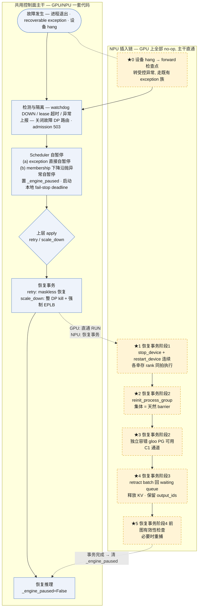
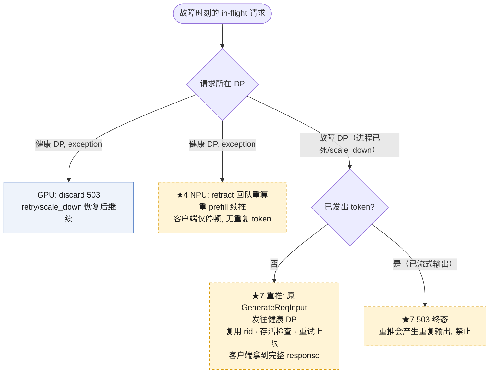

# SGLang DP-only FT NPU 兼容适配方案：GPU/NPU 一套代码

生成时间：2026-08-03
最后更新：2026-08-10（对齐 SGLang v7 自暂停 + whole-DP 架构）
目标硬件：NVIDIA GPU（Mooncake elastic EP）+ 华为昇腾 NPU（MC2 / DeepEP-Ascend）
代码基线：v7 规范 `SGLang_PAUSE_WHOLE_DP_FT.md`（`codex/ft-self-pause-minimal@b7c6f9229`）；旧 GPU 基线 `aa88dae21` 仅保留演进背景，不再是实现基准。
关联文档：

- `SGLang_PAUSE_WHOLE_DP_FT.md`（v7 normative，下称 v7 规范）
- `SGLang_PAUSE_WHOLE_DP_FT_DESIGN.md`（v7 设计指南，下称 v7 指南）
- `SGLang-NPU-MC2-容错适配方案.md`（mask 容错 + 不重捕图路线，下称 MC2 方案）
- `sglang_mc2_dp_attention_compacted_cost_zh.md`（compacted rank 成本分析）
- vllm 参照：`D:\Codex\repos\vllm`、`D:\Codex\repos\vllm-ascend`

> 本文只讨论**架构与实现思路层面的兼容适配点**。支持门控、CLI 参数、超时调参、测试矩阵等与架构无关的工程项不在此列。
>
> 核心立场：**一套代码同时兼容 GPU 和 NPU。GPU 路径零删除、零行为变更；NPU 特殊性全部通过能力声明与 hook 注入，不新建平行控制面。**
>
> **版本对齐说明**：本方案先前基于 v6「中心 pause + pause ACK + `paused_dp_ranks` + 纯逻辑 scale_down」架构。v7 已将其重写为「Scheduler 自暂停、无中心 pause ACK、scale_down 整 DP kill + 强制 EPLB、公共状态无 `paused`、membership loss 走自暂停」。本文已按 v7 更新；凡涉及中心 pause、pause ACK、`_complete_ft_pause`、`paused_dp_ranks` 的旧表述一律移除。NPU 特有的硬约束（必须 stop/restart_device、hccL 上下文需全员参与、图句柄可能失效）**不受 v7 影响，仍然成立**，且正好落在 v7 各事务钩点内。

---

## 1. 背景：两种设备上的故障恢复为什么不同

### 1.1 GPU/mooncake 现状（v7 语义）

v7 把 GPU mooncake 路径收敛为两条故障族，控制面只下发 `retry` / `scale_down` / `recover` 三个命令，中心不发送 pause：

| 故障呈现 | v7 处理 | 代码路径 |
| --- | --- | --- |
| recoverable Python exception | Scheduler 自行 `_engine_paused` + 本地 deadline，上报一次 `FaultToleranceRankFaultOutput`；中心只记 `unhealthy` + 关 admission；上层 `retry`（maskless，`active_ranks ← last_active_ranks`）或 `scale_down` | `_run_event_loop_fault_tolerance`（v7 指南 3.8(a)） |
| 进程退出 → membership 丢失 | 幸存 Scheduler 在 forward 检测 `last_active_ranks & ~active_ranks` 下降沿，抛异常走同一自暂停；中心先把 `process_alive_mask` 置 down；只能 `scale_down`，不能用 `retry` | v7 指南 3.8(b) / 规范 §5.2 |

「同一 forward_batch 当拍重做 forward」只在 **continue 策略**的原生 EPLB + 第二次 forward 路径存在（v7 指南 4.5）；pause 策略下不存在当拍自愈，故障统一收敛为整 DP 移除 + 原生 nnodes 重拉。

### 1.2 NPU 硬件约束：必须 stop/restart_device

NPU 上集合通信要求全员参与，单 rank 故障会污染所有幸存 rank 的 HCCL 上下文（挂起的 collective 无法靠 mask 清除），硬件层面只有设备级重置能恢复。参照 vllm/vllm-ascend 的既有实现：

| 时机 | 动作 | 位置 |
| --- | --- | --- |
| 故障检测后立即 pause | `torch_npu.npu.stop_device(device.index)`，**广播到所有幸存 engine 的全部 worker** | `vllm-ascend/vllm_ascend/worker/sentinel/npu_worker_sentinel.py:95-106` |
| retry/scale_down 恢复阶段 | `clean_states()`：`stop_device` + `restart_device` + `torch_npu.distributed.reinit_process_group` + 清空 input_batch/model state，同样在**所有幸存 worker** 上执行 | 同上 `:228-251` |
| in-flight 请求 | `fault_tolerant_wrapper` 把**所有** running 请求 `preempt_request()` 回 waiting 队列（释放 KV、重置计算进度），恢复后自动重算，客户端无感 | `vllm/v1/fault_tolerance/engine_core_sentinel.py:466-552` |

两个关键事实决定了兼容方案的形状：

1. **幸存 rank 也要 stop/restart**。这与 GPU/mooncake 形成根本分歧——GPU 上幸存者无需任何设备操作。
2. **vllm 不做续推**：任何故障都是 pause → 全量 preempt → stop/restart → 重建 PG → resume → 重算。

### 1.3 对 sglang 的直接推论

- NPU 上 mooncake 的「专家重排 + 同 batch 重做 forward」在物理上不成立：设备一重置，forward 状态必然丢失。v7 pause 策略本来就取消当拍自愈，与 NPU「绝不能续推」不冲突；**NPU 唯一不能用的 GPU 路径是 continue 策略**（幸存者不暂停继续服务）。
- `retry`（maskless 恢复 exception 前已提交状态）在 NPU 上仍需 `restart_device + reinit PG + retract 回队重算`，即把 v7 的 `retry` 命令包一层设备恢复事务。
- sglang 请求层现状有一笔欠账（v6 FT 指南 NORMAL_FLOW_REVIEW F4）：scheduler 进程死亡后，in-flight 请求无 abort、无超时、无终态，客户端挂起到自身超时。NPU 模型使这笔欠账变成必还项。

---

## 2. 兼容总原则：共用控制面 + 能力声明 + hook

控制面状态机、watchdog/lease、`retry → scale_down → recover` 协议、HTTP API **全部设备无关，两种设备共用，一行不删**。所有设备差异收敛到两个机制：

1. **设备容错能力声明**（数据）——描述该设备的恢复语义；
2. **设备容错操作 hook**（接口）——在固定钩点无条件调用，GPU 空实现，NPU 实现。

```text
┌──────────────────────────────────────────────────┐
│  FT 控制平面（设备无关, 共用）                       │
│  watchdog / lease / 状态机 / retry·scale_down·    │
│  recover / admission / rejoin 协议                │
└───────────────┬──────────────────────────────────┘
                │ 能力声明 + hook 调用（无条件调用, 设备自决）
     ┌──────────┴───────────┐
     ▼                      ▼
 GPU/mooncake 实现           NPU/MC2 实现
 · hook 全部 no-op           · stop/restart_device
 · batch 原地保留             · reinit PG + 重算（retract）
 · membership 可 forward 观察 · 无 membership 通道
 · 图保持有效                 · 图按需重捕
     ▼                      ▼
 暂停-恢复模型（无当拍续推）      暂停-重置-重算模型
```

以下 7 个适配点覆盖全部架构差异。

---

## 3. 适配点

### 适配点 1：设备容错操作 hook 层

**差异**：故障后 NPU 必须 `stop_device`（清除挂起的 HCCL 状态）并在恢复时 `restart_device`；GPU 的 comm/mask 故障后依然有效，不需要任何设备操作。

**方案**：抽象 `FtDeviceOps` 接口，scheduler 在固定钩点无条件调用，GPU 注册空实现，NPU 注册 torch_npu 实现（调用方式照抄 vllm-ascend `npu_worker_sentinel`）。控制面完全不感知设备。

```text
钩点                        GPU 实现      NPU 实现
─────────────────────────────────────────────────────────
自暂停完成（本地 _engine_paused    noop          （不在此处动设备）
  置位并上报 RankFault 之后）
retry 恢复事务·阶段1             noop          stop_device + restart_device（连续, 同拍）
scale_down 幸存者恢复事务·阶段1   noop          stop_device + restart_device（连续, 同拍）
rejoin 进程 device init          noop          stop_device + restart_device（连续）
```

**`stop_device` 不放在自暂停阶段，而是与 `restart_device` 在同一恢复事务内连续执行**：

- 自暂停阶段各存活 rank 各自暂停，时刻不完全同步；此刻 `stop_device`（清除挂起的 HCCL 上下文）必须由**所有幸存 rank 一起**做才是集体一致的。若各自在自暂停时抢先 stop，HCCL 上下文清到一半、其余 rank 尚未到位，反而更脆弱。
- 因此 NPU 在 `retry` / `scale_down` 恢复事务的**阶段 1** 里，把 `stop_device + restart_device` 连做（同 vllm-ascend `npu_worker_sentinel.clean_states` 的 `:228-251` 语义），再进阶段 2 的 `reinit_process_group`。此时所有幸存 rank 都已在同一处等待控制消息并执行相同恢复流，天然是集体同步点；GPU 两阶段均为 no-op。
- rejoin 的 replacement 进程在 init 钩点同样 stop+restart 连做；整节点消失则归外部 launcher——与 v7 指南既有的 nodes 重拉边界一致。
- **自暂停钩点在 v7 中落实但不动设备**：Scheduler 捕获异常后仅自行 `_engine_paused=True`（v7 指南 3.8(a)2）并上报 `FaultToleranceRankFaultOutput`；NPU 在该处不触碰设备，只靠进程自暂停 + 本地 fail-stop deadline 兜底。这取代了旧设计中「中心 pause ACK 后 stop_device」的锚点——v7 下没有中心 pause、没有 pause ACK。
- 故障 rank 自己的设备不在 hook 覆盖内（进程已死，无人可调用）：由其 DP 的幸存 rank 在恢复事务中集体 stop/restart 时一并覆盖，或由 rejoin replacement 的 init 连做。

### 适配点 2：in-flight 请求处理策略抽象（keep / discard / retract）

**差异**：同一个故障，两种模型对请求的处理不同：

- GPU exception 故障 → 现状 discard + 503（v7 指南 3.8(a)1 `_ft_discard_inflight_window`）；
- GPU 进程/membership 故障 → 目标 DP 整体移除，故障 DP 请求按适配点 7 处理；
- NPU 任何故障 → batch 的 forward 状态无法存活，但请求**不该丢**，应回队重算。

**方案**：把「故障窗口内请求怎么处理」从硬编码变成策略枚举：

```text
                    keep 原地续推    discard 503    retract 回队重算
GPU membership 故障      (仅 continue 策略)
GPU exception                       ✓
NPU 任何故障族                                    ✓
```

> v7 下 pause 策略不再「当拍续推」，故 GPU 的 `keep` 只保留给 continue 策略的原生路径；pause 策略无论 GPU/NPU，fault window 内已执行请求都会被 discard（GPU，503）或 retract（NPU，回队）。

retract 分支**复用现成的 KV-OOM retract 原语**（`schedule_batch.py:2163` `retract_all` + `scheduler.py:3070` `_add_request_to_queue(is_retracted=True)`）：释放 KV、**保留 output_ids**、回 waiting queue，恢复后重 prefill 续推。客户端只感到停顿，无重复 token，等价于 vllm 的 preempt 语义。

实现上把 fault-window 清理函数参数化：窗口收集与状态清理（cur/last/running/result_queue/chunked 按 rid 去重、KV 尾部回退）两分支共用；discard 分支发 503，retract 分支回队不发终态。

```text
GPU:  [decode] ─故障─ [decode] ────→ [done]           自暂停后 retry/scale_down 恢复
NPU:  [decode] ─故障─ 释放KV/留output ─回waiting─
      ─retry/scale_down 恢复─ 重 prefill ─ 继续decode → [done]     客户端只停顿
```

### 适配点 3：membership 事实源可插拔

**差异**：pause 策略下 `process_alive_mask` 是进程存活的权威来源（v7 规范 §3）；GPU 还可从 mooncake backend 观察 survivors forward 的 active mask（数据面观察量，用于 rejoin 数据面 ready 判定与 continue 路由）。MC2 没有等价的 membership→控制面上报通道，这条源在 NPU 上不存在。

**方案**：把第二个事实源做成 **backend 注册的 observer**，而不是状态机的固定输入：

```text
runtime_active = process_active ∧ membership_active(若 backend 注册)

mooncake backend → 注册 forward 观察器（GPU 现状, 双源, 零改动）
MC2 backend      → 不注册（NPU 自动退化为单源, 只靠 watchdog/lease 静态检测）
```

`FaultToleranceState` 的派生逻辑一行不改。功能上 NPU 不损失：整节点消失本来就由 5s heartbeat lease 静态检测覆盖（不需要等 forward）。

### 适配点 4：控制面集体通道可插拔 + retry/scale_down 设备恢复事务化

**差异**：两个相关问题。

1. NPU 的 `reinit_process_group` 是全员集体操作。v7 下 `retry` 是 maskless 命令、`scale_down` 是整 DP kill + 幸存者强制 EPLB rebalance；两者到达幸存者后，NPU 都必须在**重新可推理前**完成 `restart_device + reinit PG`。集体本身就是天然 barrier，无需新设计 barrier 协议；命令覆盖的幸存 rank 即参与该集体。
2. 恢复后每次 forward 的 MLP sync 是跨 DP 集体。GPU 上它跑在 mooncake-cpu group（dead-rank-safe，天然容错）；NPU 上它跑在普通 gloo（`scheduler_components/dp_attn.py` 的 `prepare_mlp_sync_batch_raw`），含 dead rank 即 hang。这就是 MC2 方案 §4 的 C1 工程项，NPU 侧必须自建。

**方案**：把「故障后仍可集合通信的控制通道」抽象成组件，按 backend 注入：

```text
控制集体通道（MLP sync / 恢复期集体）
 ├─ GPU/mooncake: 现有 mooncake-cpu group（dead-rank-safe, 零改动）
 └─ NPU:          独立 FT gloo PG + stateless 重建 + 紧凑重编号
                  （照抄 vllm stateless_init_torch_distributed_process_group
                    机制, 图外重建不触发重捕）
```

`retry` 在 NPU 上的恢复改造为统一的设备恢复事务（GPU 走完全是 no-op，行为与现状等价）：

```text
retry（统一协议; GPU: 全部 noop, batch 原地保留）
  ├─ 阶段1 device.restore()      GPU: noop    NPU: stop_device + restart_device（连续, 同拍）
  ├─ 阶段2 collective.rebuild()  GPU: noop    NPU: reinit PG（集体, 自然 barrier）
  ├─ 阶段3 batch.recover()       GPU: 保留    NPU: retract 回队（适配点 2）
  └─ 阶段4 active_ranks ← last_active_ranks; 清 _engine_paused / deadline（共用）
```

`scale_down` 幸存者在 v7 共享路径（安装稀疏 mask + `EPLBManager.rebalance(force=True)` + snapshot 到 `last_active_ranks`）之前也插入同样的设备恢复事务（阶段 1-3），因为其 HCCL 上下文已被死亡 rank 的挂起 collective 污染。两种恢复事务的**阶段 2 都是 `stop_device + restart_device` 连续执行**（不拆到自暂停阶段，理由见适配点 1）。rejoin replacement 则在 init 钩点完成同样的 stop+restart 连做。

> 声明：v7 公共同步的 mask/rebalance 动作在 NPU 上**只有在新重建的 comm 上才成立**；这使 MC2 方案 §5.2 的「在新 PG 上 reinit 的最小闭环」成为 scale_down 在 NPU 上可行的硬前置。

### 适配点 5：恢复后的图处理 hook

**差异**：GPU 恢复不重建 comm，CUDA graph 固化的一切保持有效；NPU 重建 PG 后，graph 固化的 HCCL 句柄可能失效（MC2 方案「不重捕图」的前提是组不换，PG 重建打破了它）。

**方案**：`retry`/`scale_down` 恢复流程加一个「图处置」阶段，设备层声明恢复后图是否仍有效：

```text
device.graph_valid_after_recovery()
 ├─ true  → 跳过（GPU 恒真）
 └─ false → 在恢复窗口内重建 graph pool, 再继续 retry/scale_down 后续
```

NPU 侧先 PoC 验证句柄是否按 group name 延迟绑定（`CallHcomGetCommHandleByGroup` 的解析时机）：若有效则此 hook 对 NPU 也是 true，整个适配点关闭；若无效则重捕进恢复事务。这是 NPU 侧最大的不确定项，但架构上它只是一个 hook，不影响共用代码结构。

### 适配点 6：故障信号入口统一（不新增第三故障族）

**差异**：GPU 的故障呈现是进程退出和 Python exception 两族。NPU 多出第三种呈现：**进程活着、设备 hang**（HCCL timeout、AI Core error）——watchdog 不报 DOWN，exception 路径也没人触发；若不处理，先撞上的是 Hard/SoftWatchdog（forward-progress 监控）的默认行为，与 FT 自暂停流程打架。

**方案**：不给控制面加第三故障族。在 NPU 的 forward 路径上加故障检查点（参照 vllm `evaluate_pause_condition → EngineLoopPausedError`），把设备 hang 转成受控异常，注入现有 exception 族入口：

```text
NPU 设备 hang → forward 检查点抛受控异常
  → _run_event_loop_fault_tolerance 捕获（v7 指南 3.8(a) 现有, scheduler.py:1549-1566）
  → _engine_paused=True + 本地 deadline（v7 现有）
  → 请求策略 = retract（适配点 2, 不发 503）
  → FaultToleranceRankFaultOutput（v7 现有）→ 控制面记 unhealthy
```

控制面看到的仍然只有「exception 族」，设备差异消化在 model_runner 层。这与 v7 只承认两族故障的原则完全一致。

### 适配点 7：故障 DP 请求的终态/重推（设备无关机制）

**差异**：这其实不是设备差异——进程死亡后 in-flight 请求无终态，GPU/NPU 同样存在（F4 欠账），只是 NPU 模型强制要求解决它。tokenizer_manager 的 `ReqState.obj` 保留了完整原始输入（`GenerateReqInput`），具备重放条件，但当前没有任何重入队逻辑。

**方案**：在 tokenizer_manager 层实现，完全设备无关，两种设备共用一套代码：

```text
新增 rid → DP 路由跟踪
process-DOWN / scale_down 事件 → 扫描受影响 rid
 ├─ 未发出任何 token → 重推: 原 GenerateReqInput 发往健康 DP
 │    · 复用 rid + 重置 rid_to_state
 │    · 重推前/中检查客户端存活（is_disconnected）
 │    · 重试次数上限, 超限转 503（防连续故障死循环）
 └─ 已流式发出 token → 503 终态（重推会产生重复输出, 禁止）
```

终态唯一性：同一 rid 要么 503 要么最终结果，不得两者都发。NPU 默认启用；GPU 可作为选项启用或保持现状——机制只有一份。

---

## 4. 请求层契约（两种设备统一表述）

| 请求位置 | GPU/mooncake | NPU |
| --- | --- | --- |
| 健康 DP，exception 故障（pause→retry） | discard，503 | retract 回队重算，客户端只停顿、无重复 token |
| 故障 DP（scale_down / 进程退出），未发出 token | （现状：挂起；可选启用适配点 7） | 重推到健康 DP，拿到完整 response |
| 故障 DP（scale_down / 进程退出），已流式发出 token | （现状：挂起） | 503 明确失败终态 |
| continue 策略 membership loss | 原生 EPLB + 第二次 forward，无感 | NPU 不支持 continue |

"客户端 curl 没断就能拿到完整 response"只对**未发出 token 的重推请求**和**健康 DP 的 retract 请求**成立；已流式输出部分 token 的故障 DP 请求必须失败，否则客户端会收到重复/不连贯输出。

---

## 5. 总结

### 5.1 分层职责

| 层 | 共用（不动） | 分叉方式 |
| --- | --- | --- |
| 控制面 | 状态机 / watchdog / lease / retry·scale_down·recover / admission / rejoin 协议 | 无 |
| 恢复协议 | 自暂停 → 处置（retry/scale_down）→ 恢复事务骨架 | 事务内各阶段 = 设备 hook，GPU no-op |
| 请求层 | fault-window 清理框架 / retract 原语 / 503·重推机制 | keep/discard/retract 策略枚举（设备×故障族） |
| 通信层 | MLP sync、retry/scale_down 的调用位置 | 集体通道按 backend 注入（mooncake-cpu / 独立 FT gloo PG） |
| 设备层 | — | `FtDeviceOps` 实现 + 能力声明 |

一句话：**NPU 的全部特殊性收敛为"一份能力声明 + 三个设备 hook + 一个通道实现 + 一个策略枚举"，GPU 路径零删除零行为变更。**

### 5.2 NPU 侧需要自建的硬骨头

1. **独立容错 gloo PG**（适配点 4，即 MC2 方案 §4 的 C1 工程项）：stateless 重建 + 紧凑重编号，是 retry/scale_down 恢复事务和恢复后 MLP sync 的前置。
2. **图有效性 PoC**（适配点 5）：PG 重建后旧 NPU graph 句柄是否仍有效，直接决定恢复窗口是否需要重捕图，是最大的工作量变量。
3. **MC2 在新 PG 上 reinit 的最小闭环**：scale_down 强制 rebalance 依赖 dispatch/combine 绑定新 compacted/rebuilt group 的 kernel/config 支持（见 compacted 成本文档 §6.1 的 `epWorldSize`、专家均分约束）。

retract 重算（适配点 2）与 503/重推（适配点 7）是设备无关机制，做一份两种设备都受益，同时也是 F4 产品契约欠账的偿还。

### 5.3 与 MC2 mask 路线的关系

本方案接受"stop/restart_device 是 NPU 硬件约束"的前提。MC2 方案中的 mask 容错（`x_active_mask` + 固定组 + 不重捕图）是另一条路线，两者前提互斥：

- 当前阶段按本方案实施（暂停-重置-重算模型）；
- 若未来 MC2 的 mask 能力成熟到进程 kill 类故障可以不重置设备，可演进为混合模式：**进程级故障走 mask 续推（GPU continue 语义），设备级故障走 stop/restart（本方案）**。本方案的 hook/能力声明架构不阻碍该演进。

### 5.4 明确不支持

- NPU 上的 `continue` 策略（幸存者不暂停继续服务）；
- retry/scale_down 恢复进行中的二次故障（继承 v7 边界，见规范 §10）；
- 已流式输出 token 的故障 DP 请求续推（会产生重复输出）。

---

## 6. 故障处理全流程与 NPU 插入点（图示）

标记约定：**蓝色实线框 = 两种设备共用的控制面主干（一套代码，不改动）；黄色虚线框 = NPU 插入点（GPU 上为 no-op）**。标记 ★0~★7 与 6.4 节映射表对应。

### 6.1 总流程与 NPU 插入链（v7：Scheduler 自暂停，无中心 pause）



### 6.2 in-flight 请求分支（对应适配点 2 / 7）



### 6.3 时序细节

```mermaid
sequenceDiagram
    autonumber
    participant FLT as "故障源"
    participant CP as "Node0控制面(TM+FTMgr)"
    participant SCH as "幸存 schedulers"
    participant DEV as "设备hook(FtDeviceOps)"
    participant API as "上层/客户端"

    FLT->>SCH: "forward 抛异常 / membership 下降沿"
    Note over FLT,SCH: "★0 NPU 设备 hang 在 forward 检查点转为受控异常（GPU 无此步）"
    SCH->>SCH: "_engine_paused=True · 启动本地 fail-stop deadline"
    SCH->>CP: "FaultToleranceRankFaultOutput（单向上报, 无 ACK）"
    CP->>CP: "记 unhealthy · 关闭路由 · admission 503"
    API->>CP: "apply: retry / scale_down"
    rect rgb(255, 244, 214)
    Note over SCH,DEV: "★1~★5 恢复事务（GPU: 全部跳过, batch 原地保留）"
    CP->>SCH: "retry / scale_down — v7 现有命令; scale_down 先由 DPC kill 目标 DP"
    SCH->>DEV: "★1 stop_device + restart_device（连续, 各幸存 rank 同拍）"
    SCH->>SCH: "★2 reinit_process_group（集体=天然 barrier）"
    Note over SCH: "★3 此后 MLP sync 走独立容错 gloo PG（C1 已重建）"
    SCH->>SCH: "★4 retract running_batch → waiting queue（保留 output_ids）"
    Note over SCH: "★5 图有效性检查, 必要时重捕"
    SCH-->>CP: "FaultToleranceCommandReqOutput（命令 ACK, 仅 DP leader）"
    end
    CP->>CP: "publish DPC route（等 Node 0 DPC ACK）"
    SCH->>SCH: "清 _engine_paused=False"
    CP-->>API: "admission 开放, 恢复服务"
    SCH->>SCH: "next batch: 被 retract 请求重 prefill 续推"
    Note over CP,API: "并行路径: ★6 rejoin replacement 进程 device init 前 stop+restart；★7 故障 DP 请求: 未出 token → 重推, 已出 token → 503"
```

### 6.4 标记与适配点映射

| 标记 | 插入时机 | GPU 行为 | NPU 动作 | 对应适配点 |
| --- | --- | --- | --- | --- |
| ★0 | 故障发生（设备 hang 呈现） | 无此故障呈现 | forward 检查点转受控异常，注入 exception 族 | 6 |
| ★1 | retry/scale_down 恢复事务·阶段 1 | noop | `stop_device` + `restart_device`（**连续, 同拍**，各幸存 rank 集体执行） | 1 |
| ★2 | 恢复事务·阶段 2 | noop | `reinit_process_group`（集体即 barrier） | 4 |
| ★3 | 恢复事务·阶段 2 | mooncake-cpu 现成可用 | 独立容错 gloo PG（C1）重建并接管 MLP sync | 4 |
| ★4 | 恢复事务·阶段 3 | keep：running_batch 原地保留 | retract 回 waiting queue，重 prefill 续推 | 2 |
| ★5 | 恢复事务·阶段 4 前 | 跳过 | 图有效性检查，必要时重捕 | 5 |
| ★6 | rejoin 进程 device init | 正常 init | `stop_device` + `restart_device` 连做 | 1 |
| ★7 | process-DOWN / scale_down 之后 | 原生：挂起（可选启用） | 未出 token → 重推；已出 token → 503 | 7 |
